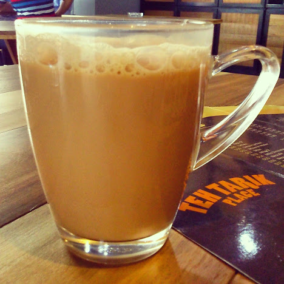
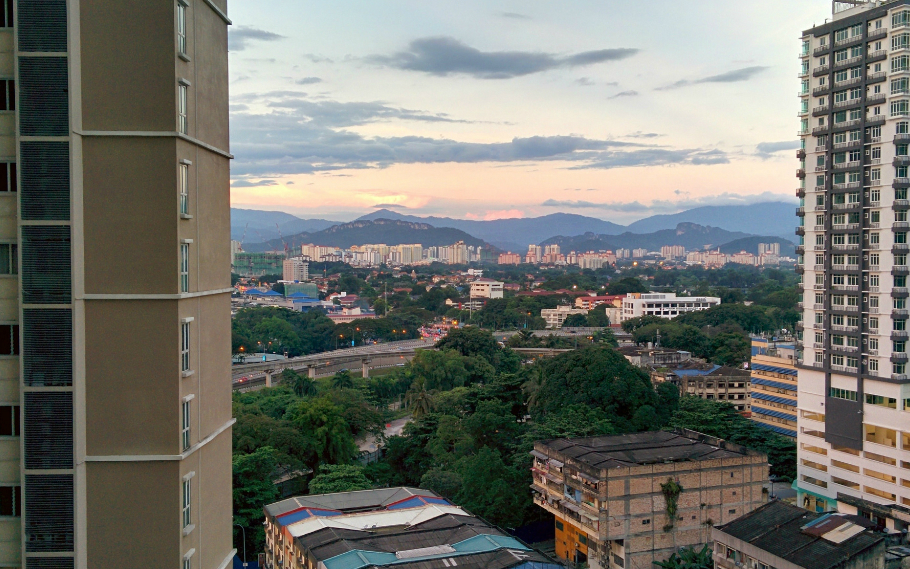
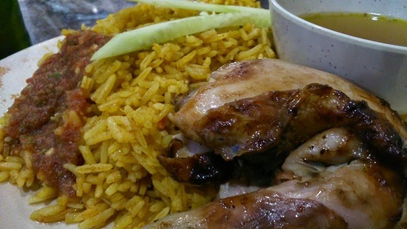
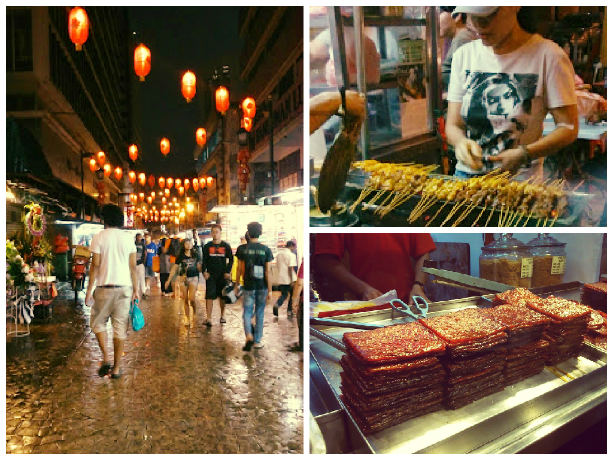
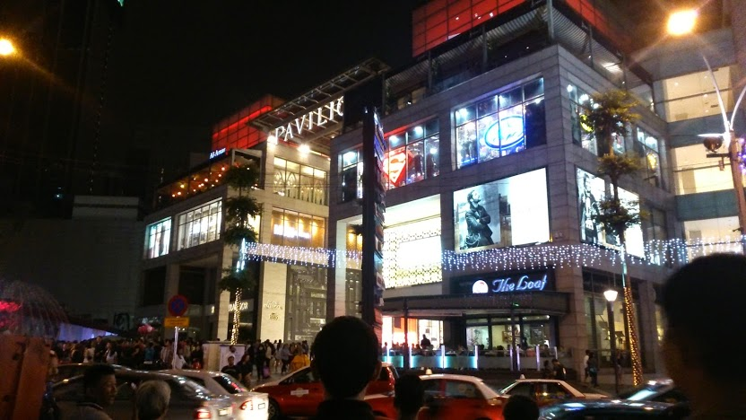
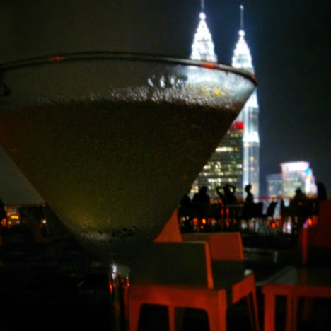

When we arrived in Kuala Lumpur in time for Christmas and New Year, we were delighted to find familiar comforts to rest and recuperate for a while – we felt that after 6 months of travel it was time to take a breather.

The humble frothy sweet teh tarik I enjoy on a daily basis

Kuala Lumpur boasts an array of neighbourhoods to relax, shop, sightsee and most importantly, eat at. Best described as a melting pot of cultures Kuala Lumpur intertwines a fusion of Malay, Indian and Chinese culture. It was very unique to see such a varied but wonderful mix of influences Malaysia prides itself on.

In total we stayed in Kuala Lumpur for 6 weeks – Kyle had work commitments so we rented an Airbnb apartment in the quiet neighbourhood Tittiwangsa, north of the city. In no time we felt like the locals whereby we shopped at the markets, jumped on the MRT into ‘town’ and became regular faces at the family run restaurants.

**Getting Around**

→The MRT (monorail) is a busy yet quick way to navigate around the city. Return fares are as cheap as 2.30 MYR whilst the service itself is reliable.

→ GoKL buses are a free service which operate in may parts of the city. This is an ideal way to explore the city for those on a very tight budget. However bear in mind that during peak times waiting times increase greatly and often it’s just easier to get the MRT.

→Taxis are very easy to flag down around the city. By law drivers have to use their meters but you’ll always meet a few that think this rule doesn’t apply to them! The easiest way to overcome this is to use the [MyTeksi app](http://grabtaxi.com/myteksi/) – this app is a safe and quick way to find registered taxis nearby that use a meter. _There is a surcharge of 2 MYR added to the overall fare but in my opinion it’s worth the hassle of having to constantly flag down and haggle!_

It was really easy to navigate around Kuala Lumpur as there are plenty of transport options to get around. We mainly used the MRT to get around as the nearest station was around the corner from our apartment.

**Our Favourite Neighbourhoods**

Being in Kuala Lumpur for a while gave us the flexibility to check out the diverse neighbourhoods around us. We particularly became fond of the following places:

**Tittiwangsa**

Located north of KL, Tittiwangsa is a quieter (and much local) part of the city. There are many condos around with plenty of local food courts and transport options – just around the corner from our AirBnB rental was both the bus and MRT station. Tittiwangsa is a far cry from the hustle around the Petronas Towers but was as close as we’d get to experience the local way of living.

The view from our Airbnb apartment in Tittiwangsa

**Chow Kit**

Pretty much the next block from Tittiwangsa with the same local vibe. Chow Kit boasts an array of wet markets, a maze of alleys and bustling bazaars. We regularly bought our supplies of fresh fruit and snacks whenever we passed though he area. We enjoyed its raw authenticity and delicious local food.

If we didn’t get lost in Chow Kit we would have never found this place! Chicken Kabsa Rice (@Suria Restaurant) is one of the most tastiest meals we regularly enjoyed. Washed down with a Barbican or teh tarik, this generous portion costed around £2.50!

**Chinatown**

Undoubtedly full of cheap goodies and knock off brands, Chinatown (at ‘Petaling Street’) boasts thriving street food options and night markets. There is an abundance of street vendors which draw in the crowds in the evening. We found a favourite hangout at Coffee Amor to indulge in great coffee and free wi-fi.

Chinatown is the place to go for cheap satay and porky treats

**Bukit Bintang**

Easily the most recognisable part of the city with the majority of shopping and entertainment activities around. We found a few gourmet supermarkets which stocked familiar home goodies. There is an abundance of food courts and restaurants to suit many tastes and budgets, as well as the countless familiar retail brands to indulge in (_or windowshop like me!_).

Shopping malls like the Pavillion are commonplace around Bukit Bintang

**Changkat**

Located in Bukit Bintang, Malaysia’s nightlife scene can be found here at Changkat. There are plenty of trendy bars, lounges and clubs – many offer happy hour deals so drink up during these periods as drinking is a pricey affair!

Enjoying an apple martini at the Helipad bar

Kuala Lumpur is so diverse and cultural in such a way I have not experienced before. The neighbourhoods I’ve mentioned are just a fraction on what the city has to offer. The blend of cultures, food and activities is so varied that it’s easy to stumble into a new venture every time you step out.

I’ll be pretty sad to part ways with KL but I definitely look forward to a brief return back before we make our way to Singapore later on this month.
