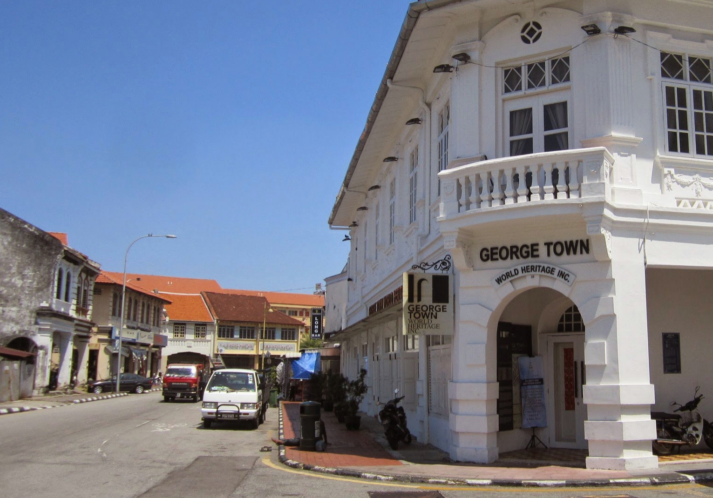
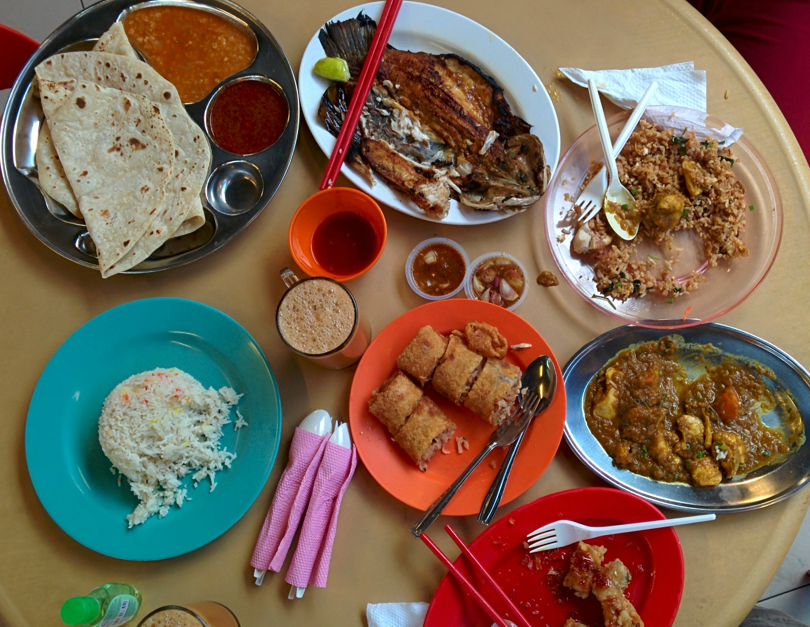
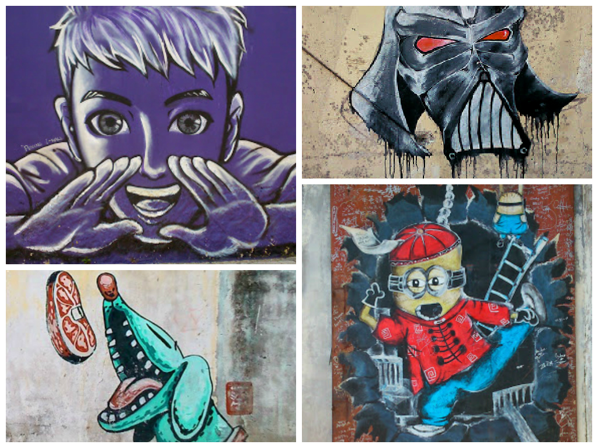
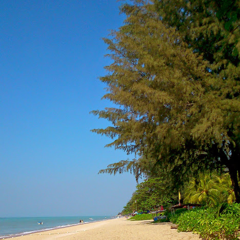
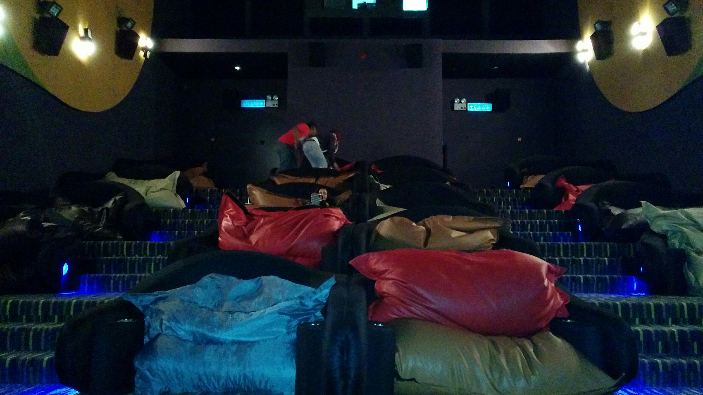

We booked an [Aeroline](https://www.aeroline.com.my/) bus from Kuala Lumpur to get to Penang.

The journey was only 4 hours and the bus was surprisingly comfy – our leather seats fully reclined, snacks and headphones were provided and the individual TVs (at the back of each seat like on a plane) had a decent choice of films. There was even a toilet onboard – and it was clean!

We reached Georgetown in the afternoon and checked into the (conveniently named) Kimberley’s Guesthouse for a few nights.

Georgetown was founded by Francis Light, a trader from the British East India Company. Light developed the once swampy village of Georgetown into a thriving trading port. Nowadays Georgetown’s’ history represents a diverse blend of Malay/Indian/Chinese heritage along side heavy European influences. The towns’ successful history has become one of Asia’s most unique destinations to explore – in 2008 Georgetown was listed as a UNESCO Heritage Site.

There are plenty of hawker food stalls around Georgetown – just a few metres away from our guesthouse were a handful of stalls selling fried chicken, char kway teow amongst other sweet treats. The choice off food stalls around Georgetown is impressive, however it doesn’t just stop there. There is also the option to check out the bigger food courts which house a wide selection of cuisine (local, Thai, Japanese, Indian, Western etc). It is an interesting style of local dining whereby you walk around the vendors and order your dishes (giving only your table number) then arrive back to your table and wait for the food to come to you, paying only when the dish arrives!

Trying out the various types of food at Long beach food court

Apart from being a hawker culinary haven, Penang is also home to an impressive collection of street art. The success of Penang’s street art has largely been contributed to Lithuanian artist Eric Zacharevic. His murals were commissioned at the Georgetown Festival 2012 – many of these murals are mostly influenced by Penang’s local lifestyle.

A snippet of kooky art around Georgetown

Although the traffic in Penang is a nightmare, walking (or cycling) is the best way to get around. With the help of a map we managed to navigate our way around the maze of lanes to find these art treasures. (Un)fortunately we weren’t alone as there were queues to take photos at some of the most popular spots!

During our stay in Penang we spent the afternoon checking out Batu Ferringhi beach. It took just over one hour to reach by local bus which snaked its way around Batu Ferringhis’ beautiful coastline.

Whilst the beach was very quiet (_always a good thing)_ it was very dirty and we often saw large piles of rubbish dumped on the sands. Water sports seemed to be the main attraction here as there were plenty of jet skis and boats accompanied by pushy touts as we walked on by. Unimpressed and exhausted from the heat we only managed an hour on the beach till we retreated back to Georgetown.

It was a great day to visit Batu Ferringhi, however it wasn’t the cleanest beach we’ve seen

Although we weren’t impressed with Batu Ferringhi, we still found Penang’s vibrant lifestyle charming. The diversity in Georgetown is reflected by its many ethnic quarters, stunning colonial architecture and modern-day art. Let’s not forget the food – it is after all one of the top foodie destinations in Asia!

_By the way if food, history or art don’t appeal to you at all and you just want to go to Penang to watch a film, then I recommend checking out the Beanieplex cinema (@ 1st Avenue Mall). They cost a little more than a standard cinema ticket, but the beanies are super comfy! Just remember to bring a scarf, the air con had us sneezing by the end of the film…_

Beanieplex!
