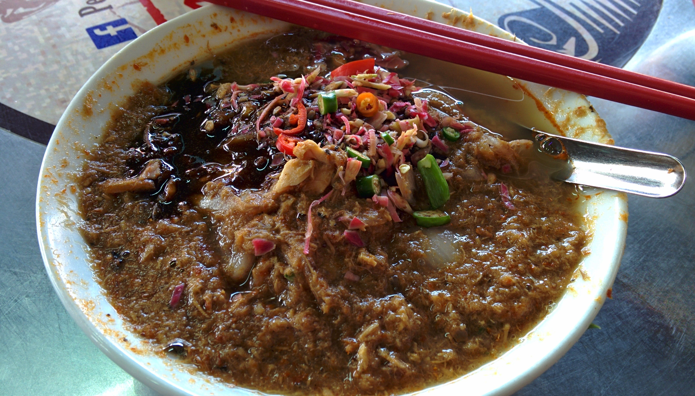

According to a 2011 CNN [article](http://travel.cnn.com/explorations/eat/worlds-50-most-delicious-foods-067535) titled ‘_World’s 50 Best Foods’_ Penang’s very own Assam Laksa features in at number 7.

Assam laksa is described as a sour-spicy-fruity mackerel broth combining a melody of ingredients including (but not limited) the following: tamarind, mint, chilli, lemongrass, turmeric, cucumber, onion, pineapple and some noodles thrown in for good measure. Intrigued by the article, I did a little more research which singled out one particular stall renowned for serving this particular laksa.

Pasar Air Itam Laksa is claimed to be _the_ best stall to try assam laksa – it is about a 45 minute bus ride from Georgetown to Air Itam market where the stall is located.

Unsure if Pasar Air Itam Laksa was even open, we decided to take the risk and go for it. From Georgetown the rapidPenang buses 201, 202, 203 and 204 all go towards Air Itam market. The bus journey took just over an hour before we reached.

As expected Pasar Air Itam was very busy. Fortunately we found a couple of rickety stools and squeezed ourselves in a corner. After miming to the staff for how many bowls we wanted, we were intervened by an older lady asking how many sugarcane juices we want (_basically there’s a tiny little stall right next to the laksa stall where this lady makes sugarcane juice and places it on most tables and will charge even if you didn’t want it_). Luckily we like sugar cane juice but only bought one to test how good it was!

Not a minute later after our order we were presented with two sloppy bowls of laksa we travelled all this way for.

And here it is guys and gals – ‘The’ Assam Laksa

**Verdict?**

Okay…. so I wasn’t _that_ keen on my first taste.

But it gets better! The combination of ingredients soon delivered a punchy, sour but refreshing taste that became quite enjoyable. Each spoonful brought a different taste sensation – sweet, sour, spicy, fruity, salty, fishy (i_n a good way!)_. I’ve never tried a dish which brought so many dimensions of flavours – all in one bowl.

The assam laksa is definitely an acquired taste which did grow on me after a while. I don’t think Kyle was too keen though!

**So, should you go?**

The success of Pasar Air Itam Laksa draws in the crowds (locals & tourists) each day, so it’s clearly doing something right. At a wallet friendly 4 MYR for a bowl of one of the world’s top 10 foods to try, I’d say it’s worth the trip to Air Itam to judge it for yourself!
