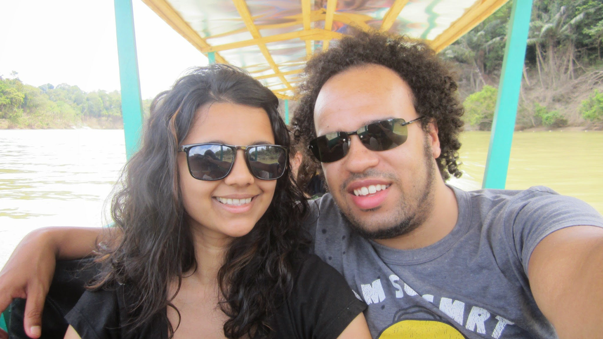
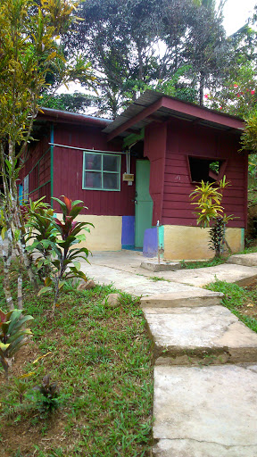
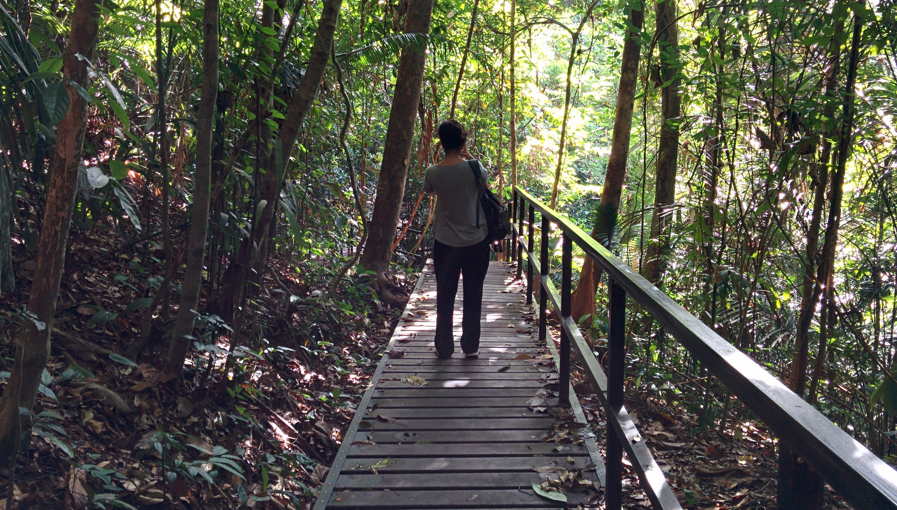
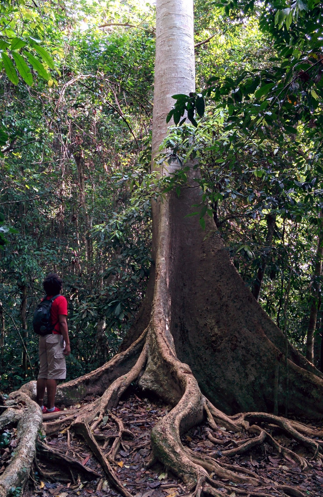
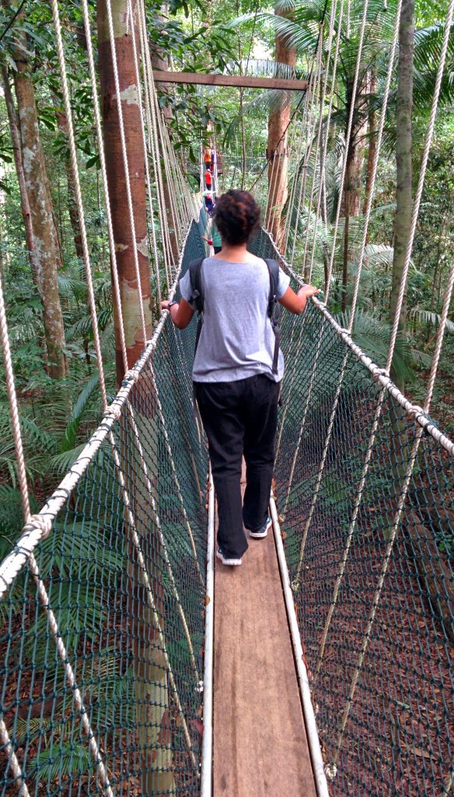
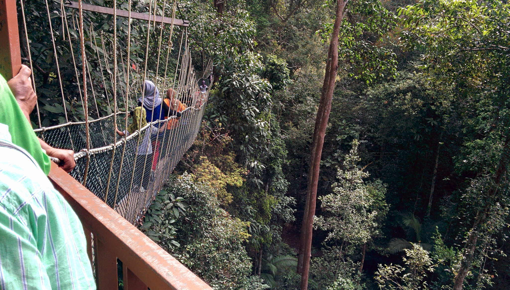
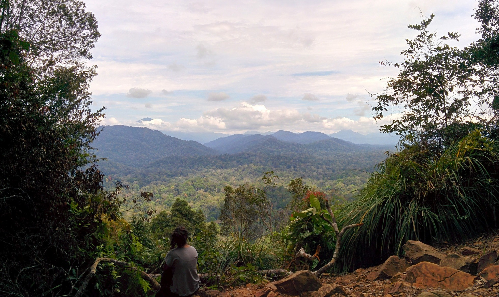
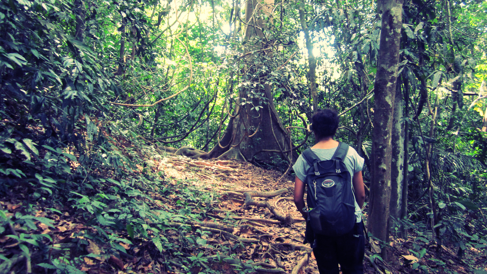

Taman Negara is estimated to be over 130 million years old and has a reputation as being one of worlds oldest rainforest. Further research has suggested that the rainforest had not even been affected by the Ice Age!

From the Cameron Highlands we booked a minivan to Jerantut and switched to a boat to reach Kuala Tahan. At Jerantut we purchased compulsory camera permits for 5 MYR.

We always start off optimistic!

The boat ride lasted 3 tedious hours. The boat was very narrow and had a couple of hard cushions to sit on – we couldn’t really manoeuvre around much either as the boat would start to rock. There was very little to see in terms of scenery. However we did see the damage caused by the recent flooding which made us question whether going to Taman Negara was really a good idea!

When we eventually arrived in Kuala Tahan we were given a brief introduction by the main tour operators Han Travel at Mama Chop floating restaurant. Guesthouses in Kuala Tahan cannot be booked online – you have to wait to arrive to check availability. Unfortunately due to the recent flooding a few of the guesthouses were destroyed, so availability was tighter than usual. As soon as everyone was briefed we grabbed our bags and hunted around for an available room.

It took around 20 minutes before we were successful. We scored the last room at the Durian Chalet for a couple of nights at a budget price of 40 MYR. _By the way don’t expect fancy accommodation in Kuala Tahan – our chalet had an awful ant infestation and mice! I’ll show you the selection of bites I woke up to each morning further down…_

Our infested lodge at the Durian Chalet – fortunately we moved to a less infested lodge shortly after this photo was taken!

There were many tours offered in Taman Negara but we chose to go on a self guided hike around the rainforest.

We set off around 9am from the chalet stocking up on water before we made our way to the jetty. There is a boat which links Kuala Tahan to the national park; it costs 1 MYR per person to cross over to the national park.

Nice shaded stroll to the canopy walk

The trail is easy to join and has frequent sign posts. As we arrived early there were minimal people on the path and plenty of shade to cool us down.

Our first stop was the canopy walk. The entrance was only 5 MYR per person. We arrived and got tickets just in time as the tour groups arrived. We still had to wait as the walkway limits the amount of people at a time. Knowing this attraction would be busy we persevered and managed to absorb the beautiful views from the height.

Queue with a view!

The canopy walk takes around 30 minutes – due to the recent flooding certain sections were closed off for safety reasons. After successfully completing the walkway we headed to the next viewpoint, Bukit Terisek. It took around an hour to reach the viewpoint and like the canopy walk, there were frequent signposts for directions.

The view at Bukit Teresik

We reached Bukit Terisek viewpoint midday and debated whether to walk the easy route back or challenge ourselves to the more technical path. Weighing up the two options we opted to challenge ourselves and chose the technical route back.

We liked the technical path as it was much quieter than the other route. Almost instantly we felt connected to the nature around us. The sounds of the rainforest filled the air with beautiful harmonies from the birds and insects. Everything sounded so loud, and we felt so tiny in comparison to it all.

We passed another couple on our way and got talking, only to stop at the sound of an elephant trumpeting nearby! Convinced it was an elephant we later found fresh dung tracks near a stream. We were all certain that we had in fact heard a wild elephant, and we were fortunate to hear the trumpeting another 3 times!

Overjoyed from all the wonderful sounds we continued on the path which eventually returned to the river. We reached our original starting point at 4pm and gladly paid a couple ringgit to transfer us back to Kuala Tahan.

It had been a vigorous day of hiking through the rainforest, but so rewarding. There’s no question about it, the potential elephant sounds were the highlight of our trek! We were glad that we didn’t choose a tour; it was much more fun walking around the forest at our own pace.

The only drawback of our stay in Taman Negara were the restless nights sleep on both nights. The jungle sounds are deafening in the evening and stopped any chance of a decent nights rest. Having said that, it was worth the lack of sleep to visit one of the worlds rainforests – something which I would defintiely do all over again.

These bites appeared on my arms when I woke up. I don’t (and would rather not) know what caused them!
