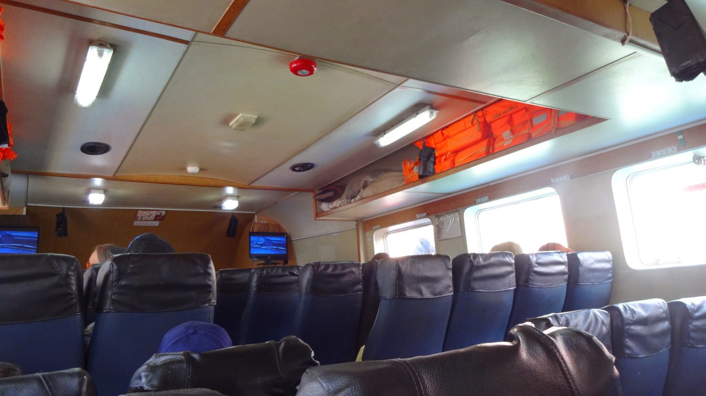
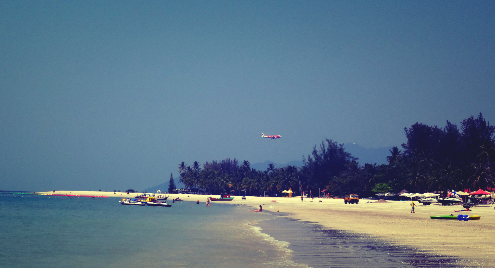
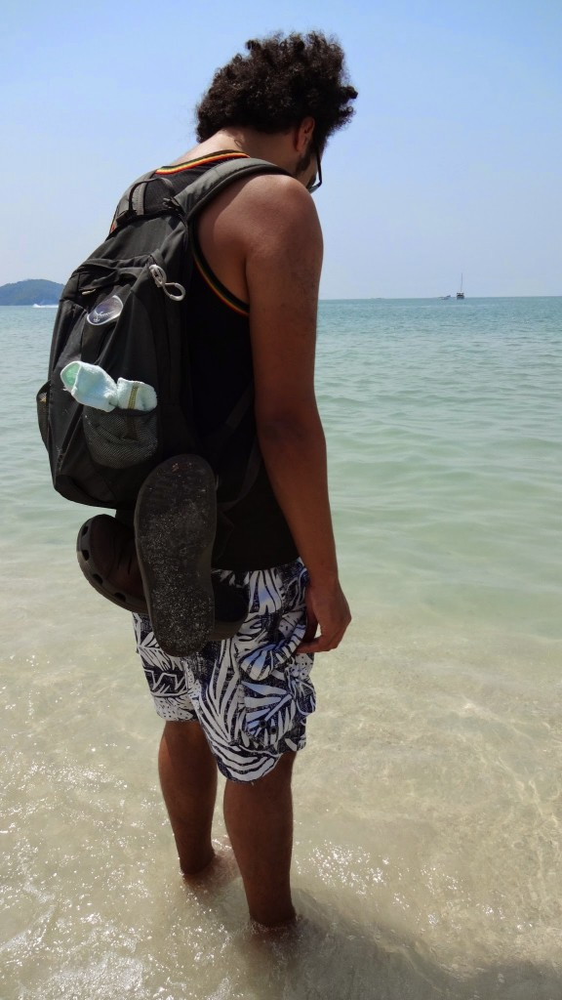
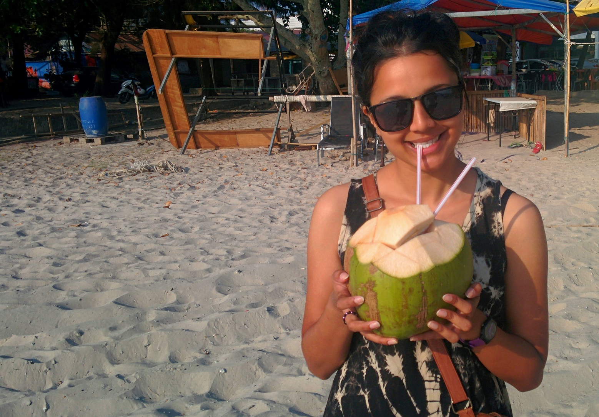
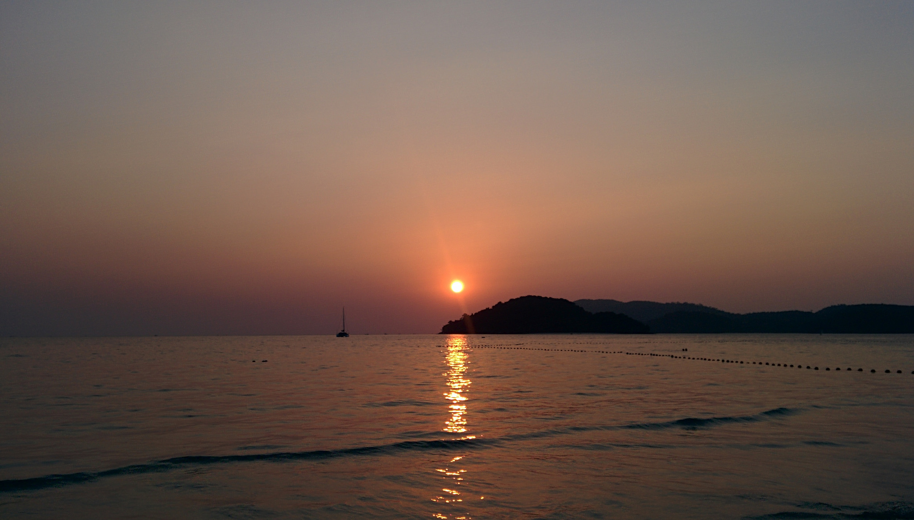
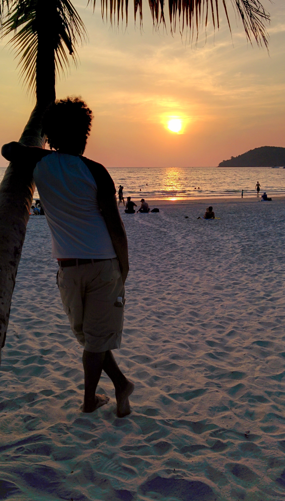
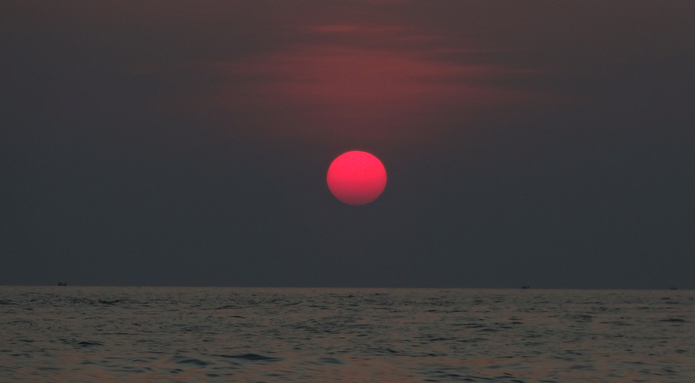
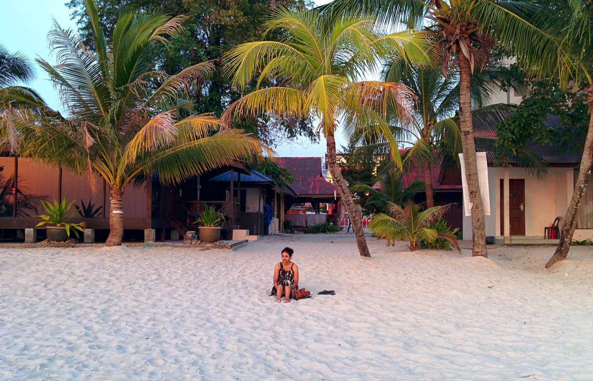

From Penang we booked ferry tickets to Langkawi. There are plenty of tour agents near the port that offer fixed prices. The price was roughly 66 MYR for a one way ticket, and around 123 MYR for a return ticket.

The ferry only takes around 2 hours from Penang to Langkawi

We stayed in Pantai Cenang, the main beach town on the island.

Langkawi was given a tax-free status in 1987 in a bid to encourage tourism and improve local living standards. Even though this means that alcohol prices are cheap, the island is predominantly religious (mainly Muslim) so drinking is tolerated but frowned upon if excessive. Luckily for us we aren’t big drinkers and welcomed the idea of a beach minus the drunken antics!

Cenang beach is about 2km long and has retained its beauty, the long stretch of powdery white sands is big enough to disperse the crowds, reducing that cramped feeling that so often happens on a beach. The waters were warm, welcoming and surprisingly clear.

The nightlife in Pantai Cenang is very laid back with a selection of chilled beach bars along the sandy shore. Our favourite hangout had to be Low Wrong bar. The bar consisted of a wooden shack where the bartenders whipped up delightfully cheap cocktails and shishas. There are about 20 intimate candle-lit loungers on the sands to enjoy and kick back to the sounds of the waves and chilled reggae beats. We loved this place so much we went back every evening throughout our stay!

Low Wrong bar – our favourite hangout in Langkawi

Though a small island the food in Langkawi is definitely worth a mention. There are many food options ranging from local cuisine to fresh seafood restaurants. It is worth splurging out for seafood as it’s so fresh and plentiful.

We ate some incredible chunky tiger prawns and barbecued sea bass (with a side of fried rice, steamed veg and a couple of beers) at Orkid Ria restaurant for around £25 – this may be a tad pricey for the budget conscious but super cheap compared to a meal like this in the UK!

There is a range of food options to suit all budgets in Langkawi

Can’t go wrong with a cheap delicious coconut!

_…Okay so I mentioned the gorgeous beach. And the beach bars…and the food. Is there anything else amazing about Langkawi?_

**YES!**

Each afternoon we frolicked onto the sands for a perfect spot to watch the sun gloriously set into the evening. For four nights we were treated to a beautiful sunset.

For me, Langkawi has easily claimed the top spot as my favourite beach destination.

Maybe it was the beautiful sunsets which captured my heart, or the copious amounts of delicious 2 MYR cocktails and fruity shishas which haze my memory. Whatever it may be, I feel captivated to return to Langkawi’s laid back charm in the future.

I wouldn’t recommend Langkawi for those wanting a boozy ‘Patong/Phi Phi’ kind of experience. Those that come to Langkawi do so to relax on wonderful beaches, indulge in delicious food and choose a more chilled approach for a ‘night out’. In Langkawi, you don’t need to drink excessively to have a good time!

I’m pretty sad to leave this beautiful island, but have fond memories that long for me to return.

I can’t wait to return to this idyllic spot!
