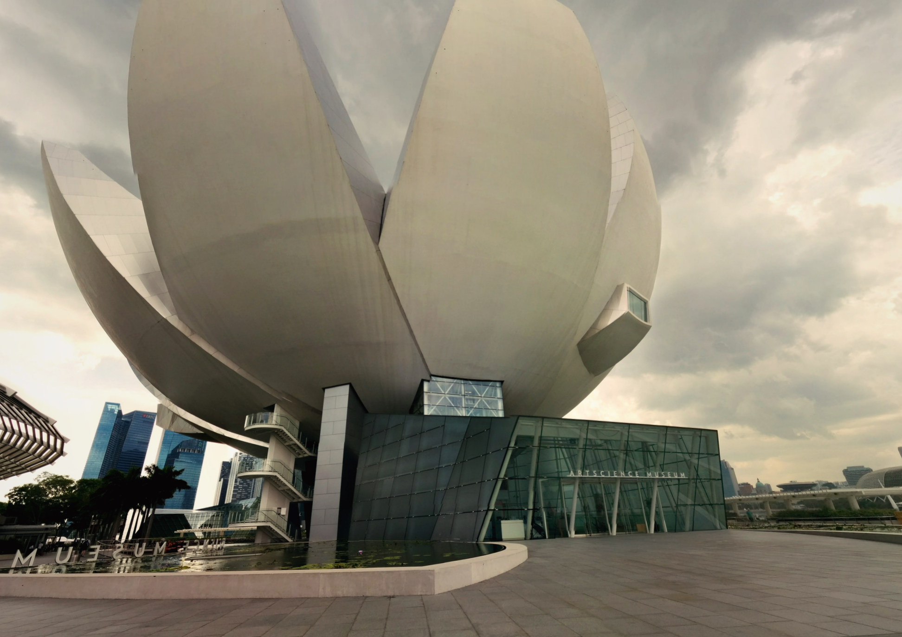
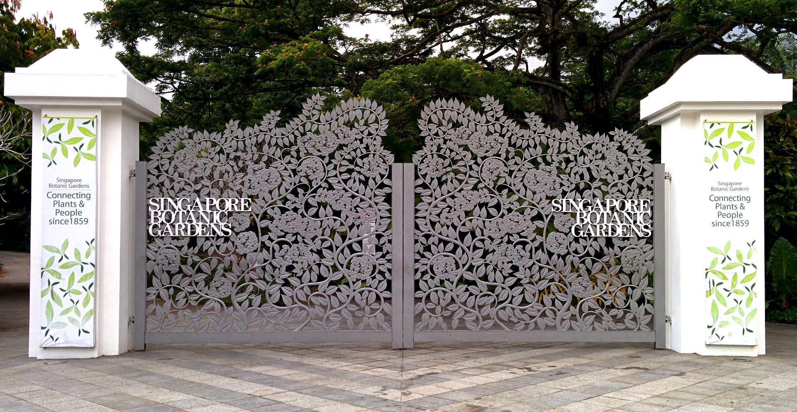
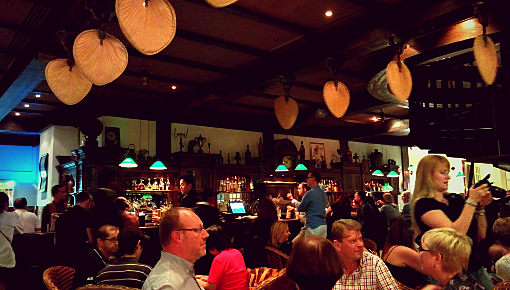
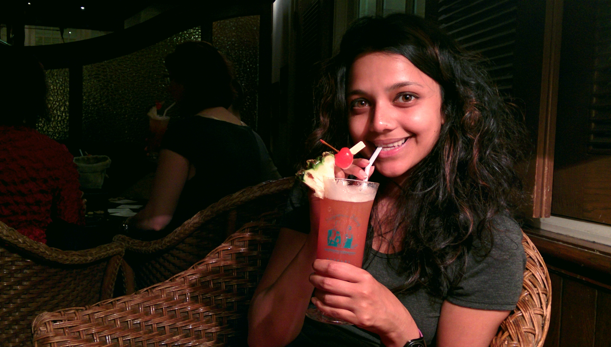
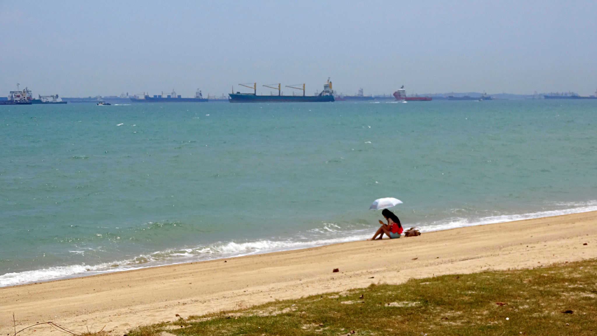
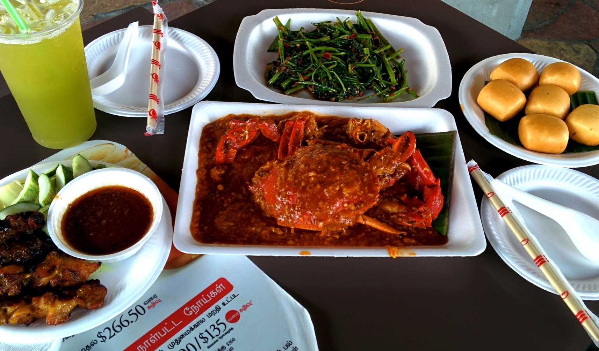
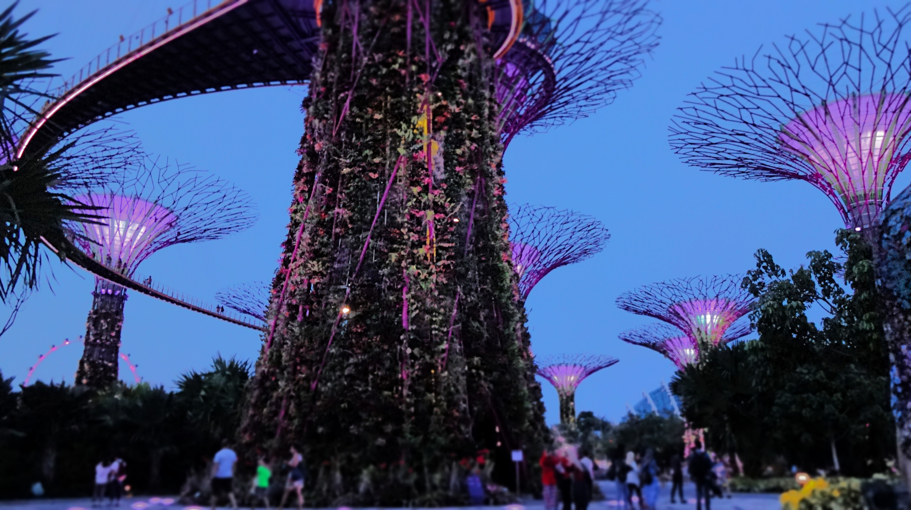
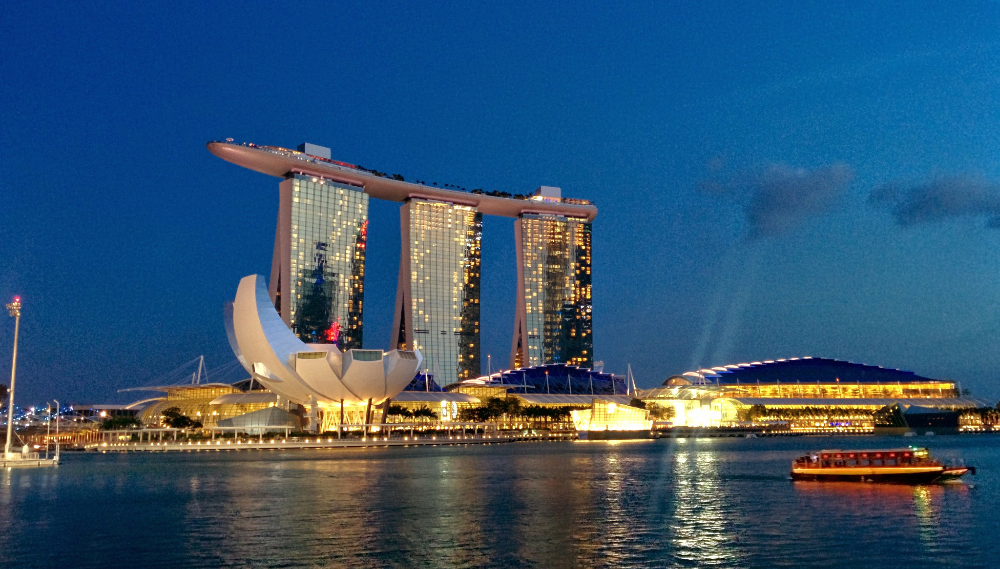
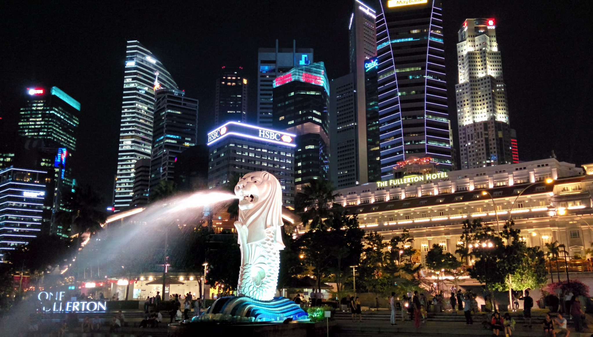

There no doubt about it… Singapore is _much_ wealthier,_a hella’ lot_ cleaner, and _1000x_ more stylish than its Asian neighbours. This pint size island is one of the largest global commercial hubs and was recently crowned as the world’s most expensive city to live in (according to this BBC May 2015 [article](http://www.bbc.com/news/business-31689124)).

Singapore has been labelled ‘Singabore’ over the years for various reasons. One may be due to the countless ‘_No-No-No’_ signs backed up by tough laws and restrictions. Could this over efficiency and strict law system results in a sterile and dull atmosphere?

Thankfully the answer is no.

As a visitor there are plenty of activities in Singapore, however most do come at a cost. Take for instance the night zoo experience or Universal Studios which can cost around $42-$75 per person – that’s just for an entrance ticket!

With a bit of research I managed to find some free attractions combined with paid activities that made our stay in Singapore a memorable one.

Here are my top 8 favourite things I enjoyed in Singapore:

**1. Food (Street & Restaurant)**

Like Malaysia, Singapore’s diverse population consist of (predominantly) Chinese, Indian, Malay and Eurasian ethnicities. With so much diversity comes a whole assortment of wonderful cuisines. I particularly enjoyed the fusion of food available and indulged in plenty of laksa, fried rice, curry mee, dim sum and Singapore’s famous chili crab to name a few!

A selection (but definitely not limited to!) of my favourite eats in Singapore

It’s not just local food that’s good! I ate some really delicious (and affordable) Western eats

**2. Art Science Museum**

Love Art? Interested in Science?

Then add the ArtScience Museum on your to-do list! At the time we visited there was a DaVinci exhibition on which costed $50 (price for 2 people). It was a brilliant exhibition and there were several other floors of the museum showcasing local art installations.

The unique exterior of the ArtScience museum

**3. Singapore Botanic Gardens**

Not only is this attraction free, the Botanic Gardens are a wonderful place to take a break from the action. Described as a mini oasis in this metropolitan city the gardens are a wonderful place to stroll around and admire the tropical flora. There are plenty of spots to chill and enjoy a picnic, or join the locals for a jog around. The grounds are excellently maintained with on site cafes making it a perfect afternoon option to escape the heat and enjoy the scenery.

**4. Haji Lane**

Haji Lane is _the_ place to be. I love finding kooky spots in each country I visit, and for me Haji Lane is my kooky place in Sinagpore. Located in the Arab quarter this particular spot is home to quirky shopping boutiques, independent cafes, cosy bars and lots of street art. I loved wandering around the narrow alleys and stumbling on new finds. There are plenty of eating options around and prices are reasonable by Singapore standards.

A tiny selection of quirky finds around Haji Lane

**5. Raffles Hotel**

Raffles Hotel is a beautiful colonial style hotel which has become one of the few remaining 19th century hotels in the world. Renowned for its grandeur the hotel oozes sophistication that cannot be replicated in todays modern builds. As beautiful and expensive as it is we still experienced a somewhat affordable experience at Long Bar.

Long bar is the renowned home to the Singapore Sling, created in 1915 by bartender Ngaim Tong Boon. It is a very pricey affair to try this cocktail, a hefty 28$ to be precise! However being in Singapore (and a fan of cocktails) I couldn’t resist. The Singapore Sling tasted great but being a pricey affair this will likely be my first and last time tasting it – maybe next time I’ll be able to afford a night at the hotel!

A very busy Long Bar

Enjoying an orginal recipe Singapore Sling

**6. Sentosa Island**

There are many attractions on Sentosa Island. In addition to several man-made beaches, an aquarium and a Universal Studios theme park there are great coastal pathways to walk or cycle around and enjoy a free day out. The sea breeze is refreshing and a wonderful escape from the city heat. There’s no way to get hungry either as there are many food courts around serving ice-cream, satay snacks and fresh seafood.

One of the beaches on our walk

Trying chili crab at East Coast Seafood Centre

**7. Gardens by the Bay**

The Gardens by the Bay showcase an abundance of tropical flora and garden artistry. Do not miss the opportunity to visit in the evening to watch the Garden Rhapsody – a stunning (_and free_) light and sound display at Supertree Grove.

Supertree Grover looks even better in the evening

Plenty of beautiful flowers around the gardens

**8. Marina Bay**

I don’t think anyone that has visited Singapore has missed seeing the Marina Bay (_at least I hope not!_). The Marina Bay can easily be recognised as one of Singapore’s most famous landmarks. Having see it both day and night, I recommend visiting at sunset/early evening for the best photo opportunities.

The Marina Bay Sands Hotel looks stunning in the early evening

Don’t forget the Merlion!
