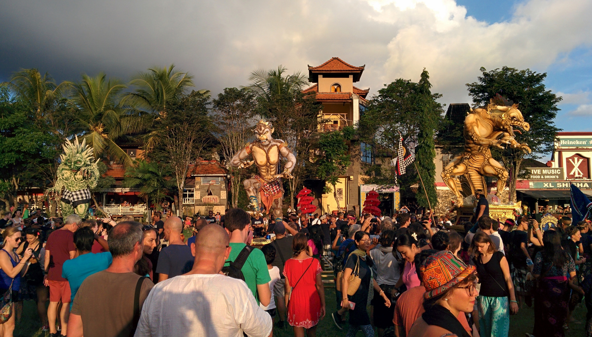

So far on our travels we have celebrated our 3rd New Year!

1.Gregorian calendar – observing New Years day as January 1st. We celebrated 2015 New Years in Kuala Lumpur, Malaysia.

2.Chinese Lunar New Year – falls on the months of January or February. This year the celebrations for 2015 Lunar New Year fell on February 19th. We celebrated the ‘Year of the Sheep’ in Cameron Highlands, Malaysia.

3.And now – Balinese New Year (known as “Caka Year) which falls during the month of March.

Unlike other New Years celebrations the entire island of Bali comes to a complete stop. No-one is allowed on the streets. Grocers, restaurants and clothing retailers are closed. Going to the beach is prohibited. Even the airport is closed!

Read on to see why the Balinese practice this tradition.

**What is Nyepi?**

Nyepi is recognised as a public holiday in Indonesia, but in Bali it seen as a sacred and important Hindu ritual. It is a celebration of a New Year which the Balinese dedicate themselves to prayers, meditation and personal reflection.

**Ogoh Ogoh Parade**

Crowds gathering for Ogoh Ogoh

The actual day of Nyepi is a far contrast to its eve. On the day before Nyepi local crowds gather to partake in the Ogoh Ogoh parade, which begins at sunset.

Statues lining up

Giant demon-like statues (made from bamboo and paper) are paraded through the streets of Bali by locals – carried mainly by young boys and men. The statues symbolize evil spirits and all things negative. The locals carry these statues and make as much noise as humanly possible through chanting and music. The Balinese believe that the noise will scare off the evil spirits; some of the Ogoh Ogoh statues are even burned to eradicate any evil influences.

Some were pretty scary looking!

Parading through the street

**Nyepi Day**

As mentioned earlier on this post, Bali comes to a standstill. Why does this happen?

According to myth the island falls into silence after the previous day’s antics to protect itself from evil spirits. These spirits or ‘demons’ are fooled into believing the island is abandoned, and will therefore pass over the island.

The day after Nyepi normal activity resumes, most trades open whilst some local families continue with religious rituals.

**Advice for Nyepi**

Although Nyepi is a Hindu festival non-residents also observe the day of silence out of respect. This applies to tourists too.

Here are some tips if you stay in Bali for Nyepi-

-   Ask your hotel/guesthouse what their plans are for Nyepi – staff may not be working on this day. Our hotel’s restaurant was open on Nyepi but operated limited hours.
-   Buy snacks, noodles and drinks the day before Nyepi – remember you aren’t allowed to be on the streets (plus nothing is open) so over buy if you get peckish easily!
-   Download movies/documentaries online the day before. Even the internet providers reduce their service resulting in super slow speeds.
-   Close your room curtains in the evening to minimise light.
-   Pop outside your room in the evening to see the night sky – with no light pollution you’re guaranteed to see a beautiful starry night.

For us we had a super chilled today. We snacked, read our books, watched films and snoozed. What’s not to like about that!

If you are in Bali for Nyepi then please be mindful of this tradition. It is fascinating to see as a visitor how much effort the locals put into this festival. Be respectful of the Balinese customs and enjoy your day of silence!

How I pretty much spent the day!
