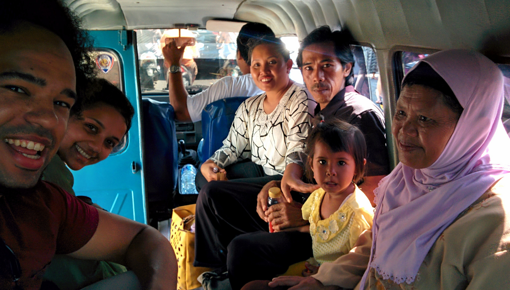
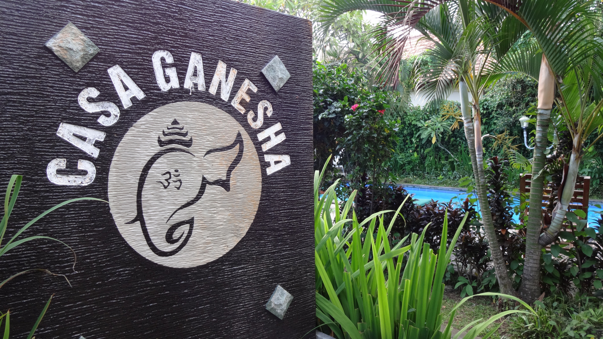
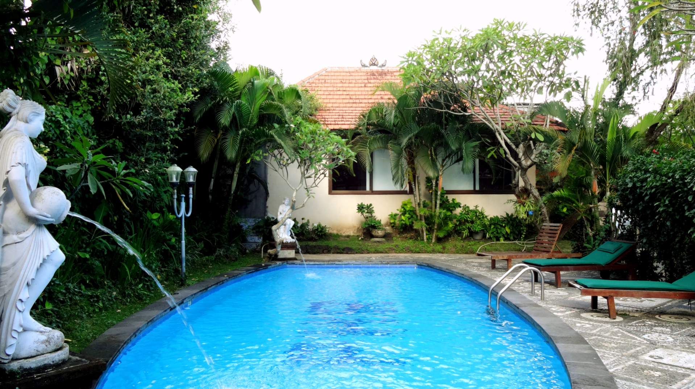
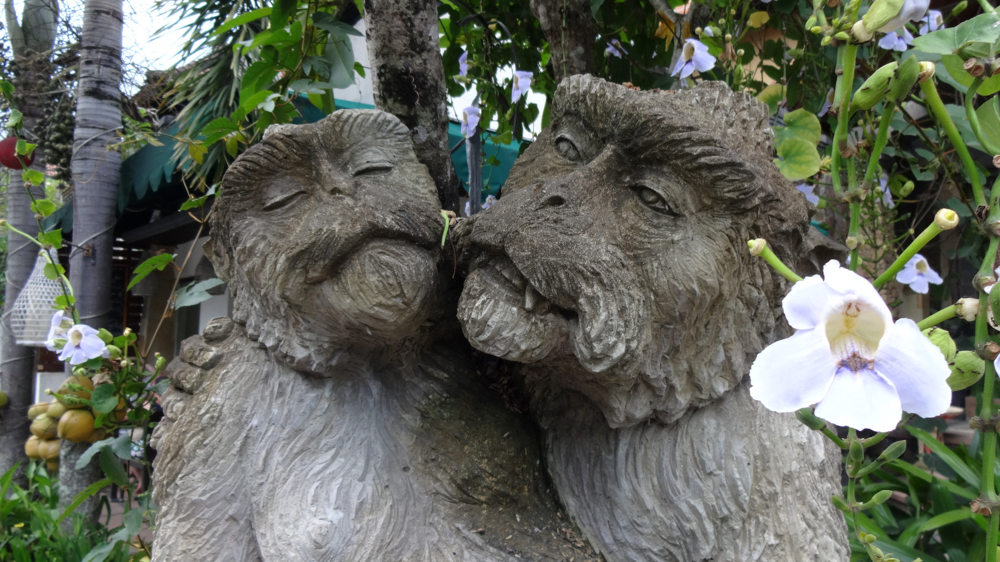
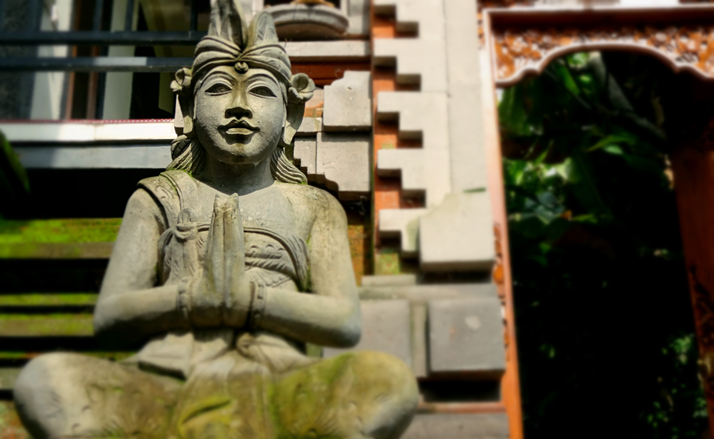
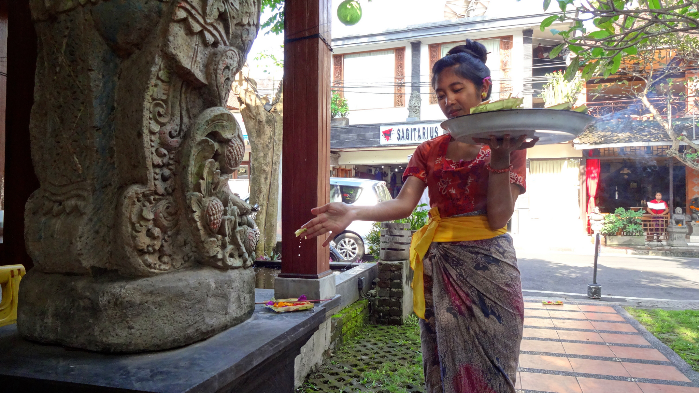
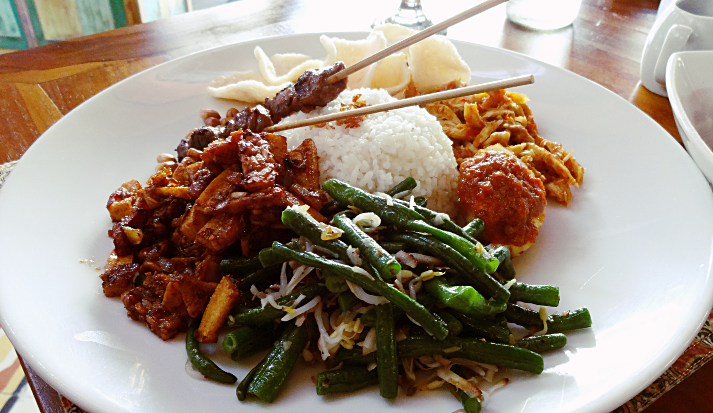

After the horrendous experience from [Mount Bromo](/posts/2015-03-when-tours-go-wrong-mount-bromo) we desperately clinged onto hopes that Bali would heal our negative minds. We settled on visiting Ubud for a week for some much-needed rest and recoup – we weren’t ready to take on the beaches just yet.

I’ve seen countless travel articles and blogs confessing a profound love for Ubud. Coincidently I’m reading Elizabeth Gilbert’s ‘Eat Pray Love’ – I’ve even waited till Ubud to read the last section!

It took 45 minutes to reach Ubud from Denpasar. We hitched a ride with a local family that were heading in the same direction.

Sharing our journey to Ubud with a local family

The closer we got to Ubud, the more beautiful the scenery became. We passed vivid green rice paddies, dozens of local handicrafts stalls and unique Balinese architecture.

There are plenty of budget accommodation options in Ubud. We stayed at the Casa Ganesha Hotel, the hotel seemed fairly new as we rarely saw anyone throughout our stay. The hotel had a pool and small library area; it was situated just outside the main tourist area so it was very peaceful at night.

Ubud is the creative heart of Bali. People around the world flock here to escape the hustle and bustle of ordinary living to find themselves.

_Why here?_

Well there is an array of yoga classes to join, organic food to devour and art courses to partake. Some come in search for a spiritual healer. Some indulge in the spas. Or rent out a motorcycle and explore the beautiful scenery.

There is plenty here to do.

There are many monkey statues around Ubud

You’d think with all these activities Ubud would be too touristy. Which is kinda’ true, but not as bad as I expected. People have to purposely make their way to Ubud – there are no beaches here. So those that come share the same purpose – to relax, be inspired or get creative.

I found Ubud to have a good balance of locals and visitors. The locals we met were always up for a chat, and it was great to have a conversation without the premise of being sold something.

Staff at Pondok Pundi restaurant present their daily offerings

Like most travelers we felt at ease with the Balinese culture. I wish I could say we participated in every single activity that came our way. But we didn’t. To be honest we were drained from the past few weeks of travelling. Especially after the Bromo fiasco we were struggling to pick up the courage to do anything else.

So instead we chose to relax and kept our itinerary free of sightseeing. We even extended our stay another week because we were so comfortable. It was definitely the right decision; we didn’t feel the need to take part in activities just for the ‘sake of doing so’ – where’s the fun in that?

Tasty eats – Nasi Campur at Pondok Pundi restaurant

Our stay also coincided with the Balinese New Years festival – Nyepi. I’ve explained more about this unique festival in this [post](/posts/2015-03-balis-day-of-silence-nyepi-festival-2015).

So, I too am an Ubud convert. This really is a beautiful place to experience, and I can see why people come to Ubud to work on one’s self. There is a spiritual connection here and plenty of things to do to escape the mundance lifestyle bogging so many people down.

I can see myself returning to Ubud on my own spiritual quest, but for now it’s time to rest which gives me more happiness than anything right now!
