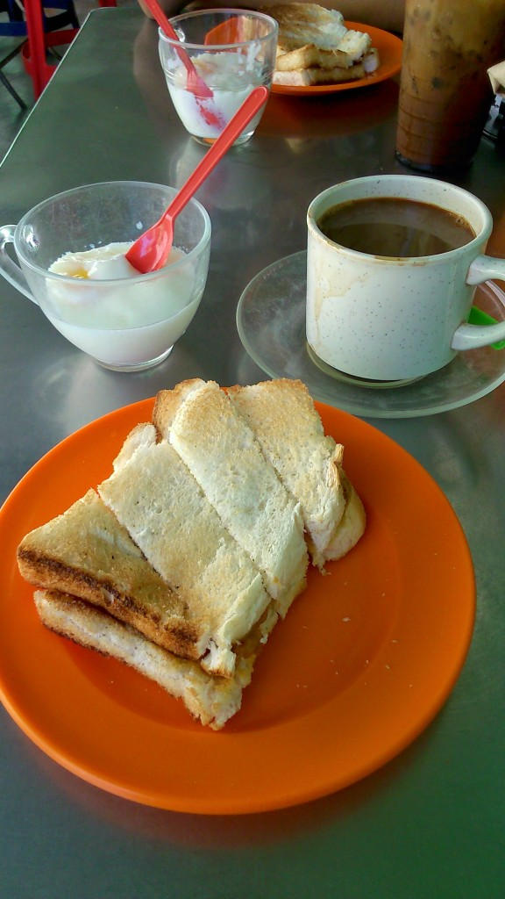
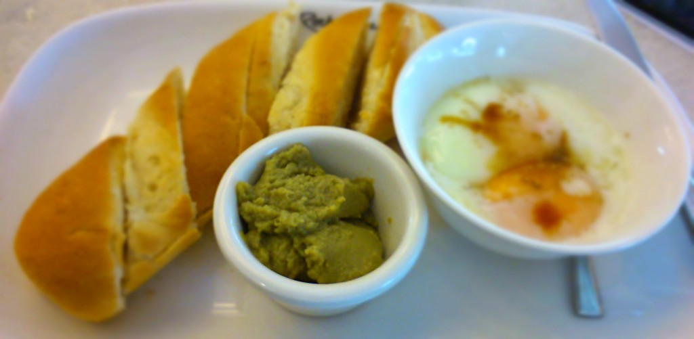
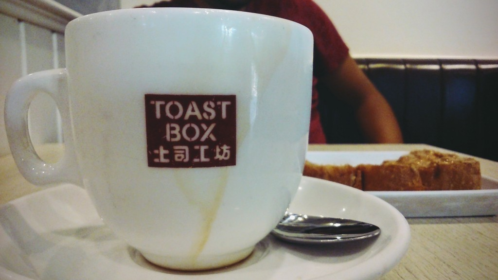

Described as a jam made from eggs, caramelized sugar, pandan leaves and coconut milk I present you one of my favourite things I’ve tried in Malaysia and Singapore: kaya.

I was first introduced to kaya in Toh Soon Cafe, Penang. What at first looked like a couple of pieces of toast with runny eggs turned into something so much more tasty with this preserve.

Trying kaya for the first time at Toh Soon Cafe

This delicious, creamy nutty texture is surprisingly not to sweet and works wonders with soft runny eggs, crispy toast and strong coffee. It’s not only perfect as a breakfast choice but also as a light-hearted snack during the day. I could actually eat this stuff _any time_ of the day and still be satisfied.

Hooked from the first taste I was thrilled to see kaya on the menus in the rest of Malaysia and Singapore’s popular kopitiams (cafes). It is usually slathered on pieces of toast with equal amounts of butter, but I prefer my kaya on the side so I can control how much I slab on my bread!

Enjoying my kaya separately in Singapore

This is wonderful stuff right here and one of the tastes I’ll be taking back home with me. If you haven’t tried kaya, then what _are_ you waiting for?!

Toast Box is a popular cafe to try kaya toast
