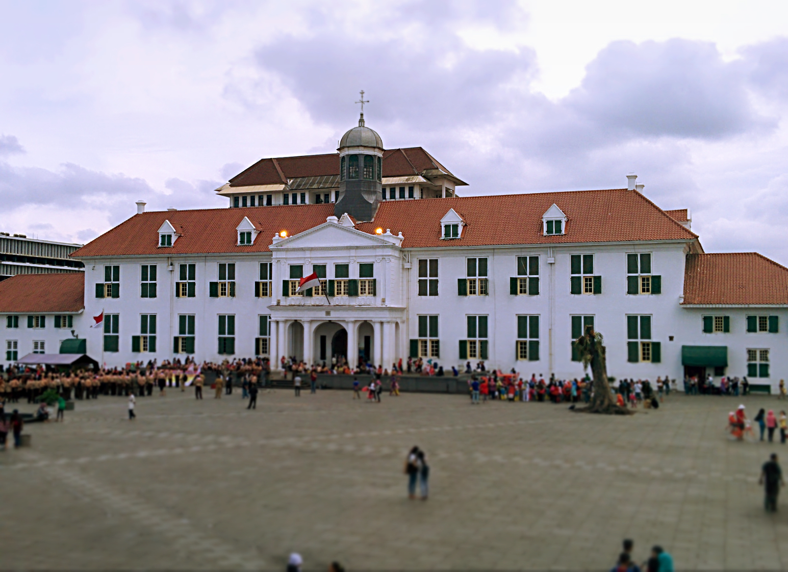
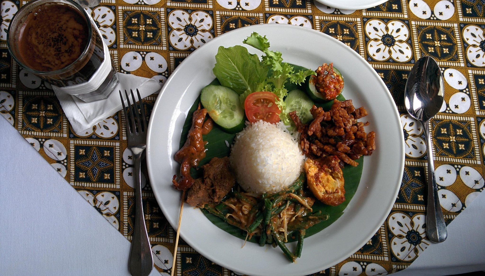

‘_URGH! – Don’t go to Jakarta, its awful!_‘

This is an all too familiar phrase from travelers regarding Indonesia’s capital. The irony though? Most of them haven’t even been….

Jakarta History Museum, Fatahillah Square

We flew into ‘dangerous’ Jakarta from Singapore. Whilst I enjoyed my time in Singapore, I was beginning to yearn the challenges of old school Asia and started to get excited about our visit to Indonesia. Unlike squeaky clean Singapore, Indonesia is raw and still developing.

Our stay in Jakarta was brief, only two nights. Having visited Bangkok I assumed Jakarta to have the same flair – rip off taxis, ridiculous traffic and dodgy characters. Whilst the majority of this can be applied to Jakarta there was one major thing I noticed which pushed aside my negative thoughts.

By the time we arrived at our hostel it was past 9pm. We arrived by taxi (which did overcharge us but got us to our accommodation safe) and started to get hungry. The staff recommended a local restaurant but to our disappointment we couldn’t find anything open around the area. Desperate to find something we continued on walking. We eventually found a 7-11 and stocked up on snacks and noodles.

It was past 10:30pm by the time we started walking back and usually we’d be feeling apprehensive walking around an unknown city so late. However we didn’t feel frightened or intimidated, because every person we walked past either smiled, waved or said hello. Literally anyone we passed by. Taken aback by the kindness of the locals we instantly felt at ease being in this city and safely made our way back to the hostel.

_So was the friendliness just a one-off?_ Nope.

The next day we ventured out again and met the same kind-hearted spirit from the locals. Kids would be running after us screaming hello, and the local women would wave as we passed by. It was surreal to experience the warm friendly vibes in comparison to the horror stories I’ve heard about this city.

Don’t get me wrong – Jakarta is by no means an easy destination to visit. The traffic is horrendous, and the unfinished pavements make walking a real challenge. There is a lack of eating options around the city, whilst the tourist sights are forgettable in comparison to what other capital cities offer. However, the friendliness of the locals surpassed all the inconveniences we encountered.

Trying Java coffee and a Nasi Campur at Batavia Cafe

Please don’t dismiss Jakarta because of its ‘supposed’ bad reputation. It is easy to understand why people don’t like this city – it’s not a place you fall in love with instantly. Having said that, if you do go and don’t enjoy it then at least you’ll have your reasons why – which is better than assuming like some people!
