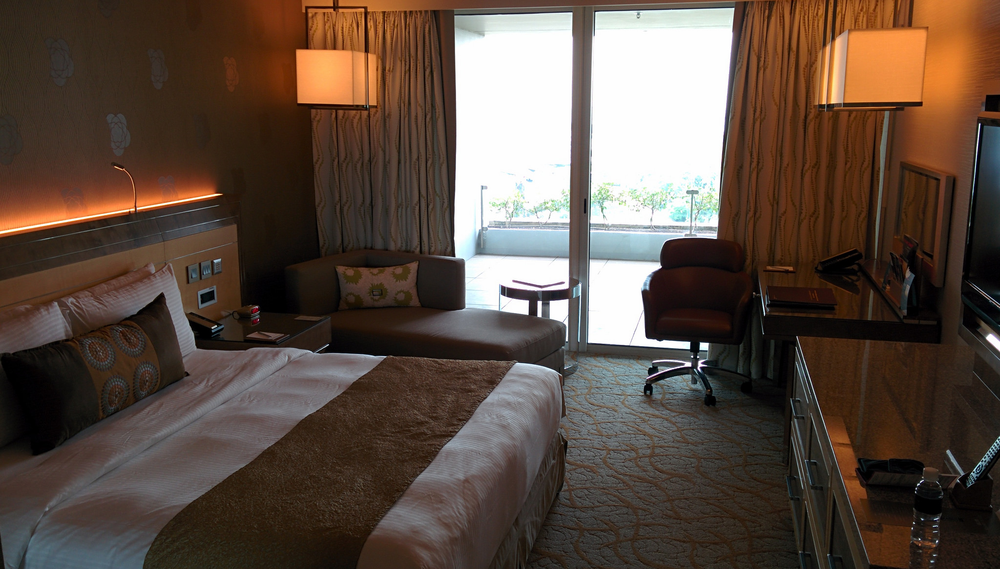
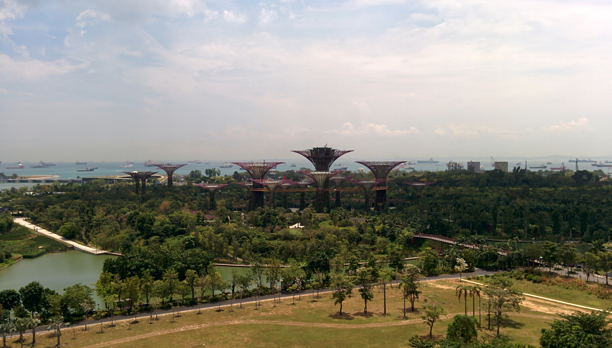
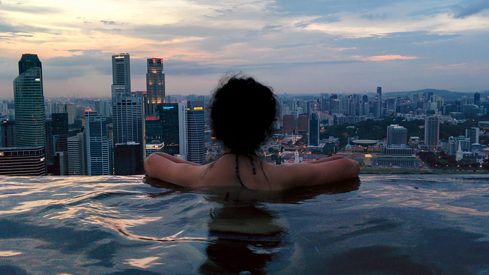
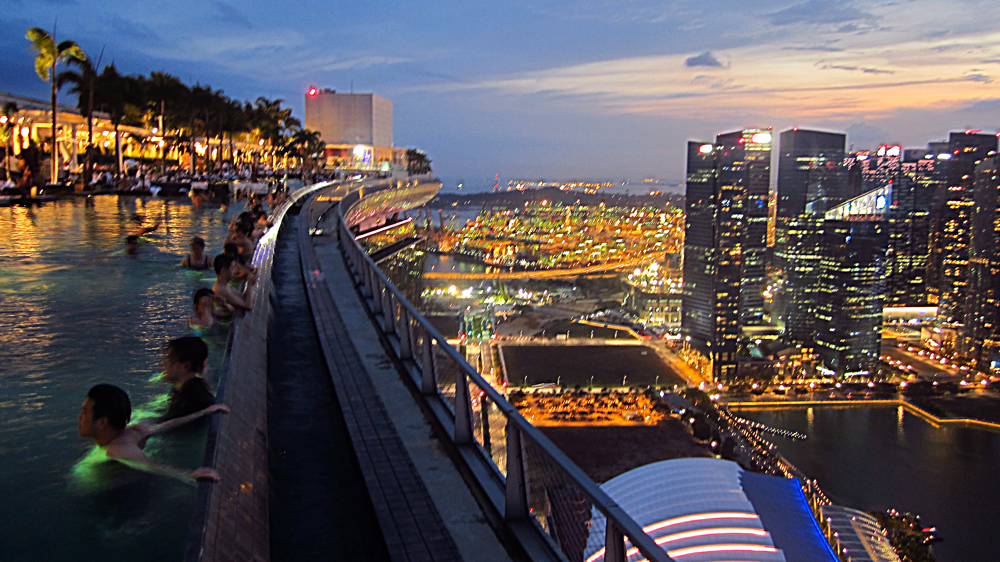
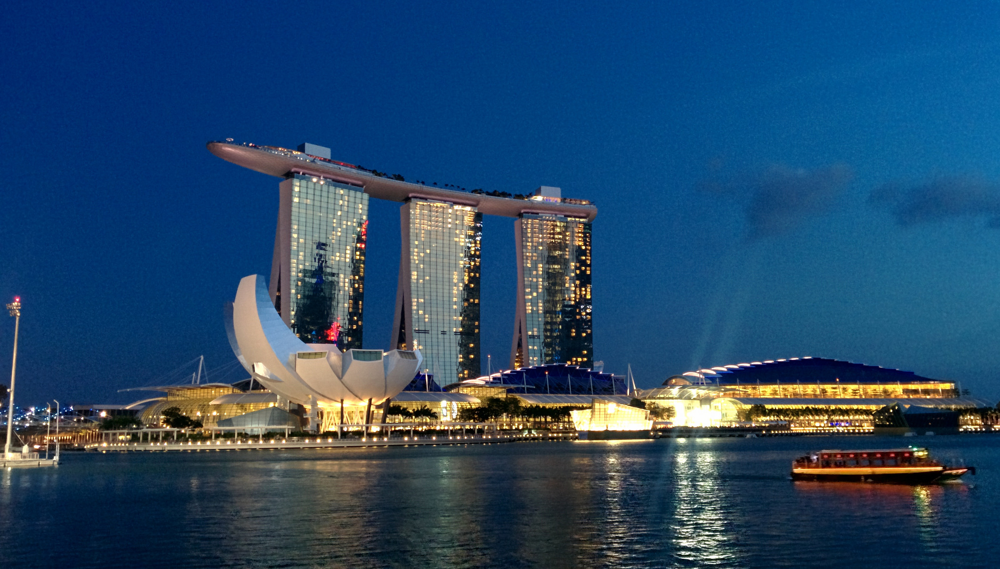

So far on our travels we’ve mainly kept to budget by staying in basic accommodation. However when we arrived in Singapore there was one expense we paid the price for – to spend one night at the Marina Bay Sands hotel.

Not only is the Marina Bay Sands hotel an icon for Singapore, it also homes the worlds famous rooftop infinity pool. I remember seeing a photo of the infinity pool in a travel magazine years ago and remember thinking, _I will go to Singapore in the future AND I’ll make it my mission to stay at this hotel!_

**What was it like?**

We checked in promptly at 3pm. Initially we worried that the staff would treat us indifferently, I mean we are backpackers after all – _maybe they would look down on us?_ Our worries were brushed aside by the friendliness of the staff who checked us in with ease.

Our room for the night

We knew our room would be decent, but wow! As soon as the door opened I immediately jumped on the bed and sunk into the luxurious duck feather duvet._It was bliss!_

The view from our room overlooked the Supertree Grove which from above, looked spectacular. We were overjoyed with the room and would have stayed inside if it weren’t for the other amenities!

The view from our room

Before seeing the pool we relished the opportunity to hit the gym for a quick session. Back home we were active gym goers so when we stay in a hotel with a gym we make the effort to go for a quick burn!

After a gym sprint we swapped our sweaty gear for swimwear and headed up to the top, just in time to catch the sunset. The infinity pool was definitely a sight to see, however I was taken aback at how many people were there! Undeterred by the crowds, we threw our towels on the nearest sun loungers and entered the pool.

The view from the infinity pool is incredible. Even more so when the sun had set and the city lights started to twinkle below us.

Incredible dusk views from the pool

We chilled in the pool for a few hours before we retreated back to the room. Our room rate didn’t include dinner so we ate at the large food court in the shopping mall. The food court has a variety of food choices which are also budget friendly!

In the evening we ventured back to the top, first to see the views from the observation deck followed by a few drinks at KU DÉ TA. The lounge next to the pool had a swanky but unpretentious vibe. There is a dress code but it wasn’t strictly enforced. There were many people wearing flip-flops (including ourselves) which didn’t present a problem, though it’s worth wearing your cleanest/smartest clothes!

Drinks prices were of course high (_talking $16 for a beer!_) but Kyle wanted to go a step higher and buy a bottle of champagne! _(Kyle had completed a big work task which is the reason for the splurge, we’re by no means regular drinkers of expensive fizz!)_

Smiles all round!

We spent several hours sipping champagne and grooving along to the DJ before we called it a night. It was definitely a day and night to remember!

**So, is it worth spending the night?**

Er, YES!

A lot of people place much emphasis on how expensive it is to stay here. Of course it is pricey, it is an opportunity to experience a wonderful hotel with world-class facilities.

The hotel’s website shows availability and prices so if you know in advance that you’re visiting Singapore it may be ideal to save a bit on the side. We don’t know when we will next visit Singapore, and we knew before our travels that if we did reach here that we would pay to experience a night at the Marina Bay Sands hotel.

**Can you still access the infinity pool if you aren’t a guest?**

Only hotel guests have access to the infinity pool. As we were checking out a random guy approached us and begged us to part with our room card so he could see the infinity pool. As the card was linked to our credit card we declined and asked why he didn’t stay the night. His response – _‘because I can’t afford it’._

Having experienced a wonderful stay here I empathized with him but understood why non-guests aren’t allowed to the infinity pool. The infinity pool remains exclusive for those that pay, and even though it gets busy it is well maintained by staff and security. Imagine how busy and loud it’d be if everyone is allowed to go up? I can imagine it would pose as a safety risk and be a pretty unfair experience for those that have paid.

Yes, the Marina Bay Sands hotel comes at a price, but with this comes a range of luxury and comfort. The experience for us will always be one to remember. We had a fantastic experience and feel like the price reflected the quality of the experience.

Marina Bay Sands – amazing both inside and out
