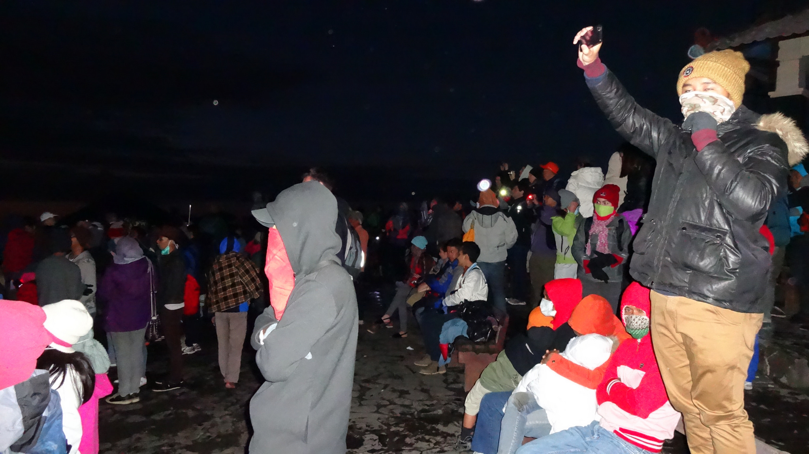

We popped into a tour operator in Jogja and booked a 2 day/1 night tour to Bali via Mount Bromo. Seeing as we were travelling to Bali we thought we were being savvy with a quick detour to Bromo. Looking back, I wish we had put more effort into our decision.

Here’s why…

The day started well. The minibus arrived on time at our guesthouse. We spent most of the day on the minibus travelling to Probollingo. There was a couple of rest stops throughout the journey including lunch. Apart from the heat (and lack of air conditioning) the journey was pretty straightforward.

We arrived in Probollingo around 6pm and were greeted by several staff members. During the briefing about the tour we noticed another option to visit Ijen crater. After speaking to the other travelers (who were going to Ijen) we wanted to adapt our tour to include Ijen. We knew that there’d be an extra charge to include Ijen on our tour which wouldn’t have been an issue.

However the staff thought otherwise. After communicating our proposed change we were informed by staff that a ‘cancellation fee’ of 350,000 IDR would be required to cancel the bus to Bali, plus an extra 300,000 IDR to include Ijen.

Shocked by the ridiculous ‘cancellation’ fee we explained that our seats to Bali have already been paid for – the bus will still leave regardless of us being there or not. _But noooooo_. Our explanation was falling on deaf ears. According to one staff member the cancellation fee was for the ‘bus’. As tempers began to flare I asked how many people are travelling on the bus – I assumed no more than 4 people in order for the bus to be cancelled.

_‘ 52 people are on the bus’_…. 52?

52?!?!?! _There is NO way a bus carrying 52 people would cancel because 2 people didn’t show up._

We literally debated for about an hour. Even the other travelers pitched in and told the staff they were charging too much. But we were getting nowhere. It got to a point where we got so exhausted that we threw the proverbial towel in and dismissed Ijen altogether.

After our fiasco we returned back to the minibus which took us to our hotels. The journey took another couple of hours, and by the time we reached our hotel it was pushing past 9:30pm. This wouldn’t usually be a problem, but on this occasion we needed to be up at 3am for an early start at Mount Bromo. It really didn’t help staying in a cold, insect infested room either.

_But hey, I guess it was just a bad day. It’d be better tomorrow yeah?_

We woke up at 3am feeling cold, miserable and lifeless. However we persevered and made our way to the pick up area; there were a couple of 4x4s waiting so we clambered inside one.

_‘Hey get out of there this 4×4 isn’t for yo__u!’._ Confused and annoyed I marched up to the front desk and demanded to know what was going on. After a couple of frantic calls it turns out we were ‘forgotten about’ and had to wait a further 20 minutes for pick up.

It finally arrived

The 4×4 eventually turned up and we were quickly ushered inside. We squeezed into the front seat and finally set off. The 4×4 snaked its way around Mount Penanjakan and dropped us off in the midst of countless 4x4s. It may have been 5am but there were hoards of people around, all flocking to see the sunrise like ourselves.

People. Everywhere

As you can imagine it was pretty difficult finding a decent spot – the deck was rammed with people. It took a while but we managed to squish ourselves in a spot in time to see a wonderful sunrise – so beautiful even that the past 24 hours felt like a distant memory.

Once the sun had risen we retreated back to our 4×4 where we headed to Mount Bromo. It was a short ride away and soon as we arrived there was yet again a sea of people, more 4x4s and strangely horses. We soon realised that the horses were brought in for a reason when we were approached countless times by men offering a ride to the top.

We walked through the dusty landscape, dodging horses on the way up. To ascend up the volcano there is a set of concrete stairs. Just before going up I purchased a flower offering for 20,000 rupiah. They’re used as offerings to the volcano and include personal wishes!

It took a while to get to the top as there are plenty of other people doing the same thing, but we rewarded with an incredible sight.

About to throw my flower offering into the crater

Having accomplished the morning agenda we made our way back to the 4×4 and returned to the hotel. Things improved at the hotel where a decent breakfast was provided for us. We were able to rest for an hour before the minibus arrive to take us back to Probollingo. So far our flower offering was dishing out the luck we needed! But this soon stopped when we saw our connecting bus at Probollingo.

Remember earlier on in this post I wrote about the drama about the bus ‘cancellation’ fee we had to pay if we wanted to change our plans? The bus that would have had to be cancelled if we didn’t show up? Well it wasn’t even a private minibus – it was a local bus.

_That doesn’t so bad though? Okay.._I wouldn’t use the word ‘bad’. Diabolical would be more fitting.

_If_ it wasn’t for the driver stopping every 20 minutes for a ciggy break (no lie) the continuous stream of noisy buskers onboard, or the copious amount of cigarette smoke (courtesy of the locals) filling the humid atmosphere on the bus – MAYBE the journey would have bearable.

_But no._

_I__t. Just. Wasn’t._

We boarded the local bus at noon. _15 hours_ later we arrived in Bali. That’s right. 1-5-hours.

We arrived at Denpasar bus station at 3am in the morning. _And the real joke?_ The bus didn’t arrive at the right bus terminal, which forced EVERYONE to take a taxi to their destination or remain stranded till the morning service began.

So to put it bluntly – we had a pretty crap experience. Thankfully our lucky flower offering kicked in and we found a cheap hotel to sleep for a few hours before we planned our next movements.

It’s going to take a few days to get over our ordeal. After all this, I really hope Bali is worth it!

_Our tour was booked with Nirwana Tours – please don’t make the same mistake as us!_
