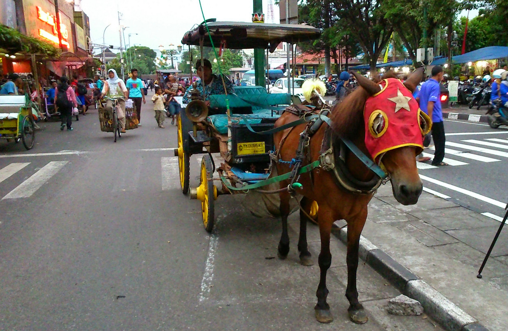
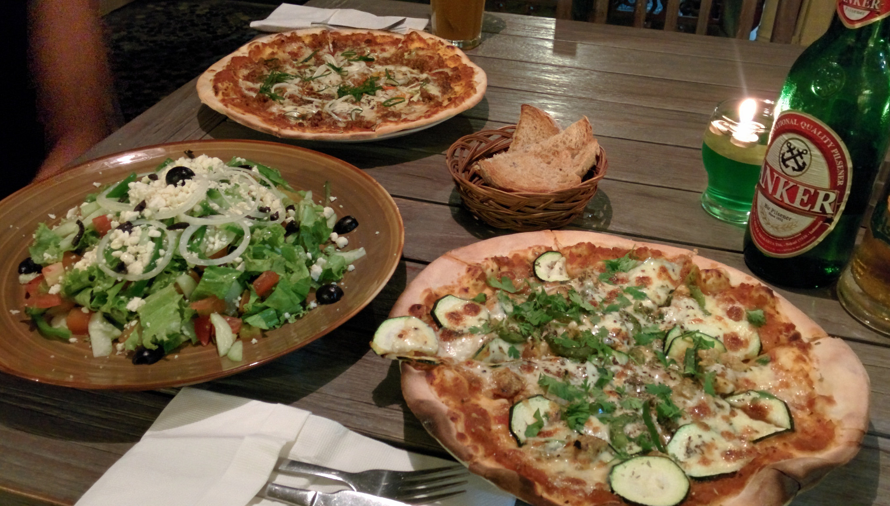
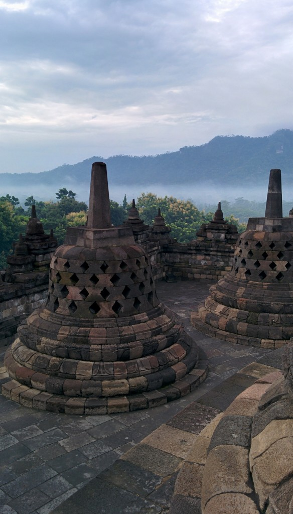
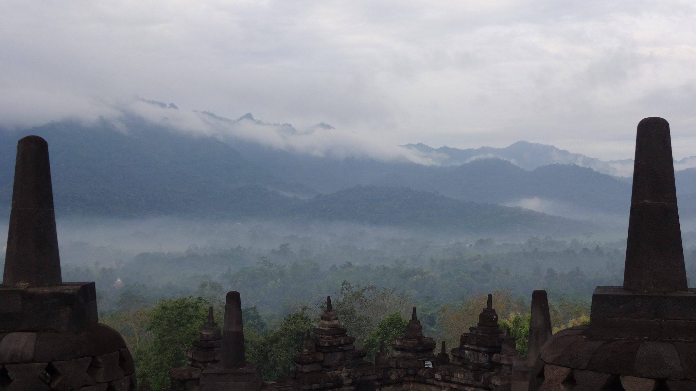
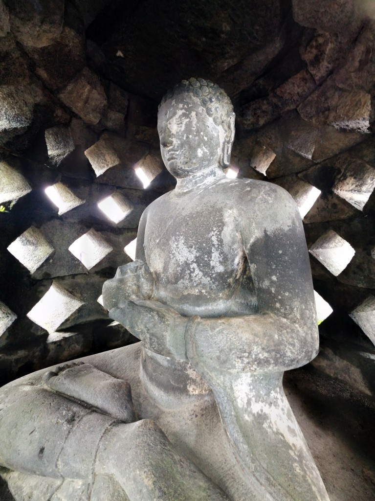
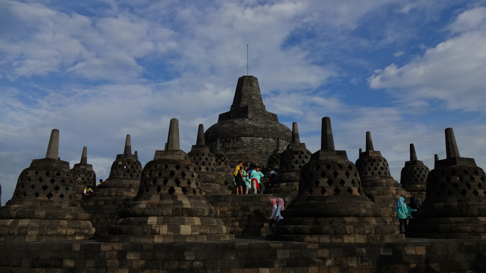
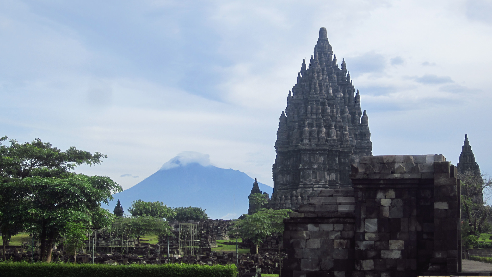
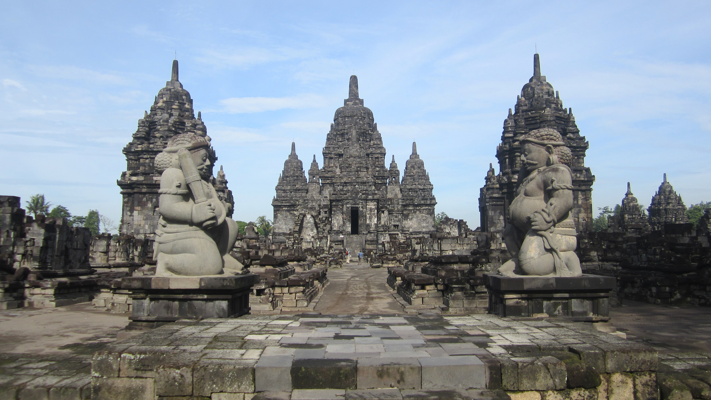
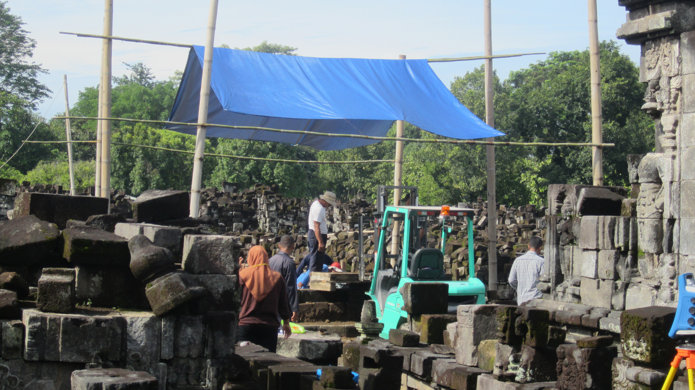

Pronounced Jogjakarta and commonly called ‘Jogja’ or ‘Yogya’ is Indonesia’s thriving cultural scene. Visitors can get involved in an array of activities ranging from traditional music, batik art and handicrafts. Interestingly it is also the only city in Indonesia where a sultan still resides (and even recognised by the Government!)

We arrived in Yogyakarta by train from Jakarta. The train departed around 9am and took around 7 hours.The city is relatively small but easy to navigate – especially if you can ride a motorcycle. We stayed at Sae Sae Guesthouse which (like most accommodation around) offered motorcycle hire.

Horse and cart around Jogja

The food in Yogyakarta is cheap, abundant and very tasty. My favourite had to be beef rendang at a local restaurant. Stupidly I forgot to take my camera so I have no photos of the dish, but it was absolutely delicious and only costed 12,000 IDR. There is also a variety of Western restaurants (particularly Italian) around so there’s plenty of choices available.

Enjoying some decent pizzas at Mediterranea restaurant

The main reason we came to Yogyakarta were to visit Borobodur and Prambanan temple. Both of these temples are UNESCO World Heritage sites and about an hour’s drive from the city. We were informed by other travelers that the best time to visit would be dawn. As we rented a motorcycle all we needed to do was set our alarms and wake up on time, easier said than done!

We woke up at a gruelling 4:30am to set off to Borobodur. Fortunately the traffic was minimal at this time and the journey took just over an hour before we reached.

Borobodur is one of the world’s largest Buddhist temples which predates to the 9th century. The temple is located on a hill-top overlooking the jungle. Thinking we were ahead of the game, we were shocked to see a littering of children at the temple – on a Saturday, at 6am.

There’s no denying the beautiful scenery

There is a Buddha statue in each of the ‘bells’

Unfortunately it went downhill from there. We couldn’t walk more than five steps without being stopped by children for ‘selfies’ and to practice their English. I couldn’t count how many groups were there, but the amount of noise from the children distracted us from enjoying our time here.

Stunning backdrop minus the children!

The views were spectacular but due to the amount of noise and crowding we left after an hour.

We jumped back on the motorcycle and made our way to Prambanan. Unlike Borobodur, Prambanan is the largest Hindu temple in Indonesia. Thankfully there weren’t as many people at the site so we were able to explore the grounds freely.

Restoration working is still ongoing

Unfortunately many of the temples have been heavily restored and although I saw some beautiful architecture I couldn’t help but compare them the ruins to Angkor Wat in Cambodia. _Which in all honesty, Cambodia wins on that…Sorry._

Although our experiences at Borobour and Prambanan didn’t go to plan, we enjoyed our time in Yogyakarta. We met some really cool people at the guesthouse and overall enjoyed the laid back atmosphere here.
