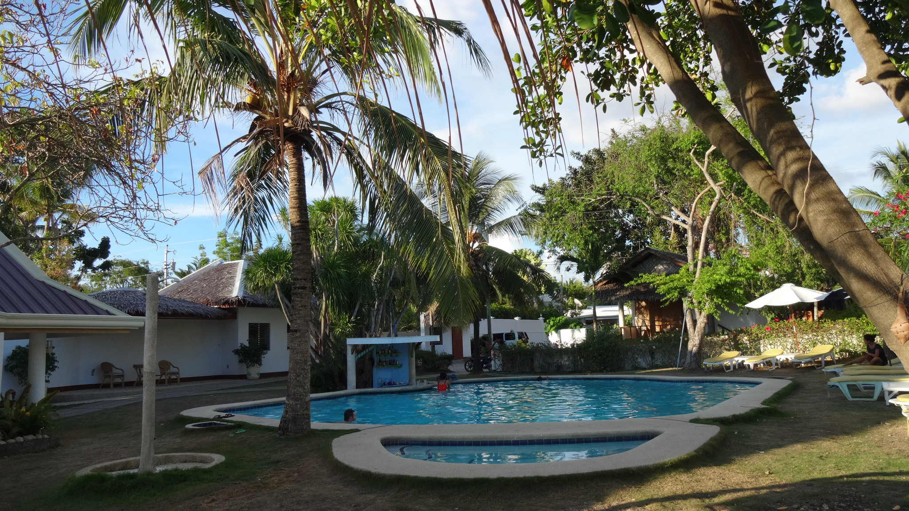
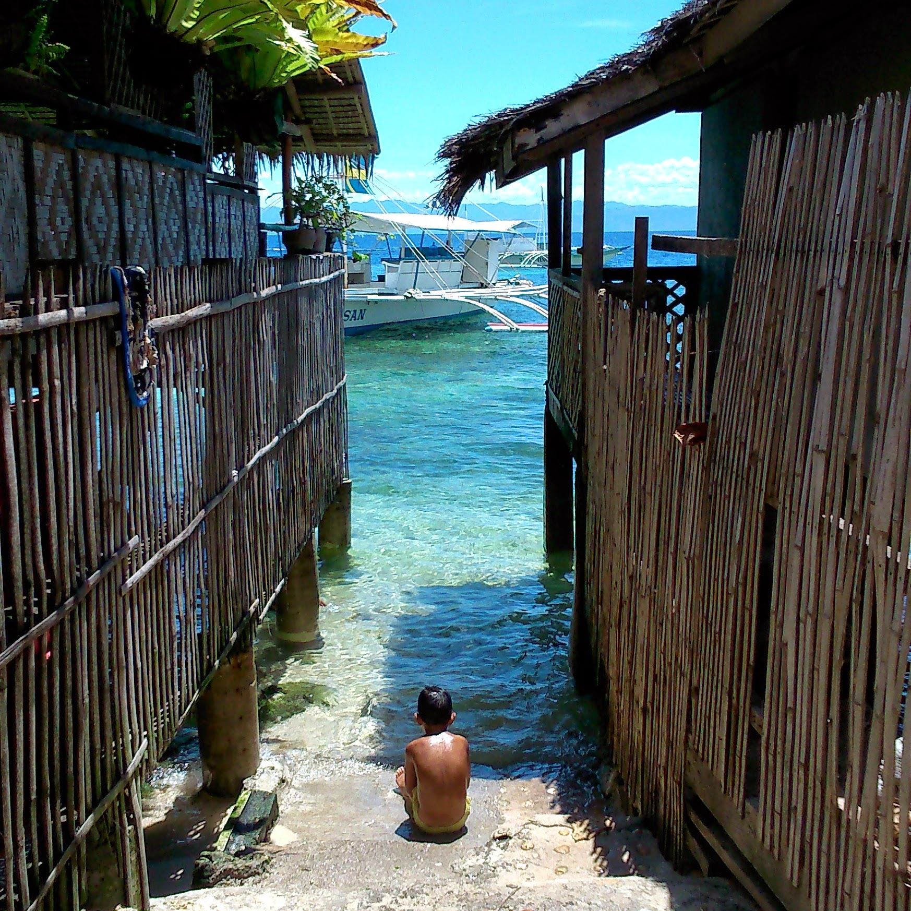
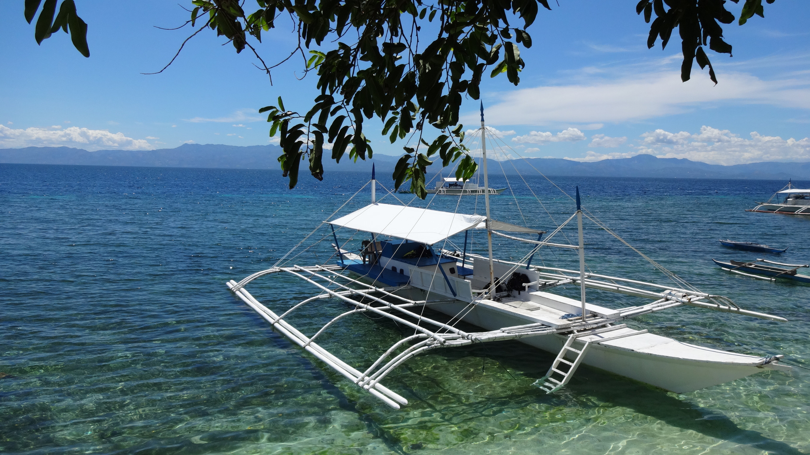
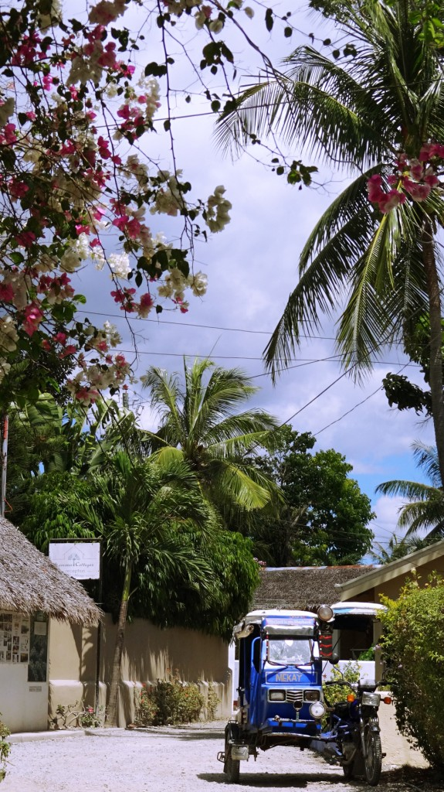
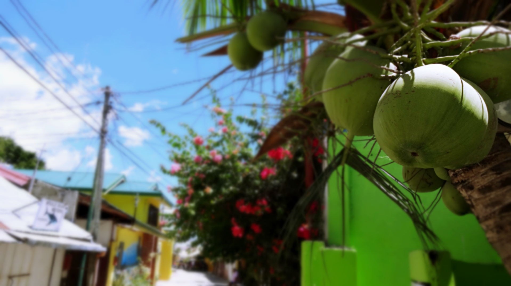

It’s super easy to get to Moalboal from Cebu City, so we planned a weekend break during our stay in Cebu.

From Cebu City we headed to the South Bus terminal and waited for the yellow Ceres bus to Moalboal. It gets very busy on weekends and we were queueing for at least hour before we boarded. Be ready to push your way on though because it is literally first come first serve – and people will barge you out the way to get a seat! We were fortunate to grab a couple of seats but I did feel sorry for those that had to stand for most the journey. It take around 3 hours from Cebu City to get to Moalboal.

We stayed at the Quo Vadis Dive Resort, the rooms were basic but comfortable enough for a couple of nights. The biggest highlights were the swimming pool and gorgeous sea views.

Pool at Quo Vadis Dive Resort

Our time in Moalboal was short so Kyle did some diving whilst I explored the local area. I only had to walk a couple of minutes from the resort to find such stunning views.

It was literally breathtaking. I sat under the tree shades for an ages, just so I can absorb the picturesque scenery before my eyes.

After my sunny ventures around, I met up with Kyle later to watch a wonderful sunset. Moalboal certainly lives up to its reputation, it was gorgeous!

There are several food options around Moalboal but don’t expect anything too fancy. On our first night it took an hour for half of our food order to arrive at the Arista restaurant – and we were impressed with what came out either! After several recommendations we found Lantaw restaurant which provided us with a decent meal (the staff were real sweet too).

Chicken Adobo, Lantaw Restaurant

Moalboal proved to be a successful weekend away; it was such a scenic, chilled place. If we had more time we would have ventured to Panagsama beach, however being on limited time I’m glad to have seen another wonderful pocket of beauty in the Philippines!
