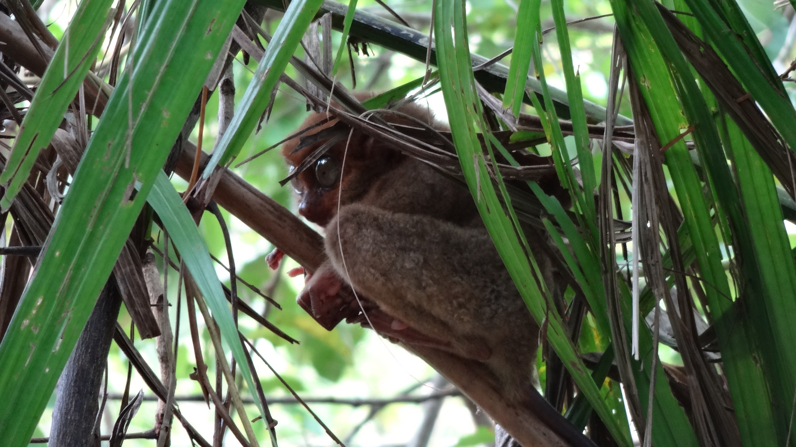
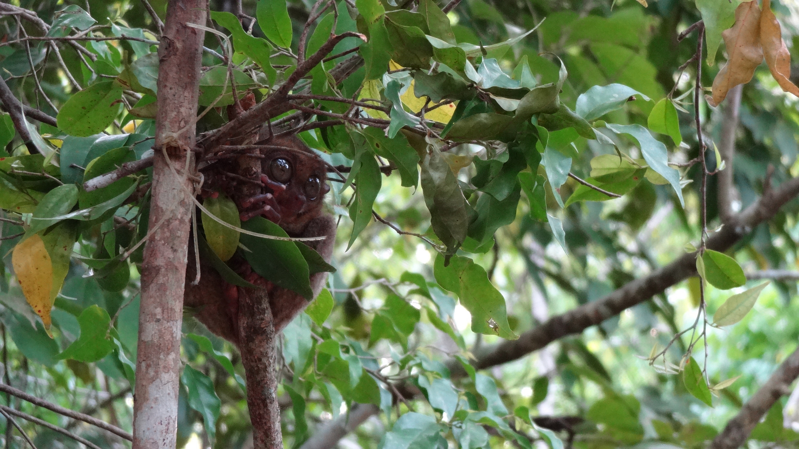
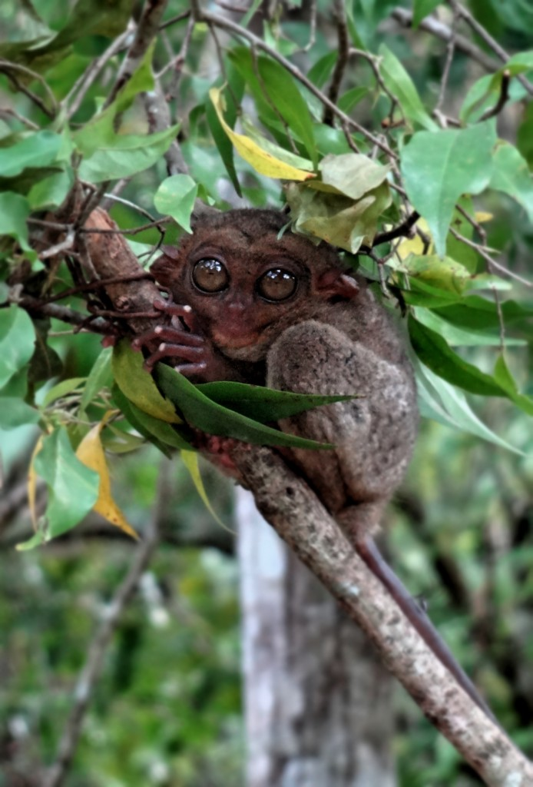
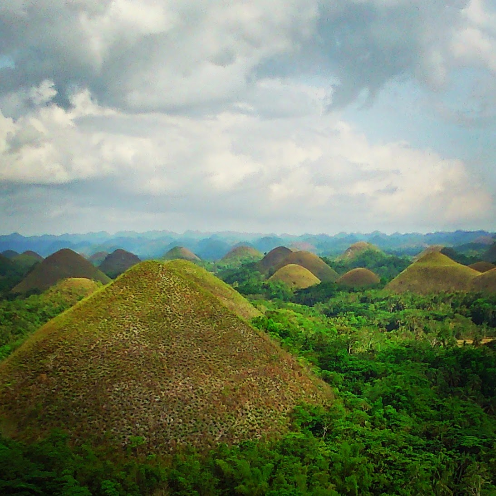
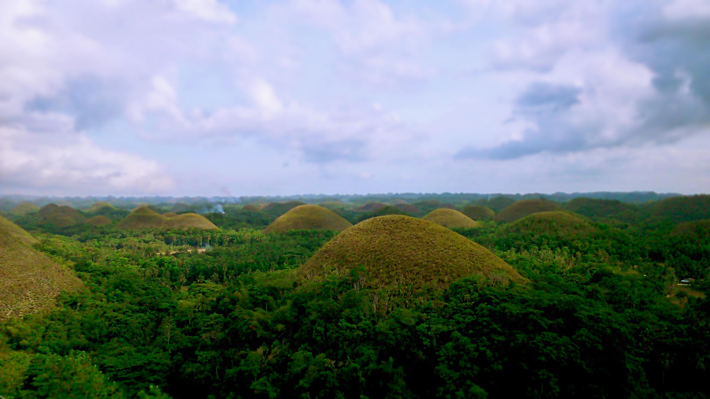
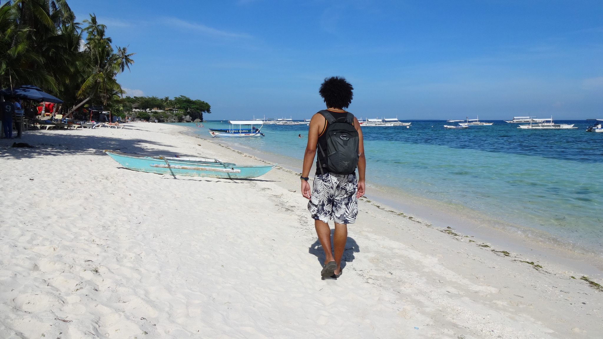
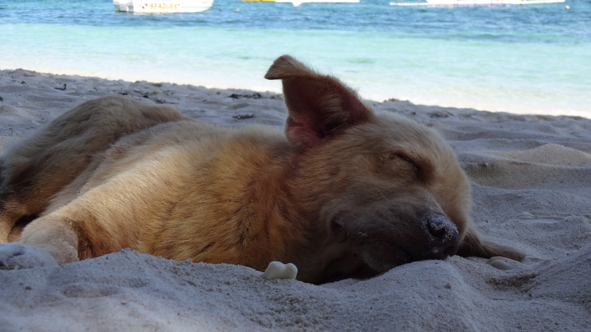
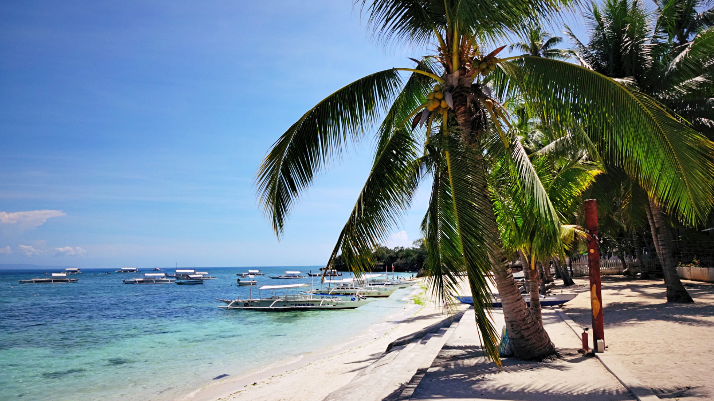

Bohol is only a 2 hour ferry ride from Cebu. There is no reason not to visit this wonderful island; it is brimming with natural wonders to entice even the fussiest of traveler.

There are plenty of activities to get involved in and around Bohol but for me there were 3 main things I wanted to see.

We only stayed in Bohol for 4 nights, but regardless of how long you stay be sure to include these on your list!

**1. Philippine Tarsiers**

The tarsiers are very unique animals. They have inhabited the rainforests for 45 million years and are one of the oldest species still in existence in the Philippines. Tarsiers are normally nocturnal but can be active around dusk and dawn. They are one of the smallest primates in the world and are no bigger than an adults’ hand.

One of their most distinguishable features are their eyes which weigh more than their body! It is said that Steven Spielberg’s creation E.T. was inspired by the tarsier – and it’s easy to see why.

It is important to visit the right place to see the tarsier – ideally the Tarsier Conservation Area. DO NOT visit caged Tarsiers – they are illegally captured and kept in awful conditions. Tarsiers are stress prone and have been known to commit suicide as a result of this (they kill themselves by bashing their heads against the cage…poor things).

As soon as we spotted our first tarsier I fell in love with their beautiful eyes and fragile nature. They are very delicate creatures be mindful of your movements and don’t use flash on your camera!

**2. Chocolate Hills**

The Chocolate Hills are an unusual geological formation found in Bohol province. There are over 1000 conical mounds varying in size. Geologists have not yet reached a conclusion on how they formed, however there are 3 legends about these hills to choose from –

-   The Fight – legend tells the epic fight between 2 giants involving rocks and boulders. The giants exhaust themselves fighting, and eventually become friends. They leave without sorting out their mess – which inevitably become the Chocolate Hills
-   The Romace – a giant named Arogo fell in love with a simple mortal named Aloya. However her eventual death caused Arogo a lot of grief. His sorrow led to many tears, tears which dried and became the Choloate Hills
-   The Thief – a giant carabao (water buffalo) was causing misery to the local folk by eating all their crops. In retaliation the local flock gathered all their spoiled food for the carabao. The carabao came and ate the food but suffered the consequences and defected everywhere. The mounds of faeces dried up causing guess what? Yup, the Chocolate Hills

The Chocolate Hills were more ‘minty’ when we visited; dry season is the best time to go to see them in their chocolatey-brown glory.

**3. Visit a Beach or Island**

It goes without saying that the beaches in Philippines put most of South East Asia’s to shame! There are a variety of beaches and plenty of islands to visit in Bohol, so just take your pick and go.

I particularly enjoyed Alona Beach. It’s one of the more popular beaches in Bohol but retains the simplicity and charm of a relatively quiet beach. It’s a great spot for snorkelling or diving, or to simply relax and bury your feet in the silky sands!

