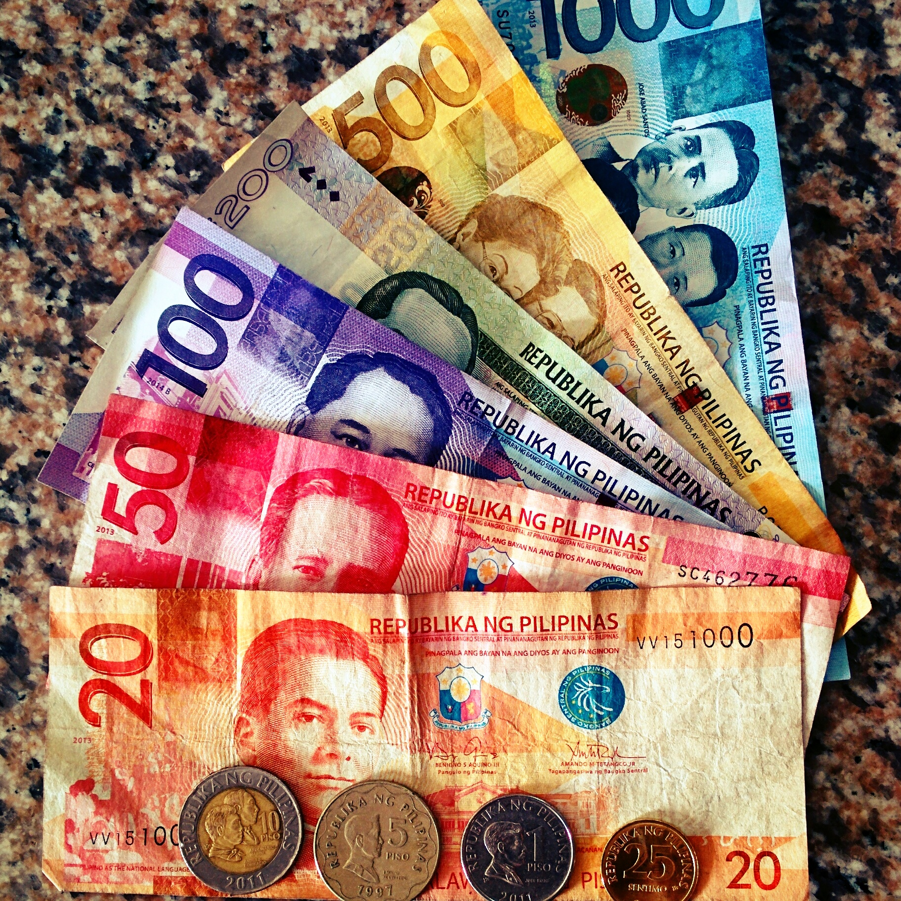
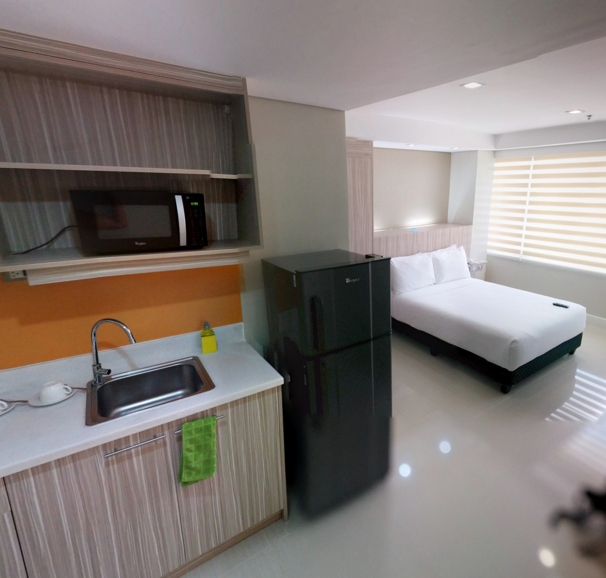
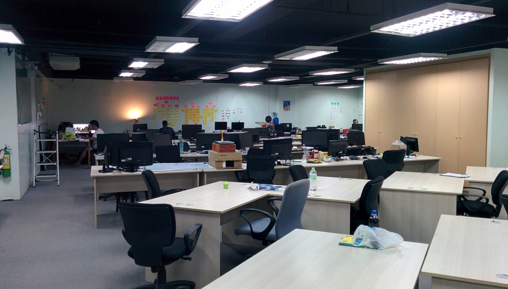
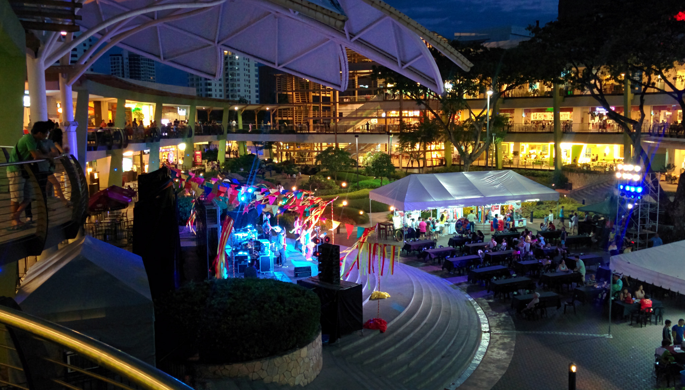
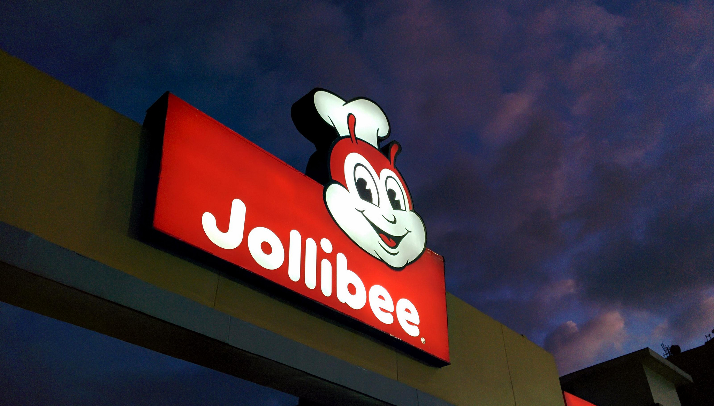

We start off our Filipino adventures in Cebu which is located in the Central Visayas. Cebu is the 2nd largest city in the Philippines.

Love how colourful the currency is!

Kyle had a few work commitments to catch up with so we visited Cebu first as we knew there were coworking spaces available.

Cebu is also a great base to explore beaches, nature and wildlife. Cebu has one of the country’s busiest ferry ports with regular vessel services to nearby islands and longer distant routes to islands such as Manila.

Our apartelle room at Alicia Apartelle

We stayed in Cebu for two weeks in total. The internet in Cebu (and probably the rest of the Philippines) is pretty poor. Even when we purchased SMART sim cards the internet signal was pretty much non-existent! Thankfully the internet at [The Tide](http://www.thetidecebu.com/) coworking space was decent so we managed on by.

The Tide coworking space, Cebu IT Park

Cebu is in the middle of an economic boom; there are plenty of construction projects around the city ranging from shopping malls, business centres and luxury apartments. I was taken aback at the amount of development happening in Cebu. Most of it seems very upmarket and dare I say, _rather fancy_. It’s a stark contrast amidst the poverty, which is an aspect that is sadly being overlooked.

Friday night at Ayala Shopping mall

When one of the main attractions in Cebu is the Ayala shopping mall, I question how far consumerism will go where Cebu will just become another ‘carbon copy’ city overwhelmed with more malls than residents can handle.

Another major thing I’ve noticed here is the presence of fast food culture. It’s everywhere. Chains such as Starbucks, McDonalds, KFC, Pizza Hut, Krispy Kreme, Chow King, Jollibee plague the streets and shopping malls.

Fast food is an unhealthy food option; but here it feels like the ‘norm’ to regularly eat out. I feel that the people here see these commercial chains as a means of ‘fitting in’ and spend an unnecessary expense at doing so.

You will see this logo everywhere

We struggled with the lack of food options but found a supermarket to stock up on noodles and simple meals. Getting around Cebu is very easy, there are plenty of taxis and jeepneys which are simple to flag down.

We don’t mind city life, however after two weeks staying here we’re beginning to get itchy feet and want out of the city. There are over 7,000 islands in the Philippines but we’ll only be visiting 3 of them. We only have a month to explore the Philippines so we best get a move on!
