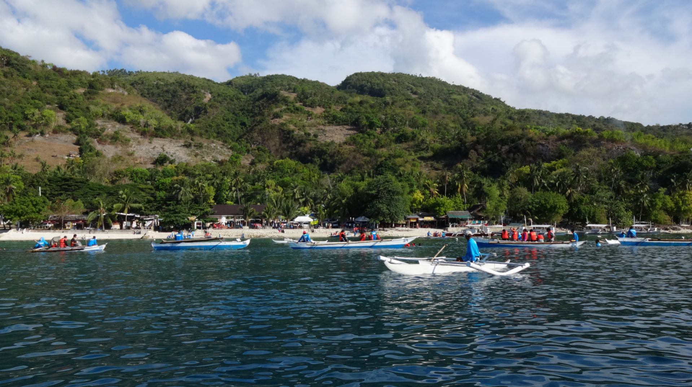
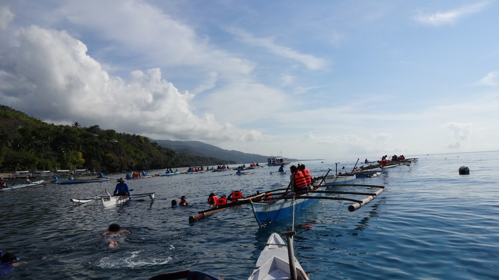
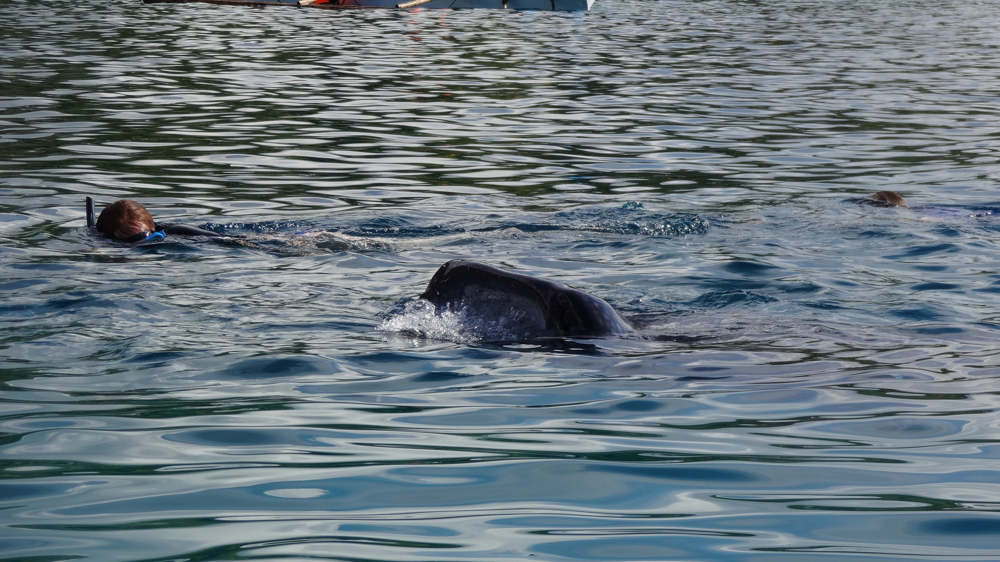
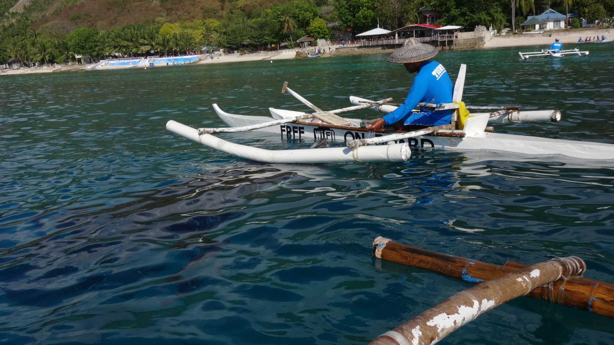

During our stay in Cebu we were recommend many times by locals to visit Oslob to see the whale sharks.

We weren’t really that keen to visit at first because we didn’t know whether this activity would be worthwhile.

We only decided to go last-minute because we went back to Moalboal for another weekend break (yes we liked Moalboal that much we went back again!). We aimed to visit Oslob and Kawasan Falls on the morning we checked out, and then return to Cebu in the afternoon.

I’d like to say that we had a good time but quite frankly: we didn’t. Here’s why.

**Early Start**

We were up at 4:30am to catch the 5am bus to Oslob – we were pretty grumpy but it could’ve been worse. If you’re travelling from Cebu then be ready for a long journey – you’ll need to get the 2am bus!

It takes around 3 hours from Moalboal to arrive in Oslob. We didn’t need to worry about connecting buses as the local drivers are well aware of the amount of tourists going to Oslob so we were always pointed in the right direction.

We arrived around 8:30am and the site was already busy. It was pretty straightforward buying tickets\* and before long we were queueing for the boat. _\*The price for foreigners is significantly more than the local fee – around 500 pesos for whale watching only and 1000 pesos to swim with snorkel gear._

The good thing about the boats is that they are rowed by the crew (i.e. they don’t have engines). However the inside of the boat hadn’t been cleaned for some time – there were pieces of trash floating around in large dirty puddles.

My real gripe was the sheer volume of people. There were literally boat loads of visitors all positioned in the same line. As our boat ‘queued’ for an available space I knew that we were in for a dull time.

**Seeing the Whale Sharks**

There is always a guarantee of seeing whale sharks for the following reason – they are steered around the boats by fishermen feeding them. I wish I could say there was more to it than that. But there isn’t.

No one is allowed to come as close as 4 metres to the sharks. However I don’t think this gets enforced much, and to be honest it’s very difficult to. All the boats are cramped next to one another, whilst most people’s concerns don’t involve the whale sharks, but rather how good of a ‘seflie’ they can get with them.

So to summarise it? We paid for an experience lasting 30 minutes to see a fisherman feed a whale shark in circles, with mounds of people splashing around in vain for a quick photo frill.

This is definitely not ethical or sustainable, and for that I do regret going. However I have heard that Donsol is another is one of the best place to see whale sharks properly, so we’ll definitely bear this in mind next time.

**‘Kawasan Falls Please’**

We left Oslob at 10:00am. The next part of our plan were to visit Kawasan Falls. When we got on the connecting bus we informed the ticket guy to tell us when to get off. He agreed and wandered off. _Sorted. Or maybe not._

In all fairness it was probably wasn’t his fault. As usual the bus got very crowded and as a result of that we were forgotten about. I only noticed that we missed our stop when I saw a sign for Moalboal!

The ticket guy realised his error as he passed back our way again. His face dropped. He was speaking Filipino to the other passengers, and judging by the looks on their faces I could see their pitiful expressions of ‘_oops’_. We actually found it quite hilarious though and just laughed it off. Maybe he did us a favour!

We concluded our un-eventful morning with a McDonald’s and a 100 peso trike ride back to the hotel.

_I wish I would end it more gracefully than that, but yeah. The end? Meh, I need a nap…._
