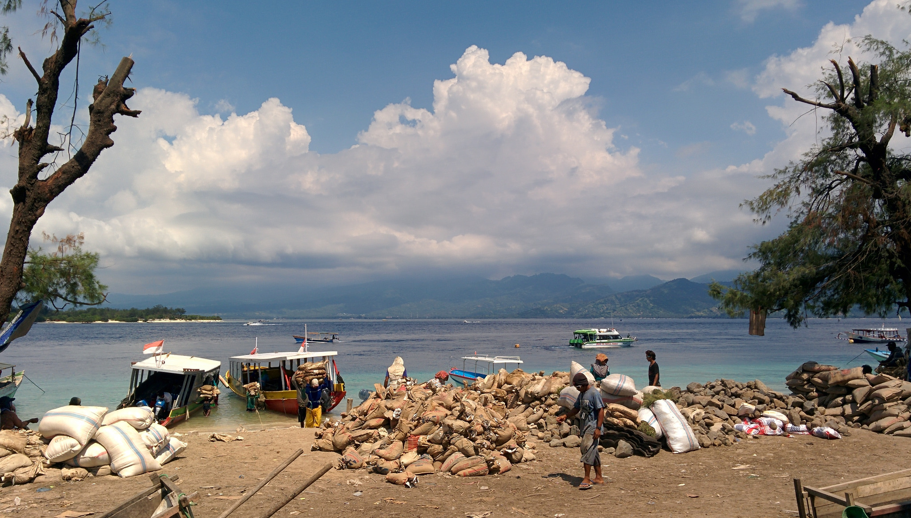
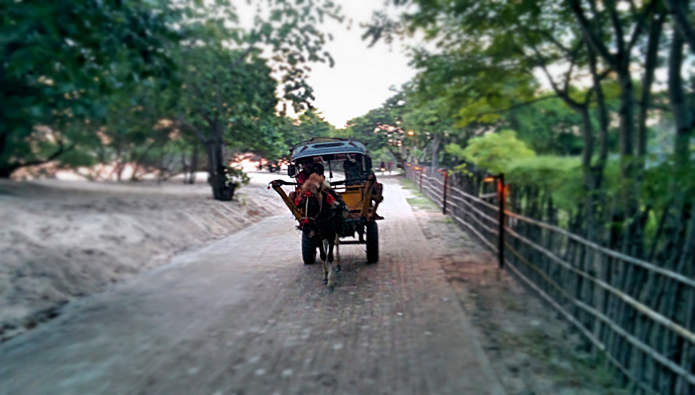
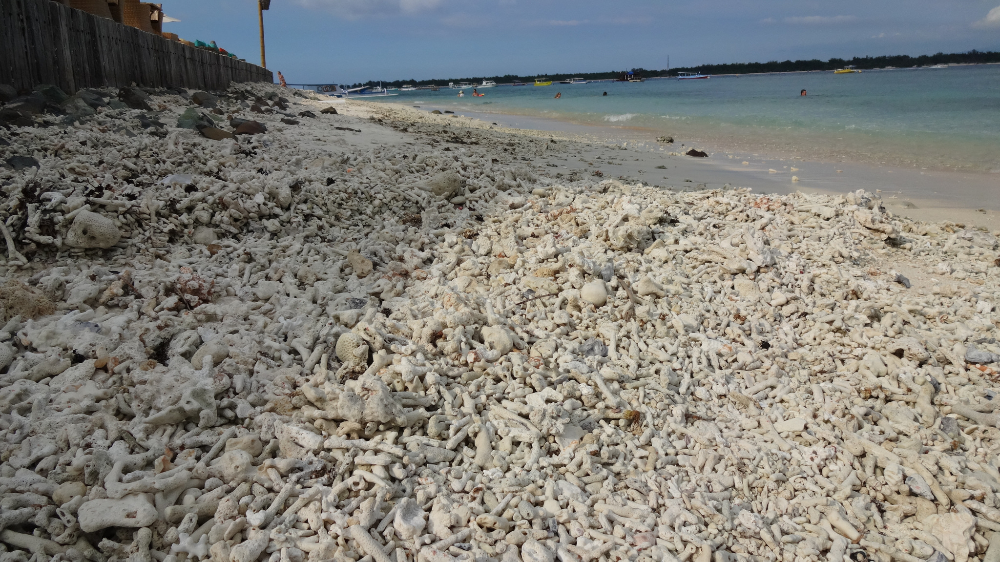
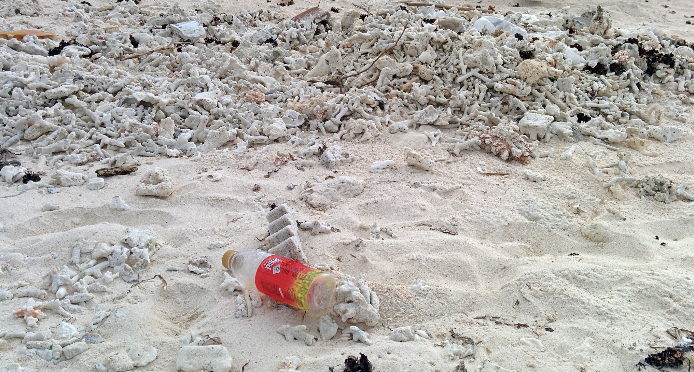
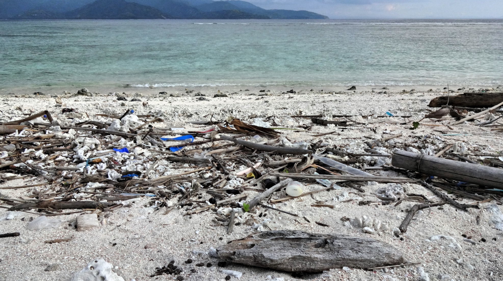
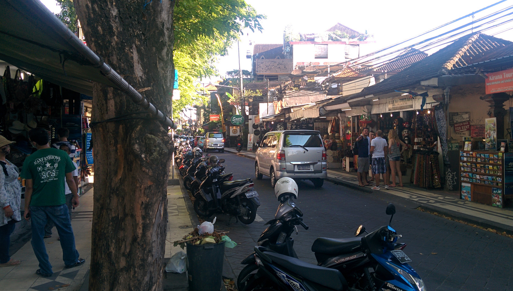
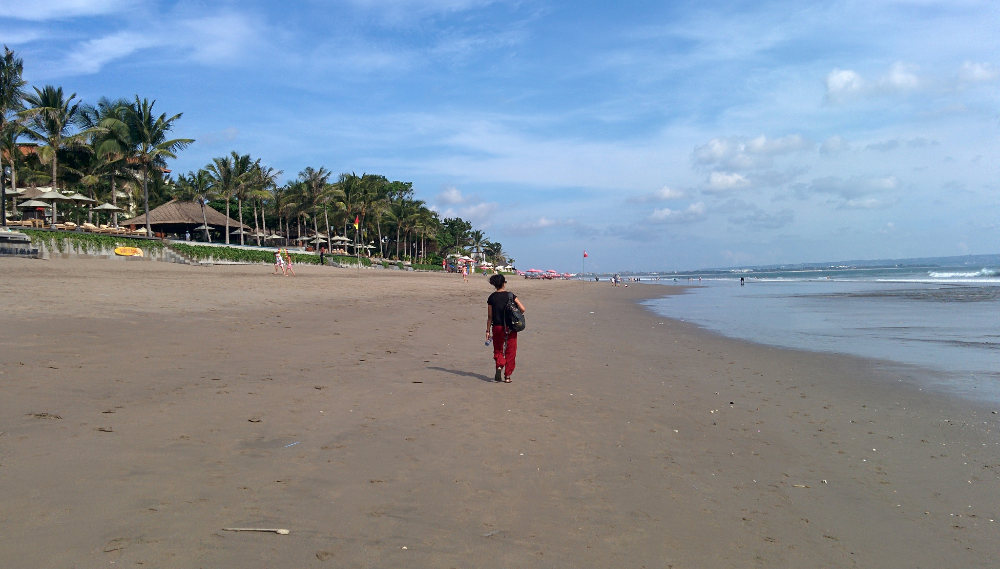
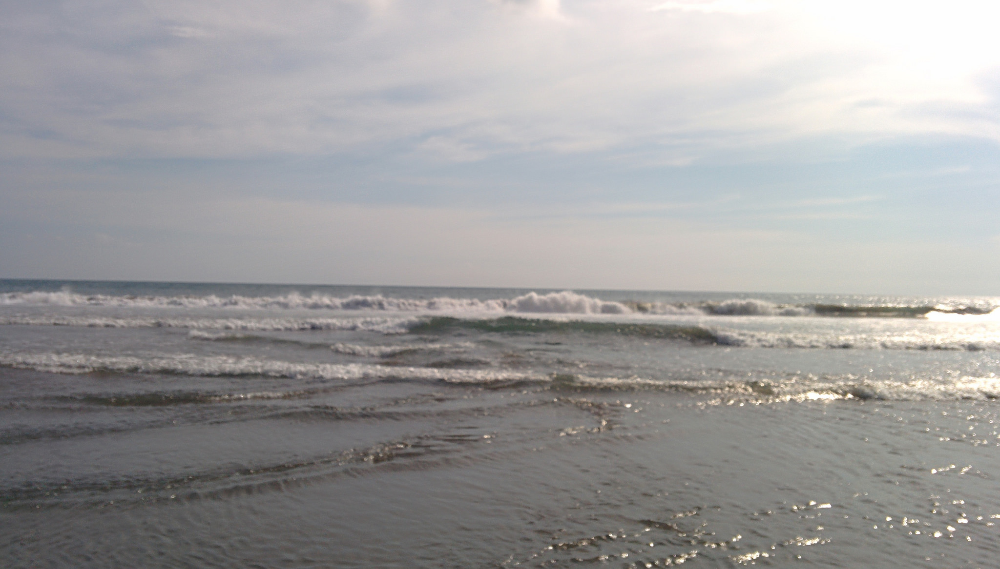
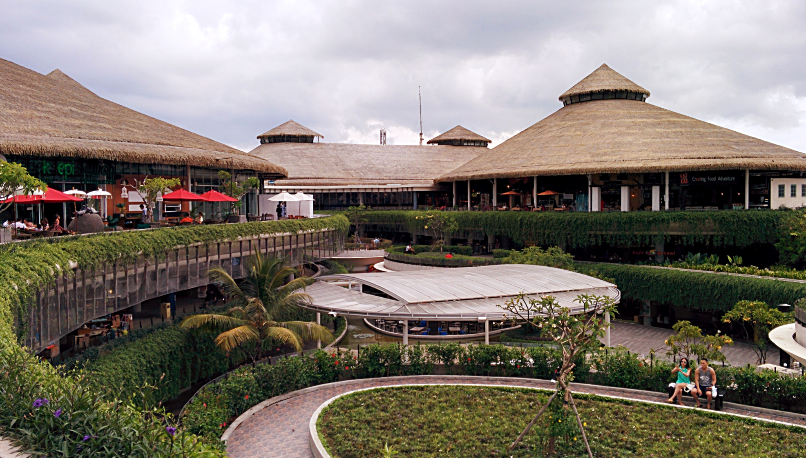
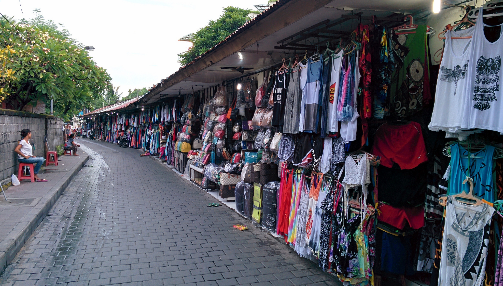

_Please note when I mention Bali in this post I’m referring to the beach locations Kuta and Seminyak. I’m not referring to other parts of the island – especially Ubud which I absolutely loved!_

The beaches of Bali and the Gili Islands are regularly frequented by visitors around the globe in search for sun, sea and sand. _Aaand…_if you all want is sun, sea and sand then I guess you’ll have a great time.

Not me though. I know I shouldn’t but I can’t help compare these beaches to others I have visited in Asia (in particular Langkawi). As painful as it sounds I just didn’t enjoy my time at these beach locations, but I’ll try my best to explain why.

**Gili Trawangan**

We only visited Gili T so I can’t speak for the other islands. Our visit was brief – only 4 nights but we decided to go as Kyle wanted to do some diving here. We heard horror stories of nightmare ferry companies so we paid a little extra and went with Blue Water Express (and had no problems with their service).

Once we arrived I immediately saw how touristy this island had become. The amount of Western faces outnumbered the local ones I saw. Granted there were no cars on the island but this was replaced with horse carts. Lots of horse carts. Too many even, where we were constantly dodging out the way every few minutes as horses trotted past in both directions.

Poor horses…

The number of dive schools is beyond ridiculous – pretty much every other building offered diving opportunities. Kyle went on TripAdvisor and dived with Blue Marlin Dive but found their service to be very pushy and busy for an enjoyable experience.

Certain parts of the beach on Gili T are overridden with trash and dead coral. We found this out when we went for a walk – the nicer beach parts were overrun with many people and we wanted some space to relax.

Appealing much?

To say I was disappointed is an understatement!

What redeemed our stay in Gili T were our hotel neighbours. We spent a couple of nights with them drinking, playing card games and eating at the food markets – without them our stay would have been miserable!

**Bali – Kuta and Seminyak**

After our return from Gili T we stayed in Seminyak for a few nights. Again we heard horror stories about staying in Kuta so we only went for a day trip.

Seminyak is meant to be better than Kuta in terms of accommodation and beaches. However we changed accommodation after two nights as the hostel we stayed at happened to be a ‘party’ type where we got no sleep at all and met some really ignorant guests.

As for the beach aspect, well…There wasn’t really much of a difference between Seminyak or Kuta. They’re both pretty dirty, uninviting and dull. They’re both dominated by a constant stream of hawkers too, which was very off-putting. The sea is apparently good for surfing but apart from that, there wasn’t much going on.

If you’re expecting white sands then you’re in for a shock!

Fancy a dip? Me neither…

The only thing going for the beaches are the sunsets, which are wonderful to see provided you find an okay spot to sit.

Apart from the beaches there is a large shopping mall in Kuta which has plenty of Western retail/food brands, and even a cinema. In both Kuta and Seminyak there are plenty of local souvenir stalls (selling pretty much the same tat) so make sure you haggle as they’ll go in twice the ‘retail’ price!

Beachwalk shopping mall, Kuta

Cheap clothing and souvenirs can be found all around Kuta and Seminyak

I wish I had a better beach experience on both these islands, but unfortunately they were both let downs. Maybe it was the time of year I went? Or maybe I’m just getting bored with tourist run beach islands?

_What are your thought of the beaches in Bali and Gili Trawangan? I’d love to hear your thoughts on this!_
