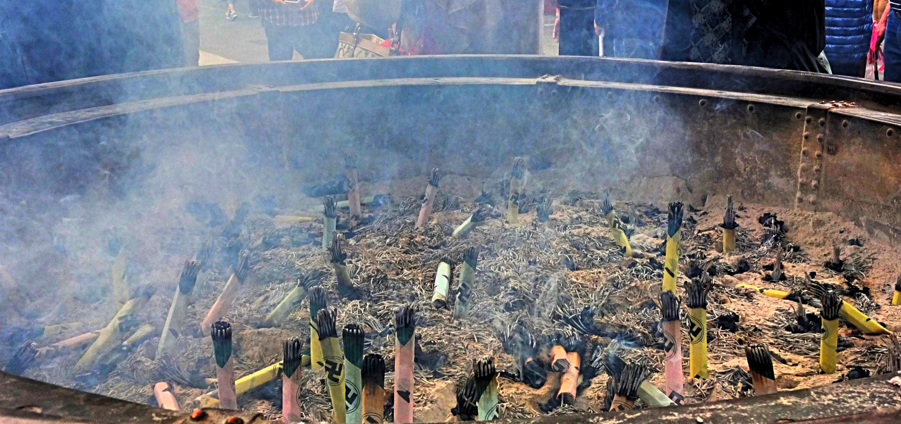

We stayed in Tokyo for a little over one week and mainly covered the popular districts. Although we didn’t stray too far from the tourist path, I found that each district had its own personality and flair.

Tokyo is a densely populated city which can take some getting used to. If you enjoy city life (like me) then you’re in for a great time. That being said there is a calmer side to Tokyo; there are many well maintained parks to spend an afternoon at, and districts like Kita (where we stayed) are much more laid back and local.

As I mentioned the districts listed below are popular – but don’t let that put you off. They’re worth a visit in their own right and have something unique that will certainly catch your eye.

**Asakusa**

Tokyo’s oldest temple can be found here in Asakusa. Senso-ji temple was founded in 628 when Tokyo was all but a tiny fishing village; it is now one of Tokyo’s most visited sights.

Senso-ji Temple

Incense ritual – waft the incense over yourself for purification before entering the temple

Nakamise dori is a street leading up to the temple. It is popular for buying Japanese souvenirs, traditional snacks and street food. The trade at Nakamise dori dates as far back to the 18th century.

Picture perfect moments around the maze of streets

Busy, but worth it!

Matcha and vanilla ice cream, definitely worth a try!

**Akihabara**

Otherwise known as the ‘anime’ district, Akihabara is home to a large collection of manga and maid cafes, countless games arcades and discount electronic stores.

Expect the unexpected in this district, there is plenty to experience to here. We couldn’t pass the opportunity to check a maid café, but more about that in another post…

Super Potato – my favourite games arcade

Bustling streets of Akihabara

**Harajuku**

Harajuku is located in the Shibuya ward and is most recognizably known as the heart of Japanese fashion. You’ll find the latest Kawaii trends at Takeshita Dori – a street lined with kooky clothing and fast food joints. There’s also a huge 100 yen Daiso store here.

Elvis-inspired dancing at Yoyogi park

It’s not all about the fashion – there’s plenty of busking around too

For a bit of culture visit Meiji Jingu, another popular shrine in Tokyo. Located in a tranquil spot in Yoyogi park, over 10,000 trees have been donated from other regions forming Meiji Jingu forest. It’s a perfect way to spend an afternoon absorbing Japanese culture.

Huge torii gate – entrance to Meiji Shrine

Barrel after barrel of sake

Traditional and modern coexisting in harmony

**Shibuya**

Shibuya is one of the most popular districts in Tokyo, and is particularly famous for ‘that crossing’. It is a very popular shopping and entertainment district attracting tourists and locals alike.

Catching some live funky music around Shibuya

Neon glory

The best place to get a view of Shibuya crossing is (unfortunately) Starbucks. It’s worth a visit though, especially in the evening. You’ll have to wait a bit until you find a decent spot to sit but the views pay off.

Shibuya crossing

**Shinjuku**

Shinjuku at dusk

Shinjuku station is the busiest station in the world – it handles a daily capacity of more than 2 million passengers. It is also this station where ‘pushers’ are employed to squeeze passengers into an already packed carriage.

Shinjuku is popularly known for its skyscrapers, red light district (featuring countless bars, clubs and love hotels) and Golden Gai – a tiny nightlife district of its own with over 200 small bars.

We made a visit to the free observatories at Tokyo Metropolitan Government building for a fantastic view of the city.

Stunning city views from Tokyo Metropolitan building

**Odaiba**

Meet Asimo at the National Museum of Innovation and Emerging Science

Odaiba is an artificial island South of Tokyo – it takes around 1 hour to get there from Central Tokyo. It is a quieter part of Tokyo but still houses a large entertainment and shopping district. The National Museum of Emerging Science and Innovation is also located here.

Looking up at the FujiFilm TV Building

Venus Fort Shopping Mall

The rainbow bridge which connects Odaiba to Tokyo looks particularly stunning the evening when the bridge is illuminated.

Rainbow bridge, Odaiba
