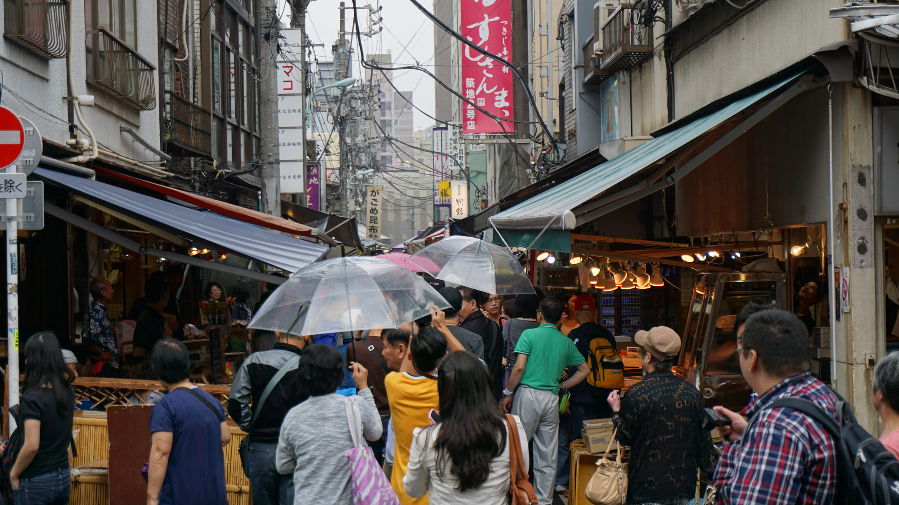
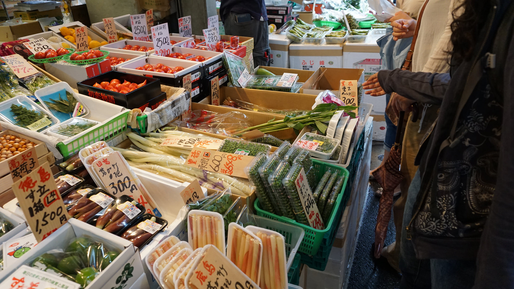
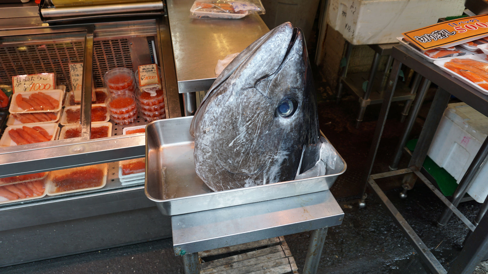
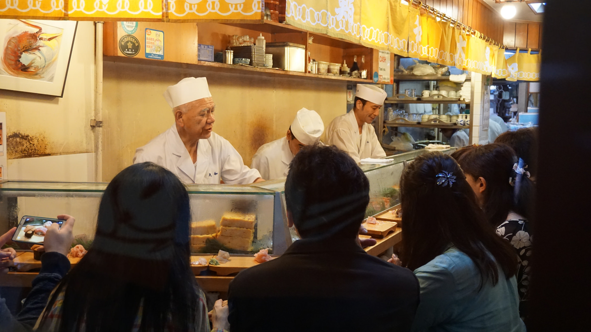
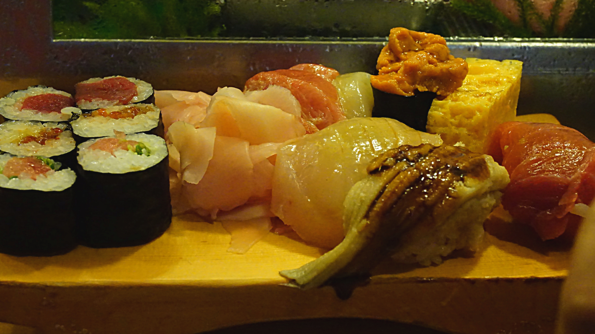
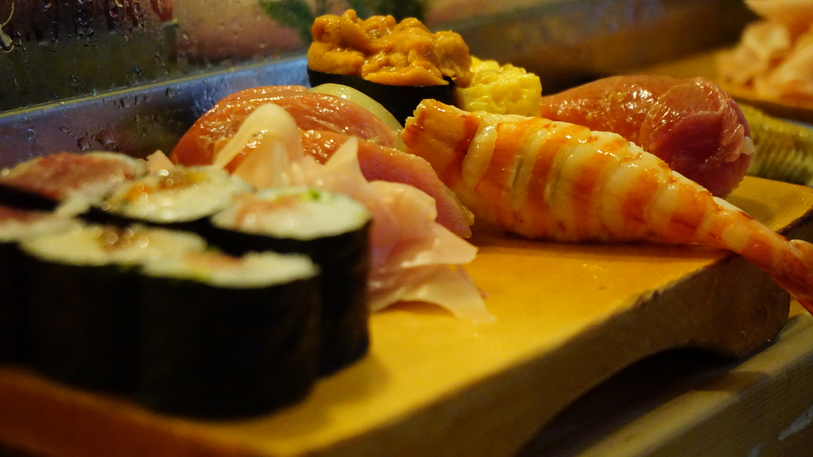
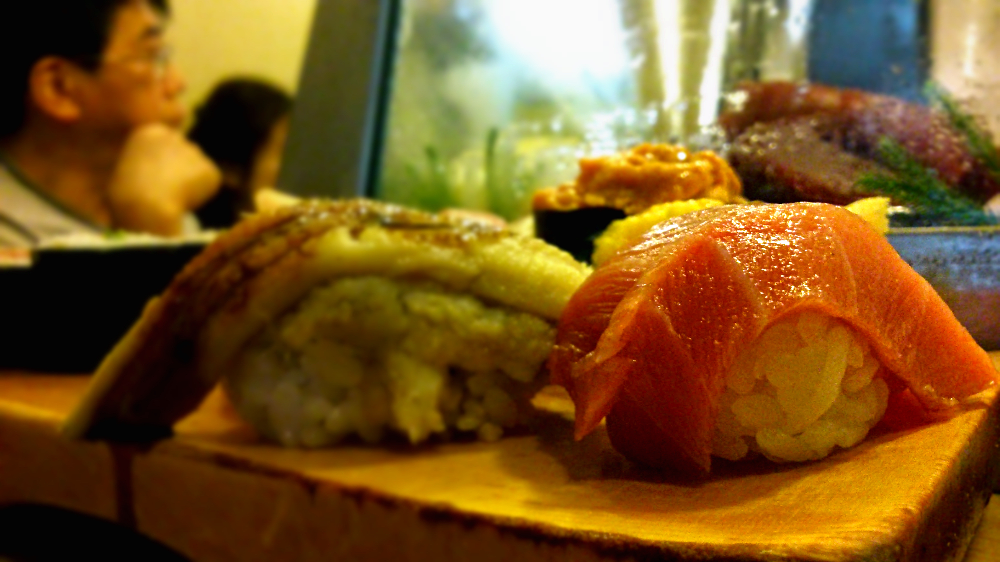

What is easily the most visited attraction in Tokyo, the Tsukiji Fish market draws a huge number of visitors each day to do two of the following things:

1\. Be up ridiculously early to see the famous tuna auctions

2\. Queue up for a delicious sushi breakfast

Reading recent articles about the tuna auctions, most were suggesting that a 2am arrival is the _earliest_ you’d need to be there as there are a limited number of people allowed at the auctions. It is basically operated on a ‘first come first serve’ basis, so even if you get there early you may not be allowed in if they’ve reached the limit.

We didn’t go to the tuna auctions because there was actually no easy way to get to the market at that time. Transport in Tokyo doesn’t run at night so it would have been a case of us doing an all-nighter around the area until we were allowed in!

Instead we got a night’s rest, woke up at a reasonable time and went to the market to explore (_sounds much better doesn’t it_). We arrived at around 9am and the atmosphere was still thriving.

Passing countless stalls of fresh fish, snacks and restaurants our appetites gradually increased. With a bit of research we wanted to try a sushi breakfast at Daiwa Sushi. When we arrived we saw a huge queue of people who had already beaten us, but undeterred we joined them in anticipation. Anyways, all the best places to eat have the biggest queues!

Peeping inside

Just over an hour later and we were seated in the tiny sushi bar. We squeezed ourselves on the stools and were handed a picture menu from one of the friendly chefs. Kyle ordered a set menu whilst I decided to pick and mix my sushi.

Service was quick and efficient, soon after we received our miso soup and green tea were we presented with the sushi. Not only did it look incredibly beautiful, it tasted like super fresh sushi would – amazing.

My favourite had to be the fatty tuna. They only tuna I’ve eaten had come out of a tin, so I didn’t have clue what it’d actually be like, you know…’real’ tuna. _My god_. It was incredible! I know I’ve mentioned ‘incredible’ twice already but it really was! It was just so damn good. Thinking about it now makes me want to time travel back to this very moment and savour the experience all over again.

Medium fatty tuna – bliss

I’m glad I didn’t order the set menu because even Kyle struggled to finish it! As with popular sushi bars as soon we finished we had to leave straight away to accommodate for the next set of people.

The bill came to around 8,000 yen (£42) which in hindsight was very reasonable. You will not find fresher sushi than Tsukiji Fish market, which made this experience all the more worthwhile. I would gladly wait hours in line to eat here again. By the way it’s true what they say, once you’ve tried sushi at Tsukiji you’ll never be satisfied with the sushi anywhere else!
