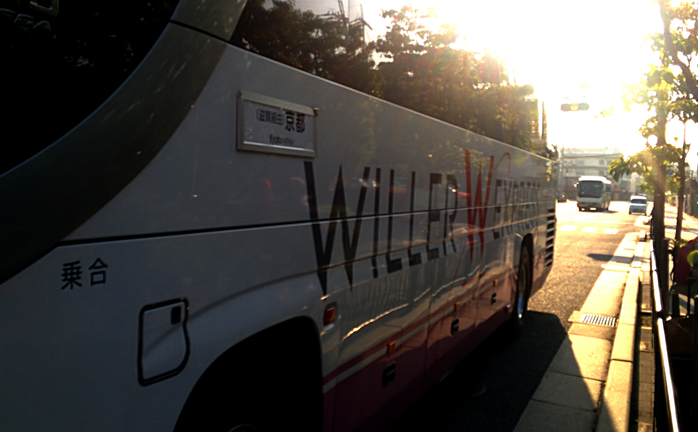
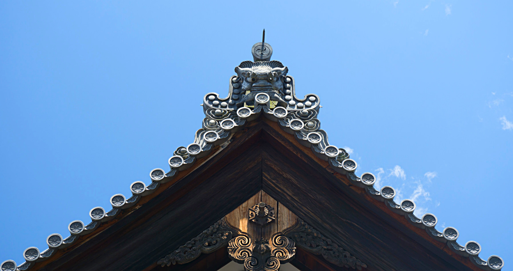
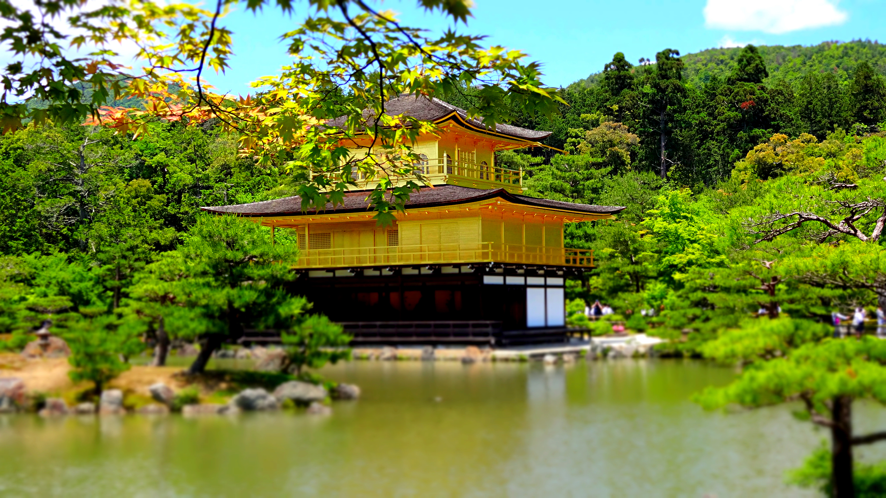
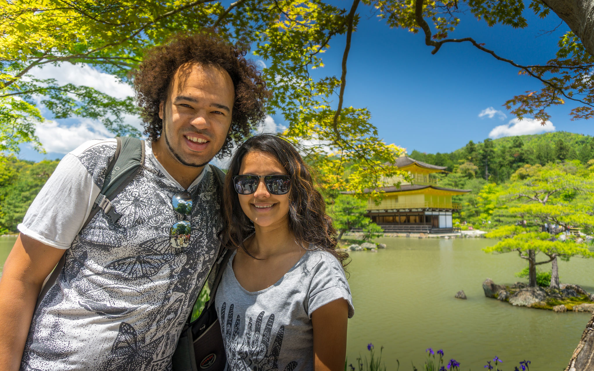
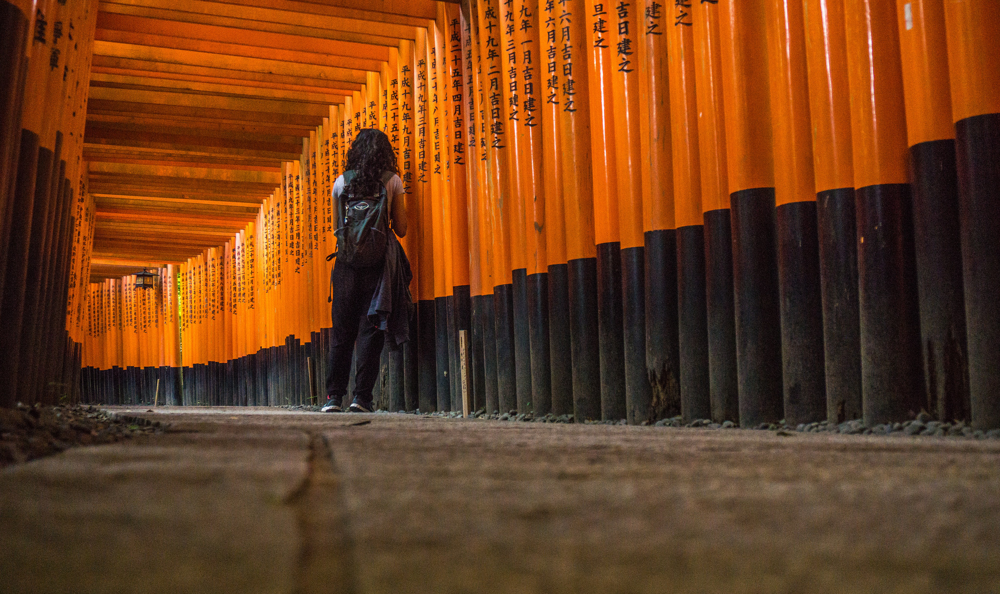
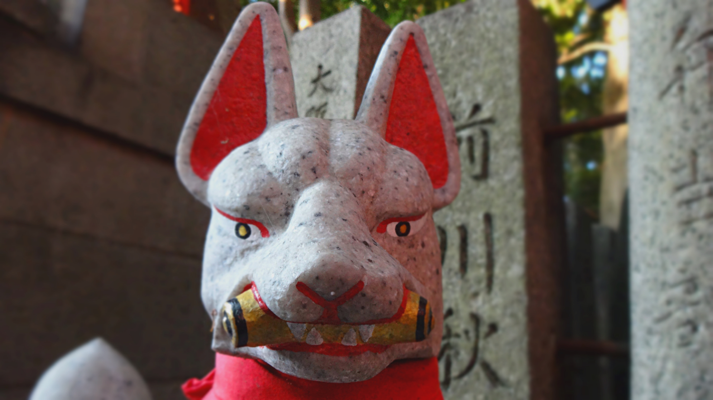
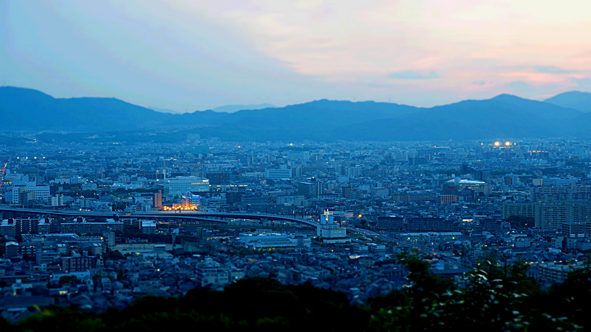
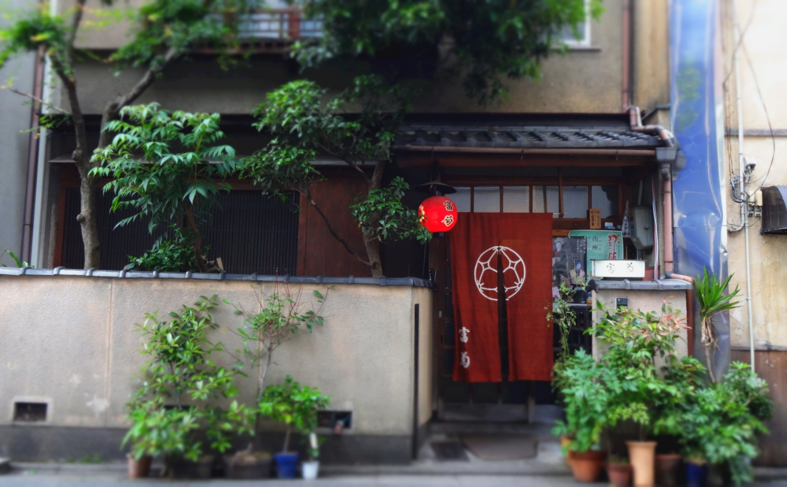
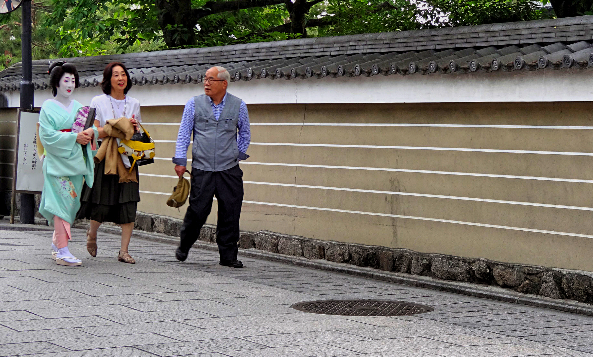
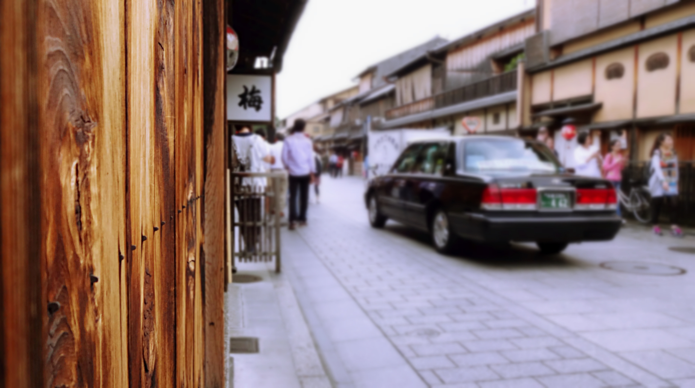

Kyoto was once the Imperial Capital of Japan for more than 1000 years and is known as the ‘City of Ten Thousand Shrines’.

Kyoto is as traditional as it gets; here you will find ancient temples, majestic gardens, traditional ceremonies and geisha. There is plenty to see here and depending on which season you visit you’re guaranteed to see some wonderful scenery.

At first I didn’t want to leave Tokyo, but after we arrived in Kyoto I welcomed the laid back atmosphere. It’s amazing to see how Kyoto has preserved its authenticity; the locals are as friendly as they come and the city is easily accessible by bus (a 1 day city bus pass costs 500 yen per person and covers the majority of sights).

Arriving into Kyoto via Willer Express night bus

We stayed in Kyoto for 4 nights and did as much as we could. We didn’t feel the need to dash around the city to see everything – Kyoto is there to appreciated, not rushed!

I’ve listed my 3 favourite sight-sees around Kyoto – Kinkaku-ji, Fushimi Inari and Gion. These particulars sights are the most frequented by visitors and offer just a taste on Kyoto’s spectacular sights.

**Kinkaku-ji Temple**

Fortunately this temple was a 10 minutes walk away from our guesthouse so we had no trouble locating it (it’s easy to reach by the 205 bus, getting off at Kinkaki-ji Mechi). Entrance is 400 yen.

Kinkaku-ji temple is one of Kyoto’s best known sights. The Golden Pavilion (pictured above) is worth a trip alone, whilst the beautifully maintained grounds make a great escape from the crowds.

It can get very crowded at Kinkaku-ji so it’s best visiting early morning or just before closing time. As always weekends are the busiest so plan accordingly!

**Fushimi-Inari**

Fushimi Inari is one of the most important shrines dedicated to Inari – the Shinto god of rice.

All I can say is WOW. Fushimi Inari seems like an endless trail of torii gates spread across the base of a mountain. There are over 10,000 torii gates at the complex (which is free enter and roam around).

Just a handful of torii gates in this vast complex

It’s not just gates that are the main attraction. Along the route there are plenty of stone fox statues. Foxes were considered to be the messenger of Inari and are also sacred in Japanese tradition.

It took us a few hours walking through the tunnel of gates. On our way back down we were treated to great views of Kyoto as the sun was setting.

**Gion district**

To get a real feel for old Kyoto, go to Gion. Here you will find a selection of tea houses and geishas amongst the traditional wooden structures.

During the day the district is very busy with cars and people, so it can be difficult to appreciate the environment. We were lucky though and spotted a few geishas, however they gained a big crowd and before we got our cameras at the ready they had long gone!

There are plenty of restaurants to sample local sweets and tea, we tried a green tea latte which was delicious.

The crowds here are difficult to avoid, however Gion is quieter in the evening which is an ideal time to explore.

