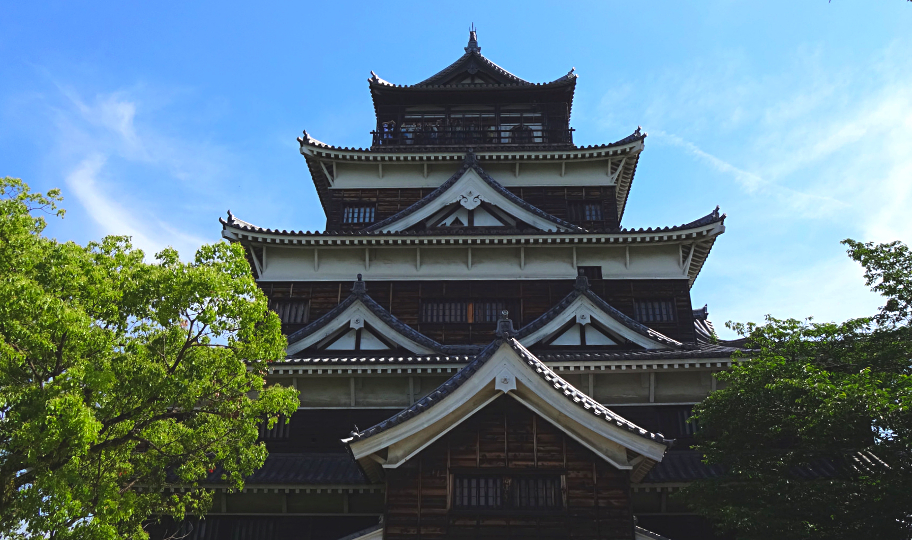
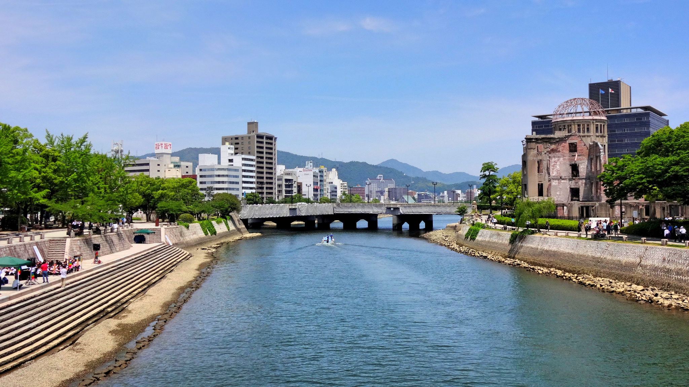
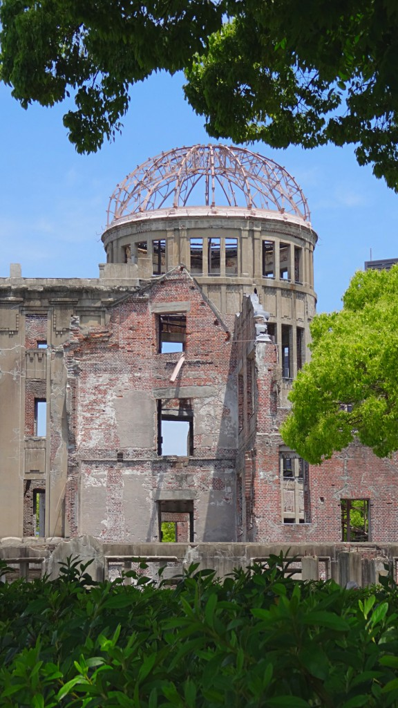
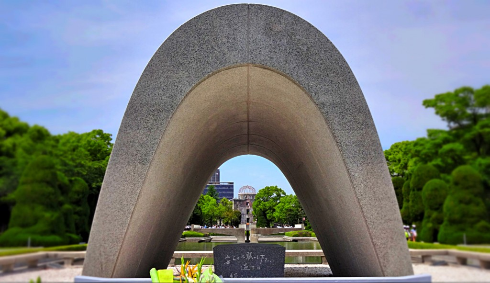
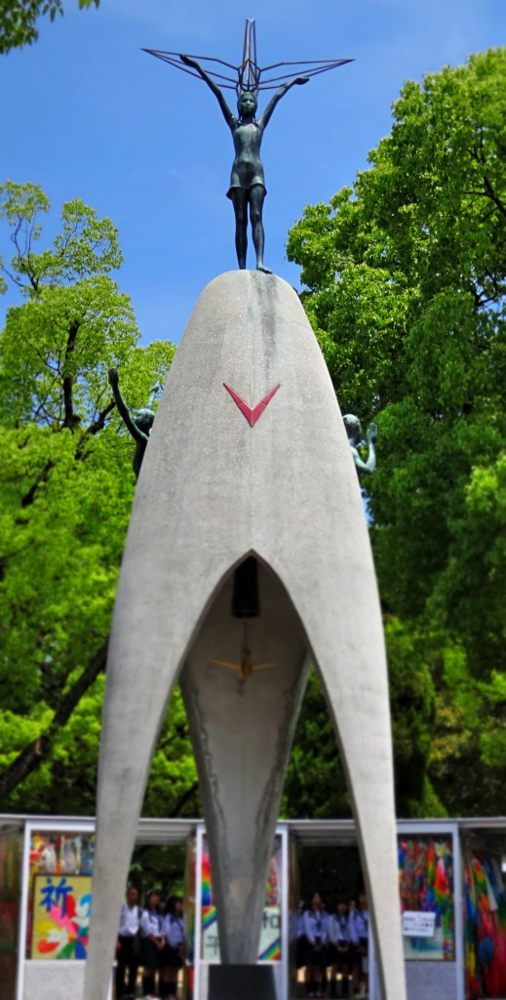

Our travels in Japan wouldn’t have been complete visiting Hiroshima. Infamously known as the city destroyed by an atomic bomb in WW2, Hiroshima rose from its ruins and rebuilt itself to now become a proclaimed ‘City of Peace’.

Our stay in Japan was nearly coming to an end so we only stayed in Hiroshima for one night. We arrived early morning by night bus – about 7am. By the time we stored our bags in lockers and ate breakfast the [Sightseeing bus](https://www.chugoku-jrbus.co.jp/teikan/meipurupu/en/) began its service for the day.

We started at Hiroshima Castle – which was reconstructed in 1958 after it was destroyed in the bombing. It is now used as a museum showcasing historical facts and samurai culture.

Hiroshima Castle

The grounds are very peaceful and picturesque, yet the crumbling foundations of former buildings are the only reminders of what once stood.

The next stop was Hiroshima Peace Memorial Park. Before the bomb this part of the city was originally the political heart.

After the bombing the site was developed as a memorial in commemoration to the thousands of people who died.

The A-bomb dome defied odds and retained its skeletal structure. It was only the building which survived the bombing.

The A-Bomb Dome

Around the Memorial Park there are various facilities and monuments peace related.

The Peace Memorial Museum only costs 50 yen to enter and has lots of information and artefacts about the aftermath of the bombing.

Children’s Peace Monument – Sadako Sasaki holds a paper crane stands at the top of the monument

Amongst visitors there is a very sombre feeling walking around Hiroshima; life goes on but the past will always stay as the focal point. The destruction, loss of life and tragedy in this city has pushed the people here to yearn a world free of war. The message here is simple – peace and unity for all.

Hiroshimas’ past was conserved as an appeal to end future wars – and in particular the atomic bombs. The people here are resilient in their efforts to support their heritage and teach a peaceful way of living. It is without doubt that anyone leaving Hiroshima will not forget the painful events that occurred in 1945. However from learning of this tragic event we can see the continuous effort to create an everlasting world of peace.
