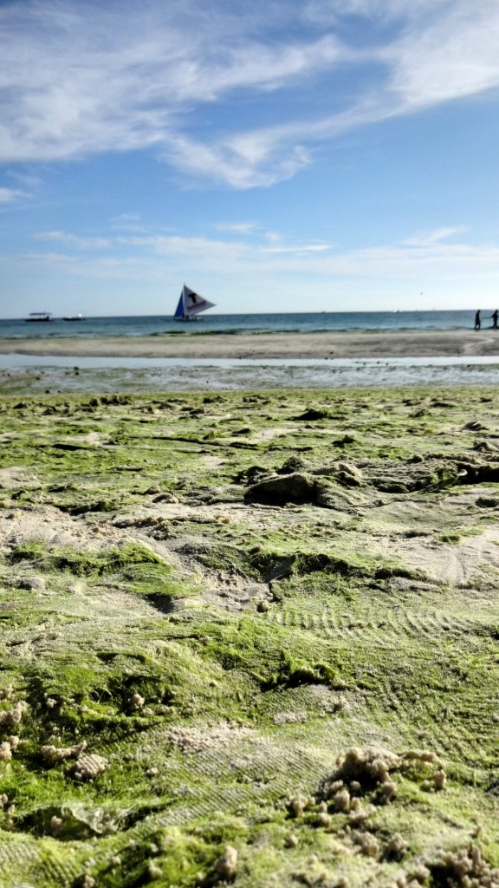

We had a tough decision to make – do we visit Boracay or Palawan?

Both were a flight away, and both had their own reasons to visit. Palawan had picture postcard scenery and incredible natural wonders. Boracay is the most developed beach island in Philippines, but is renowned for its glorious white sands and serene sunsets.

It wasn’t easy, but we chose Boracay. We weren’t keen on the touristy side but we were intrigued to see the beaches (White Beach is known to be one of the best beaches in the world). Plus we only had 4 nights to stay somewhere – if we visited Palawan we would have prefered to have stayed at least a week.

**Getting There**

We flew from Cebu City to Caticlan airport with Cebu Pacific Air. On the short flight we paid a surplus fee onboard to arrange transportation from the airport to our hotel (which compromised of a short boat ride and shared taxi).

We knew White beach was the main tourist zone so we booked 1 night at Station 3 to get a feel of the area, and moved to a quieter part of the island for the remaining 3 nights.

**Stations 1, 2 and 3**

Station 2 is the busiest out of the 3 offering more dining and drinking options – it is also where most of the hostels/budget accommodation can be found. Station 1 is where the trendy hotels are, whilst Station 3 is said to be the quietest part of the stretch (which could have been quieter in my opinion!).

Watching the MayPac fight at Station 2

The main stretch along White Beach is the most ‘tourist-orientated’ I’ve seen. There is a sandy path to walk along the restaurant/bar front, which is separated from the main beach area. There is ‘no smoking/drinking’ policy on the beach which is enforced to minimise littering.

Tasty eats at Hawaiian BBQ

Sadly Boracay doesn’t escape from the commercial chains – there is a McDonalds, Yellow Cab Pizza, Subway _and_ Starbucks on the main stretch. It’s pretty off-putting to see such big chains dominating this tiny island – it takes away the whole premise of escaping to an idyllic beach.

Boracay sand castles are made all along the stretch – but you’ll have to pay if you want a photo!

**White Beach**

It’s really important I mention this because I feel like it had a big impact for our stay. Each year a seasonal bloom of algae affects White Beach and it’s difficult to predict how bad the algae will be.

Consequently our visit (in May 2015) coincided with the algae bloom. To be honest I found the algae situation to be very off-putting, which ultimately overshadowed the beauty of the beach.

**What Causes the Algae Blooms?**

Well this depends on who you ask. Scientists have agreed that Boracay’s waters are ‘nutrient rich’. This was caused by the poor sewage system on the island; a case where untreated waste water (sewage) is directly discharged into the sea, thus causing seasonal algae blooms._It’s worth noting that water analysis samples confirm Boracay’s waters on White Beach are safe to swim in._

Ask a local though and you’ll get a different answer. Apparently the algae blooms have been seasonal for decades, even before the island became popular. The idea that this occurrence is caused by poor sewerage systems is strongly dismissed by a local.

For me though I found the beach to be more of an eye sore than anything else. It’s such a shame because I know my outlook would be positive if I visited another time of the year.

Station 1 was the only area which raked the algae from the sand

White Beach didn’t live up to the hype for me – the algae bloom was too prominent to ignore, and the sheer volume of visitors made it difficult to relax.

However all hope wasn’t lost! Our time in Boracay significantly improved when we changed hotels and stayed in the northern part of the island. Our hotel (Oasis Resort and Spa) was a few minutes walk to Ilig Iligan beach. This beach was much quieter and picturesque than White Beach, and we spent most our time relaxing here.

Relaxing at Oasis Resort and Spa

Ilig Iligan beach

**So, is Boracay worth a visit?**

Despite the crowds and algae blooms on White Beach we enjoyed our stay in Boracay – though this was largely due to us moving away from the crowds to a quieter part of the island.

There are plenty of money-saving options to eat, drink and stay at on White Beach which is worthwhile for budget travelers. However there is more to Boracay than White Beach, so I recommend staying in a quiet part of the island and enjoy the other beaches. Many hotels provide free shuttle service (like ours did) to White Beach so you’re able to get the best of both environments.

We stayed for 4 nights which I think is an ideal amount of time. The ‘tourist thing’ gets boring very quick so unless you have a proper agenda or don’t mind crowds then this island may not be for you.

I’m happy to have visited Boracay but it’s unlikely I’ll return again. There are plenty of islands to explore in the Philippines and my future goal is to return and see a beach island free of commercialism and mass tourism.
