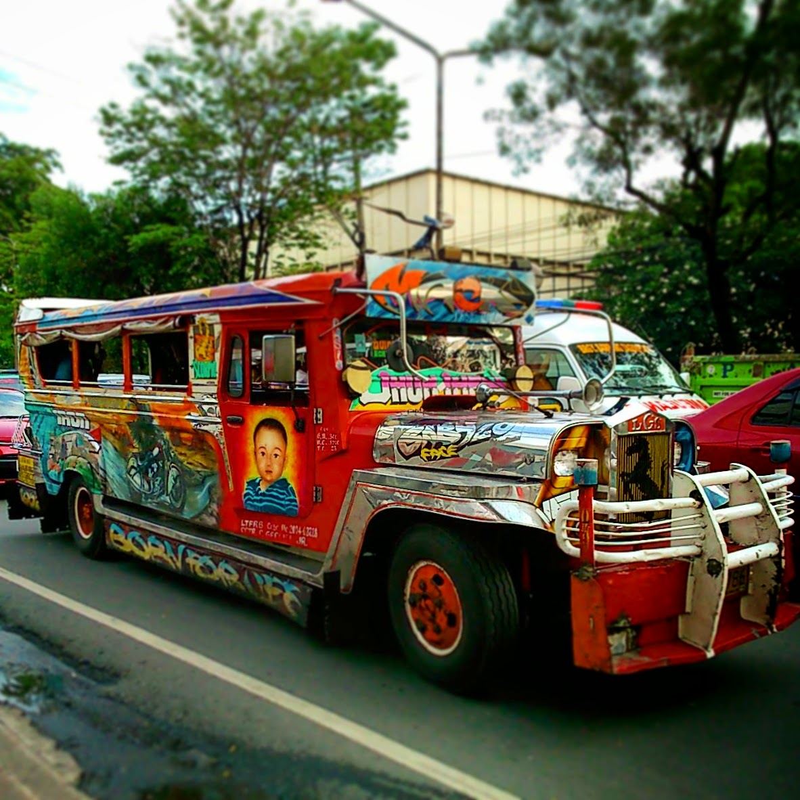
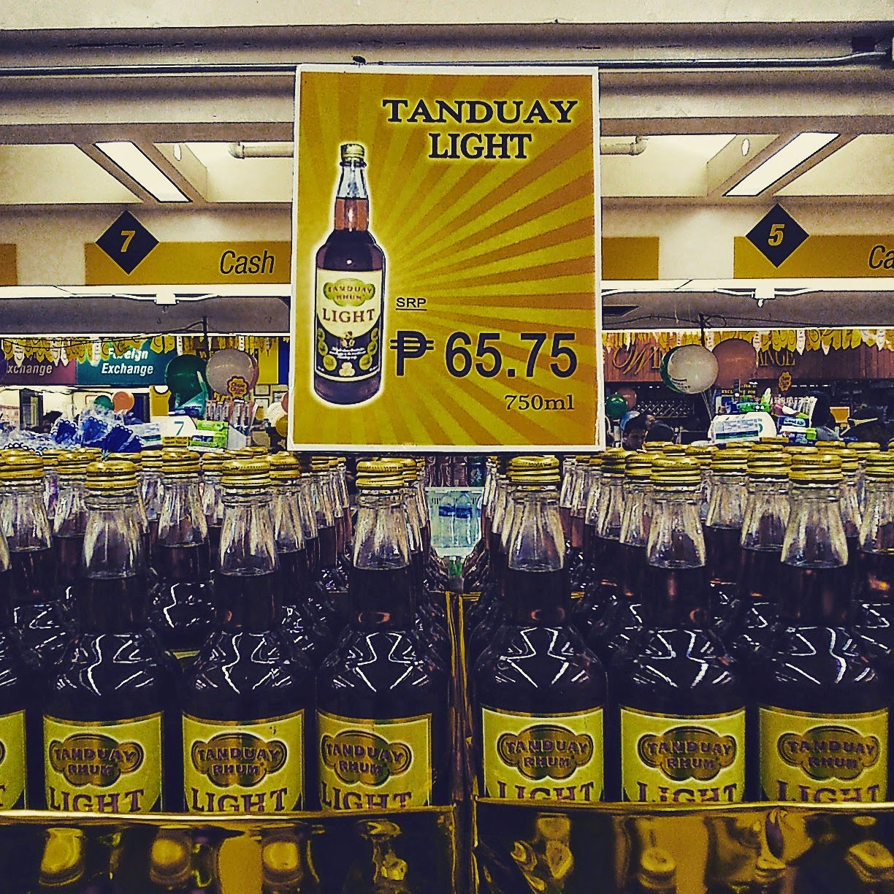
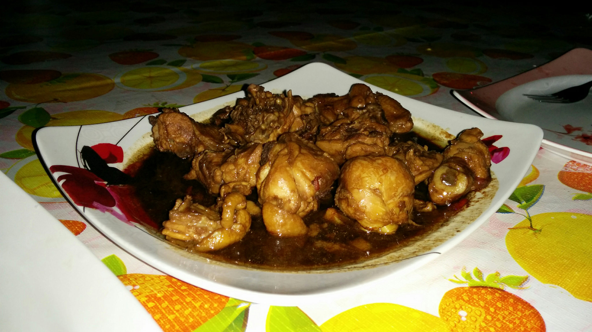
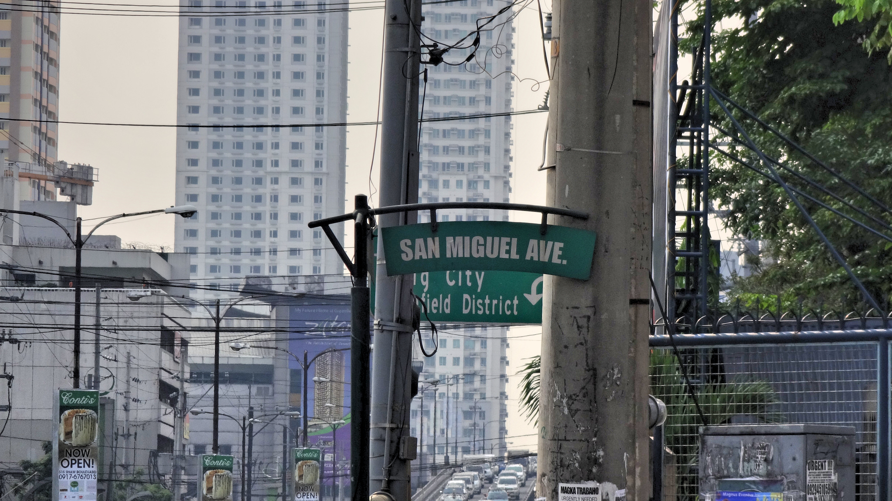

It’s been a whirlwind month around this wonderful country, and as always I can’t quite get over how quickly time seems to pass before we’re making arrangements for the next destination.

Our visa on arrival granted us 30 days to explore the Philippines. We visited Cebu, Moalboal, Oslob, Bohol, and Boracay. This sounds like a lot of places to visit, but the truth is we’ve barely scratched the surface. There are over 7,000 islands in the Philippines, boasting some of the world’s best beaches and natural wonders in South East Asia.

Speaking of Asia, the Philippines often gets overlooked in favour of familiar countries like Thailand or Vietnam. This is a shame really, because making the effort to go to the Philippines is so worthwhile. Like the Asian saying goes the Philippines is kinda’ ‘same same but different’ when compared to rest of South East Asia.

Jeepneys, Manila

Instead of tuk tuks there are trikes which are pretty much the same thing – autoricksaws whereby you agree/haggle on a price before your journey. The jeepneys are reminiscent of the ‘red trucks’ in Chiang Mai, except they’re bigger and individually designed. Religion is very important here but instead of temples and stupas there are Catholic churches. The traffic here in Manila is similar to scenes witnessed in Bangkok or Jakarta.

Instead of Chang, Tiger or Bintang beer the Filipinos enjoy San Miguel beer and Tanduay rum – both which get a seal of approval for me!

Just over 65 pesos for a bottle of rum. Thats less than £1 folks

The Filipinos are very welcoming by nature and easy to converse with – there are no language barriers as most Filipino’s are taught English in school.

The one downside we’ve not enjoyed much is the lack of food options. Unfortunately the Philippines lack in this vital department; I didn’t particularly enjoy the flavours of local cuisine sadly. Our diet has suffered as a result of this and no doubt we’ve added a few pounds from all the crap we’ve consumed!

Not really a fan of the local food though…sorry

We’re currently in Manila planning our itinerary for the next destination, Japan. Sadly we won’t get to do any sight-seeing in Manila due to time constraints. However we’re discussing a trip in the near future to visit Palawan and El Nido.

We’ve relaxed on idyllic beaches, marvelled at wonderful scenery and experienced Filipino city living. Our mini adventure has been short but sweet; hopefully it won’t be long before we meet again and continue the adventure.
