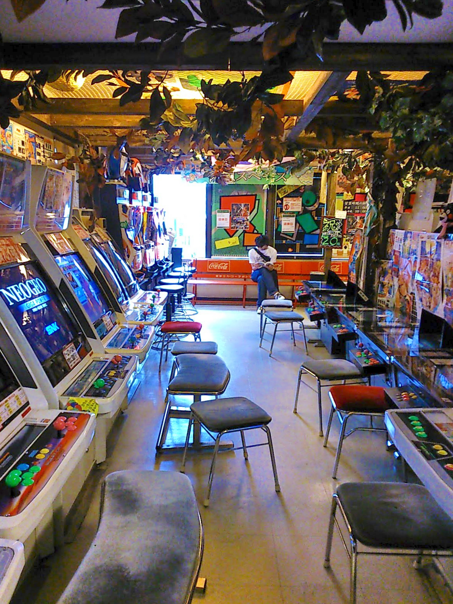
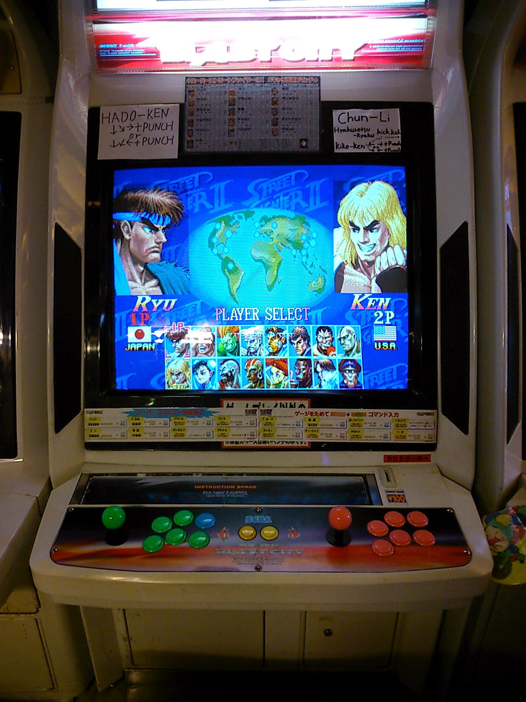
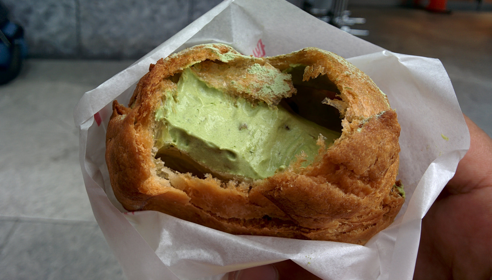
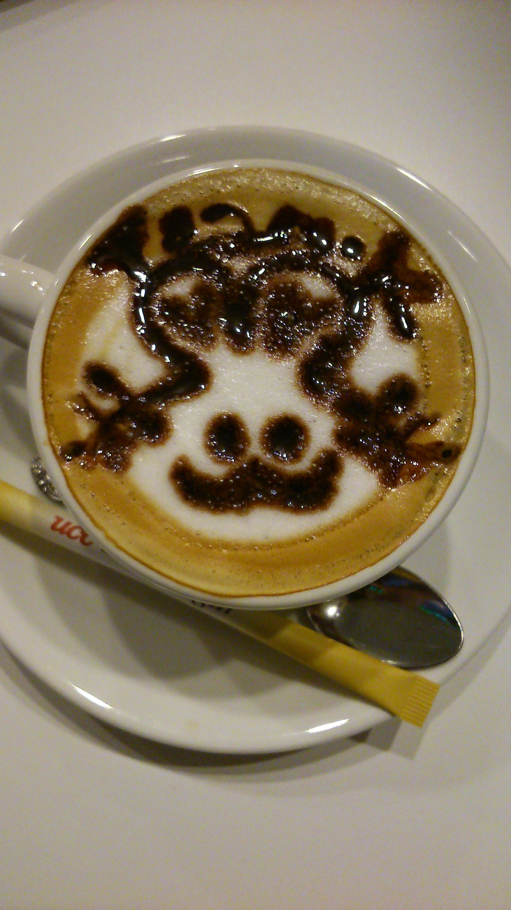
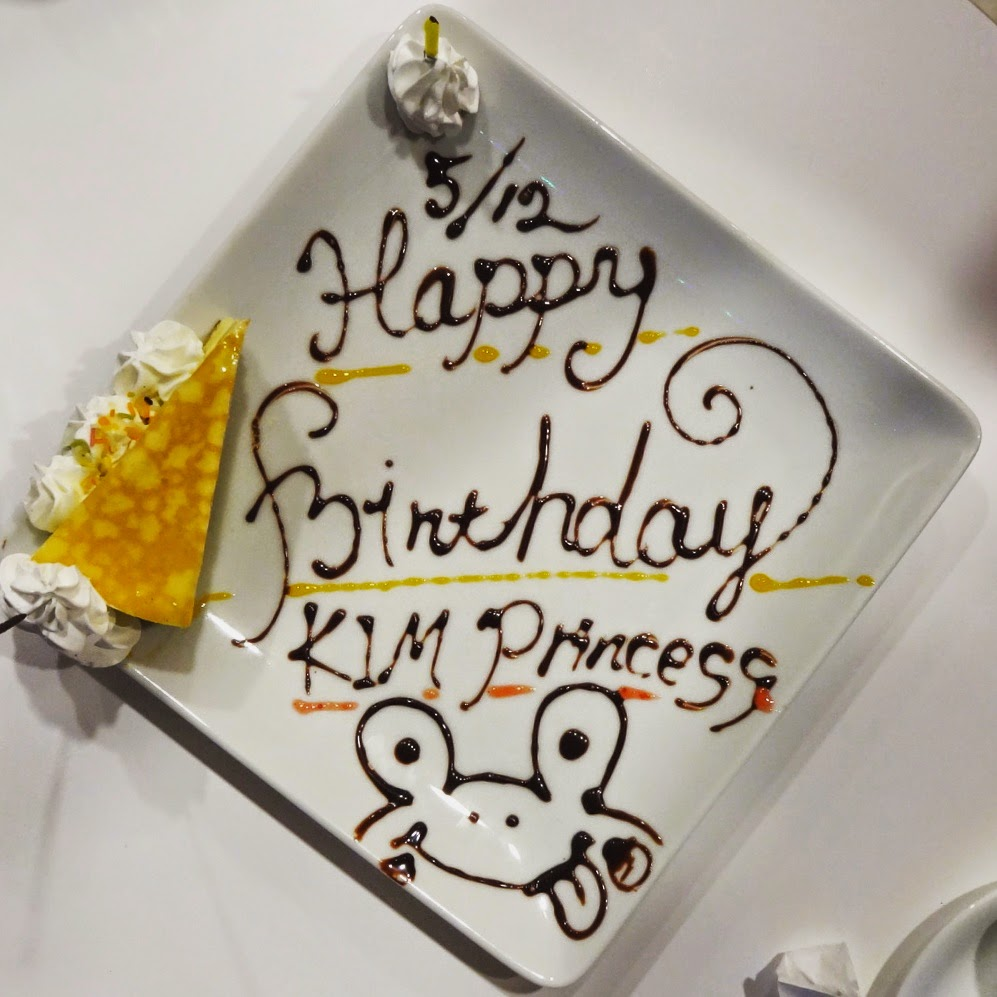
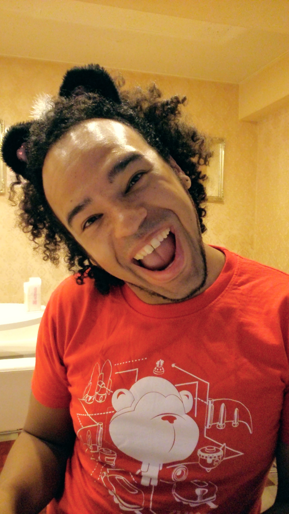
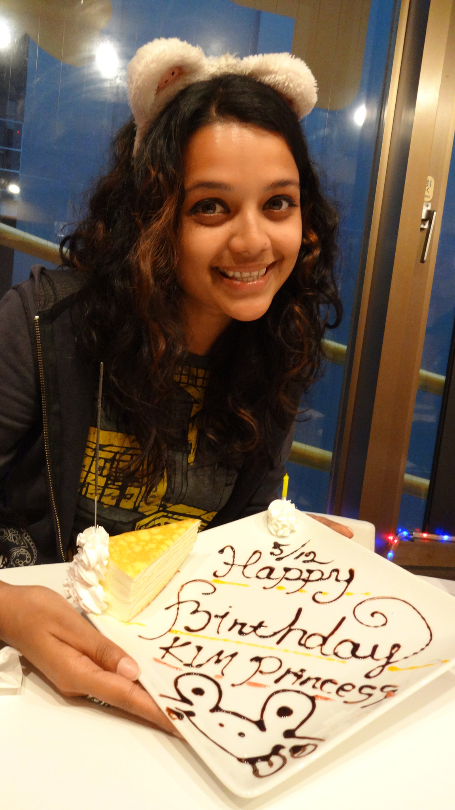
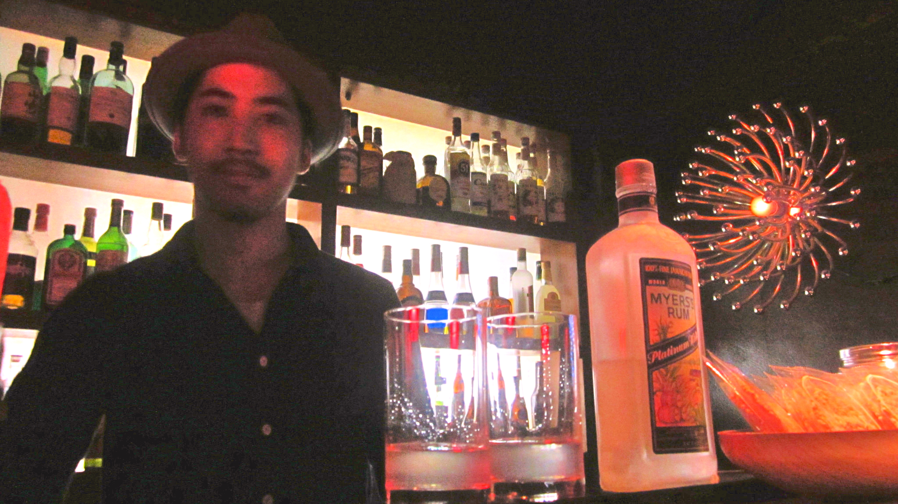

Never did I think that I’d spend my quarter-of-a-century birthday in one of the coolest countries in this world. But I did, and it was awesome!

I didn’t do anything glamorous or expensive, but that just made my day all the more enjoyable. Normally on mine or Kyle’s birthdays we’d usually shell out a large amount on a spa weekend, which admittedly we had great times but were nothing out the ordinary,

Being in a mega city which has so much to do I decided not to stress out and plan a fancy evening out somewhere, but rather go out and do the things I enjoyed doing here.

So I played retro arcade games, out of curiosity went to a maid cafe and then went to a live music bar in the evening. I got free play at the arcade, free birthday cake at the maid cafe and free shots at the bar. It was that cheap, simple and stress free, feeling old in Tokyo never felt so good!

Favourite aracde in Akihabara – Super Potato

<!-- close group -->

Getting beat on my favourite game!

<!-- close group -->

Nerdin out with my new t-shirt

<!-- close group -->

<!-- close row -->

Gorging on delicious cream puffs

<!-- close group -->

Drinking an overpriced latte at the maid cafe

<!-- close group -->

<!-- close row -->

Cutes-y birthday surprise at the maid cafe

<!-- close group -->

Even Kyle joined in on the cutesy action!

<!-- close group -->

Happy Birthday to Me!

<!-- close group -->

Enjoying a laid back evening at The Room bar

<!-- close group -->

<!-- close row -->
