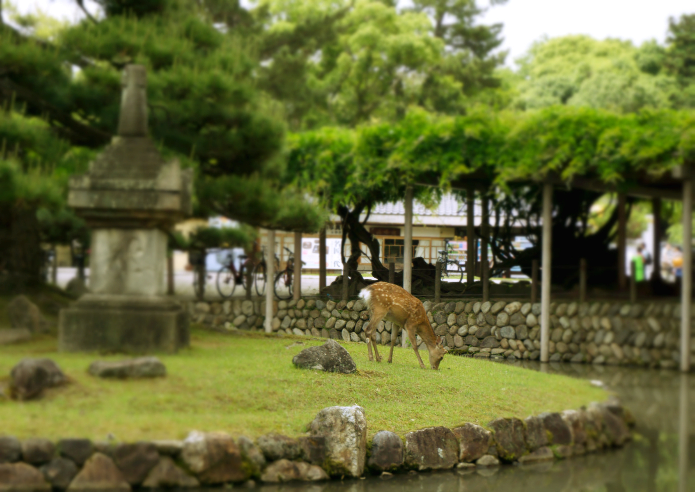
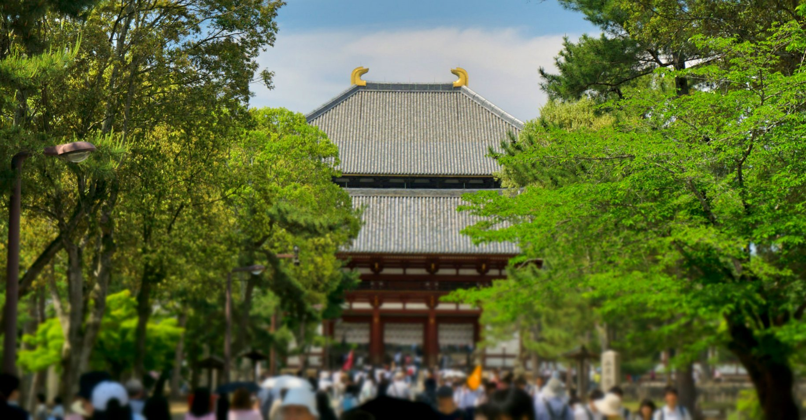
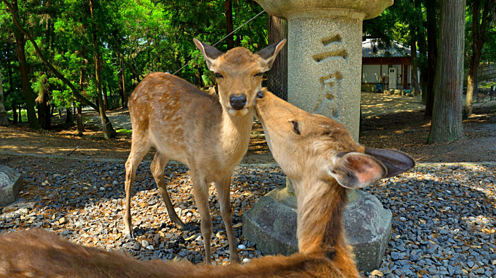
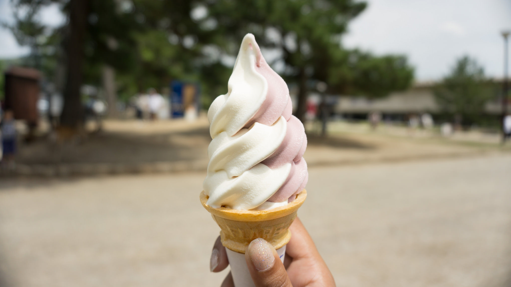

On our way to Osaka we popped into Nara for one reason only – to see some deer!

It took over 1 hour from Kyoto to arrive by local train. We threw our bags into a locker at the train station and spent a couple of hours sightseeing.

According to Shinto legend the deer are considered to be messengers of god and have since been considered a national treasure.

It didn’t take long till we met a bunch of deers, freely roaming around. At first it was exciting being so close, but this soon faded. We visited on a Sunday which was a bad move – it was absolutely heaving! As a result of this there were heaps of people crowding around the deer or luring them with ‘deer crackers’ (which can conveniently be purchased at many vendors for 150 yen).

We continued on to visit Todaji temple, but our minds changed once we got there. It was just _too_ busy to take photos or freely navigate around the area. Disappointed with ourselves for visiting in the afternoon we made our way back to the train station to get to Osaka.

Nara is a beautiful place to discover but the experience will depend on how busy it is. For us we timed it badly and sadly wanted out! Saying that it was great to see so many deer roaming around; maybe another visit during the weekday would change ours minds.

Saving the day with ice cream!
