Japan doesn’t fall short when it comes to quality, and the city of Kobe is a prime example of this. There is no better place than Kobe to indulge in two of Japan’s finest delights – Kobe beef and sake.

We took a day trip from Osaka to visit Kobe which took a little over 1 hour to reach by train. Conveniently reaching before noon, we made our way to [Kobe Ishidaya](http://www.kobe-ishidaya.com/ishida.html#_=_)restaurant where we had reserved seats for the lunch special.

It took some research to find a decent restaurant – we settled for Ishidaya as they had a very good [TripAdvisor](http://www.tripadvisor.co.uk/Restaurant_Review-g298562-d3212155-Reviews-Kobe_Ishidaya-Kobe_Hyogo_Prefecture_Kinki.html) score and were modestly priced.

There are different grades of Kobe beef ranging from C1 all the way to A5. The price of the meal will reflect on the grade you choose. We both decided to have the A5, the most premium cut known for its fantastic marbling and tenderness.

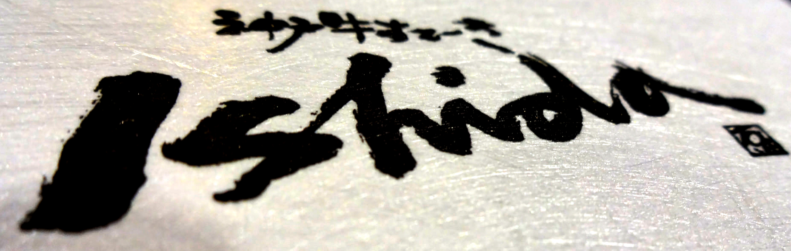

It costs 7,800 yen for a lunch set with 130g of A5 Kobe beef, or 8,800 yen for 150g. We ordered a small and large set and sat back in excitement.

I could go on in detail about the awesomeness that went down, but I’ll let the photos do the talking!

Once we chose our set menu a starter came out as the chef prepared his ingredients.

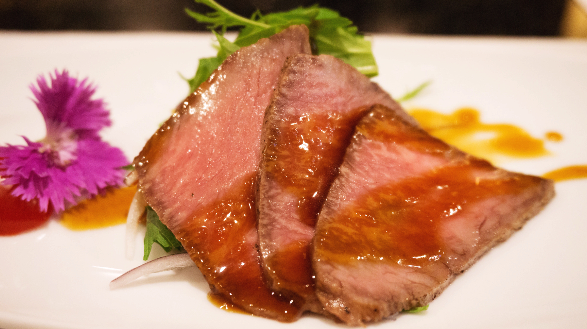

Simple yet delicious starter

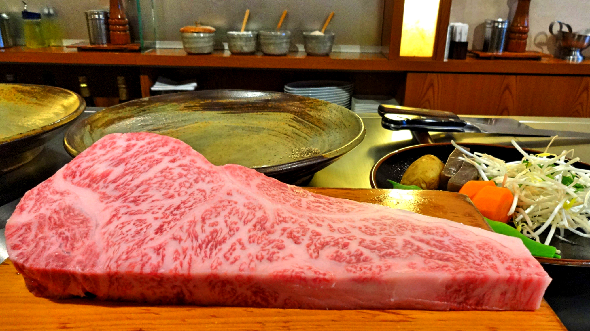

Once the meaty goodness arrived the waitress brought out a salad alongside rice, miso soup and pickles. The chef asked us how we liked how meat cooked and then proceeded to the part we’d been waiting for.

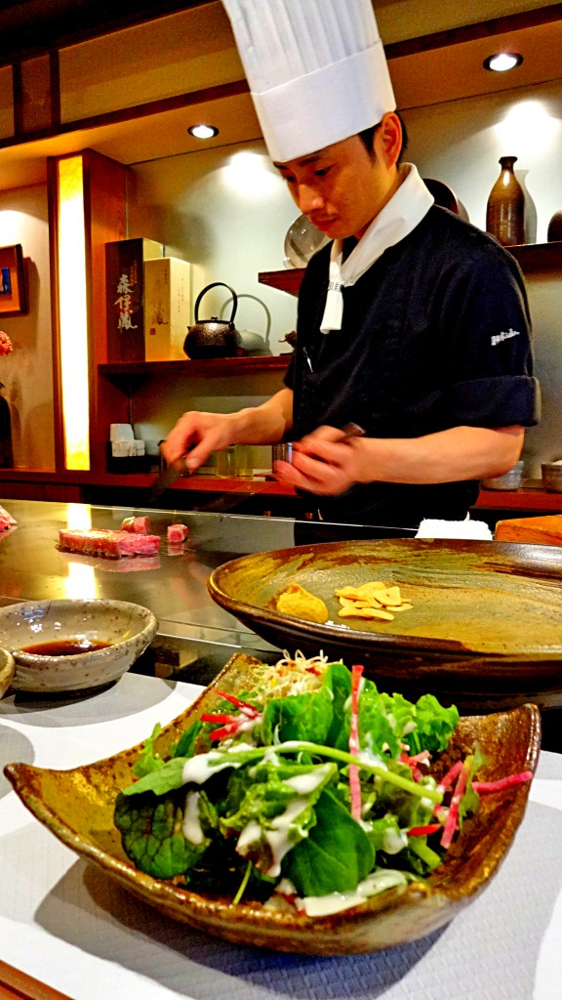

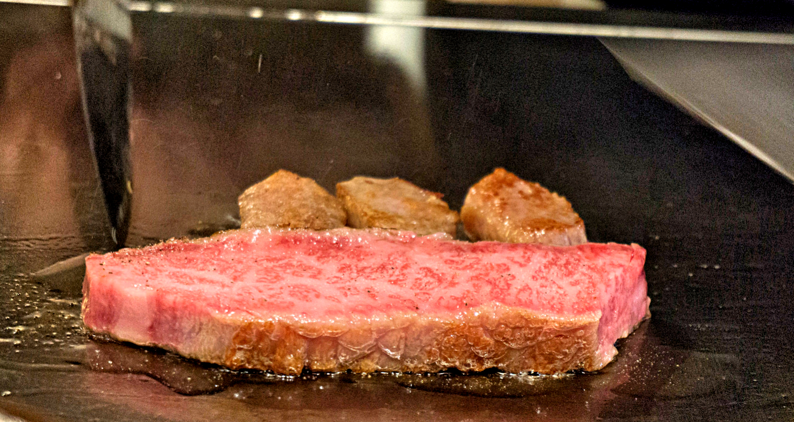

I can’t quite describe the incredible aromas wafting from the sizzling grill, my mouth drooled uncontrollably due to the overload of senses. Thankfully it didn’t take long for the chef to cook and serve us the beef dreams are made of.

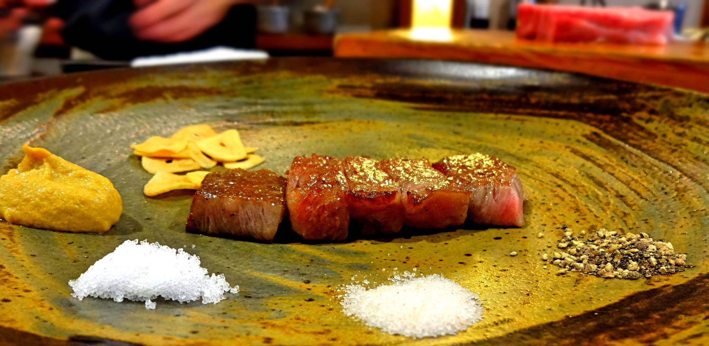

I’m sure the term ‘melt in your mouth’ is too cliché to take seriously. But this really couldn’t be more fitting when it comes to Kobe beef. It was delicious, tender, and _sooo_ juicy. It was the real deal, and we were glad we chose the best grade. Teamed up with the rice, salad, veg and soup I was struggling to finish everything.

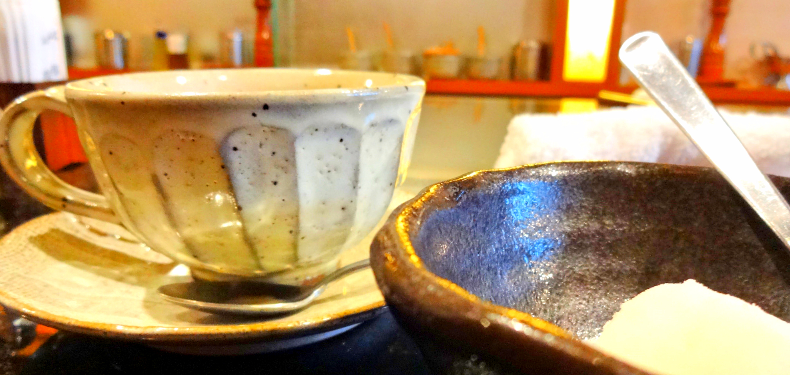

The meal finished with tea and sorbet. I found the service was impeccable throughout the meal which added to an already great dining experience. The overall price came to around 20,000 yen (£102) for us, which was so worthwhile considering the quality and service.

With our tummies feeling very satisfied we made our way back to the station and continued with the fun. Our next stop was [Hatsukuru Sake Brewery Museum](http://www.hakutsuru-sake.com/content/08.html#_=_).

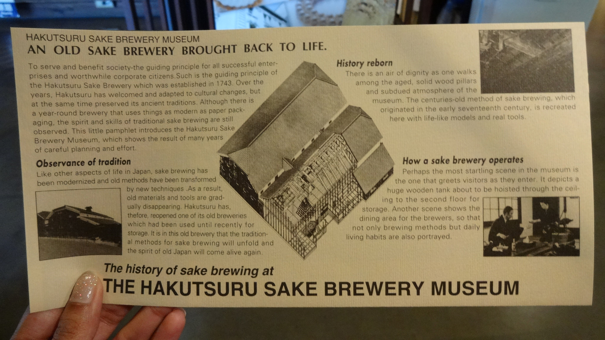

Not only is this museum free to enter, it has a fantastic exhibit explaining the history of the sake brewing process. The film clips were also available in English so we had no excuse to learn!

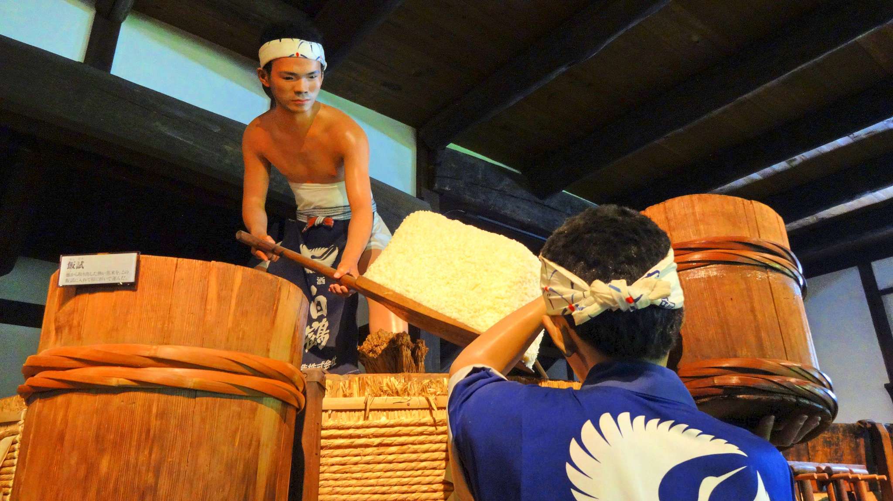

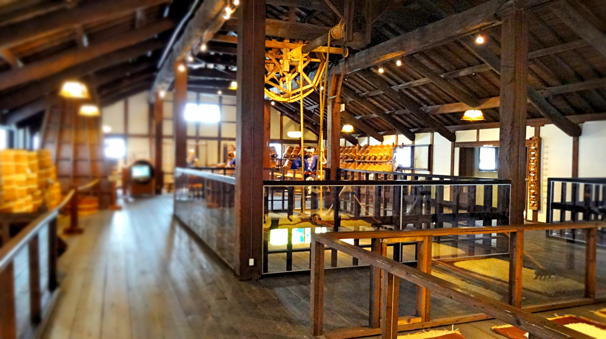

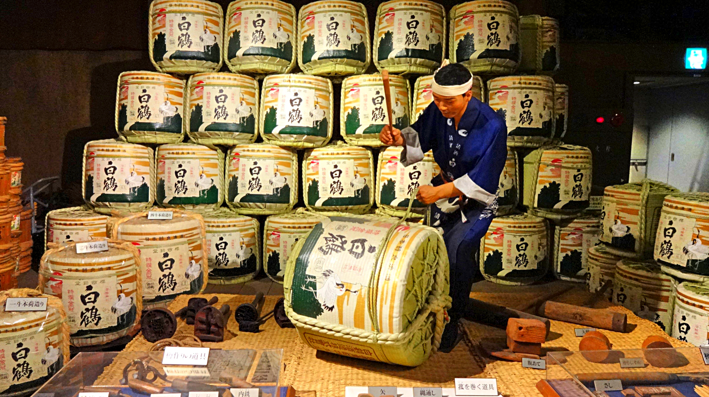

My favourite part of the museum had to be the free sake tasting at the end of the exhibit. There were several testers to try, and the staff were persuading us to sample as many as possible (we didn’t need much persuasion!).

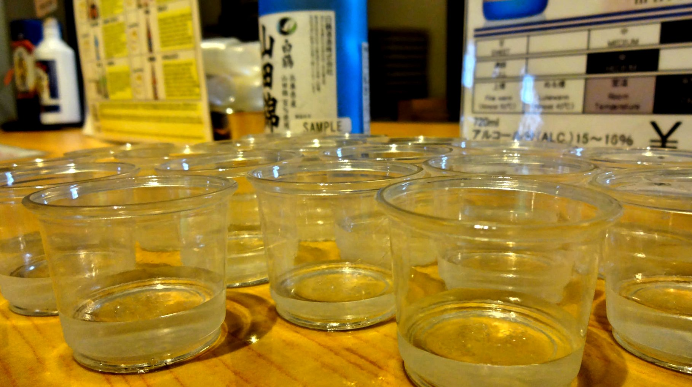

I don’t know why but I had a fear that sake would taste very pungent and bitter. How wrong I was! It was slightly sweet, dry but oddly refreshing. It was very more-ish and went down _very_ well. So well even that we were raiding the gift shop for our own personal stash!

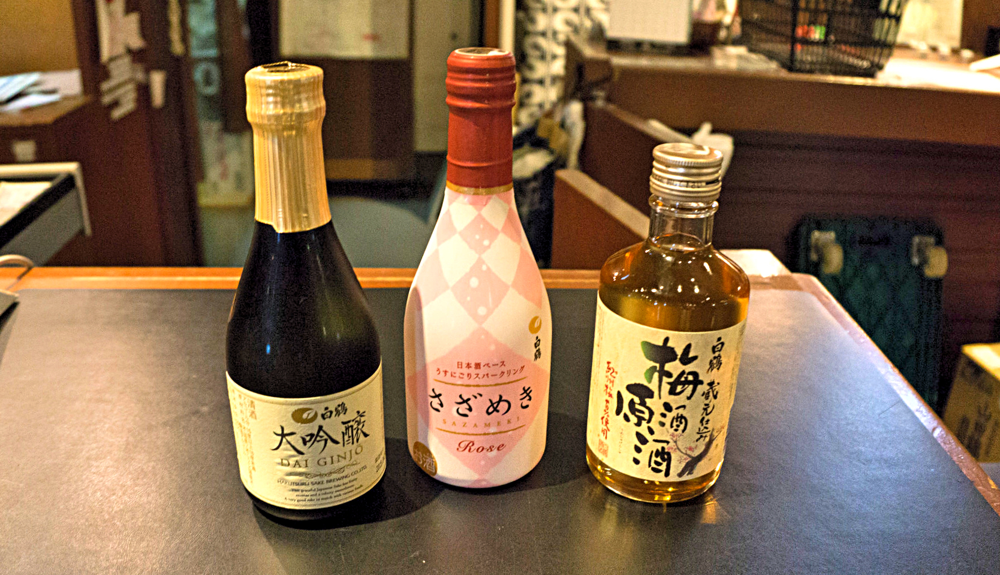

3 is the magic number!

Our day trip in Kobe was a success, never have we been so pleasured by food and drink until now. It’s so easy to do a day trip from Osaka too (or Kyoto) so there is no excuse to miss out this wonderful city.

I’m going save my pennies up and treat myself to a bigger piece of Kobe beef when I return!
