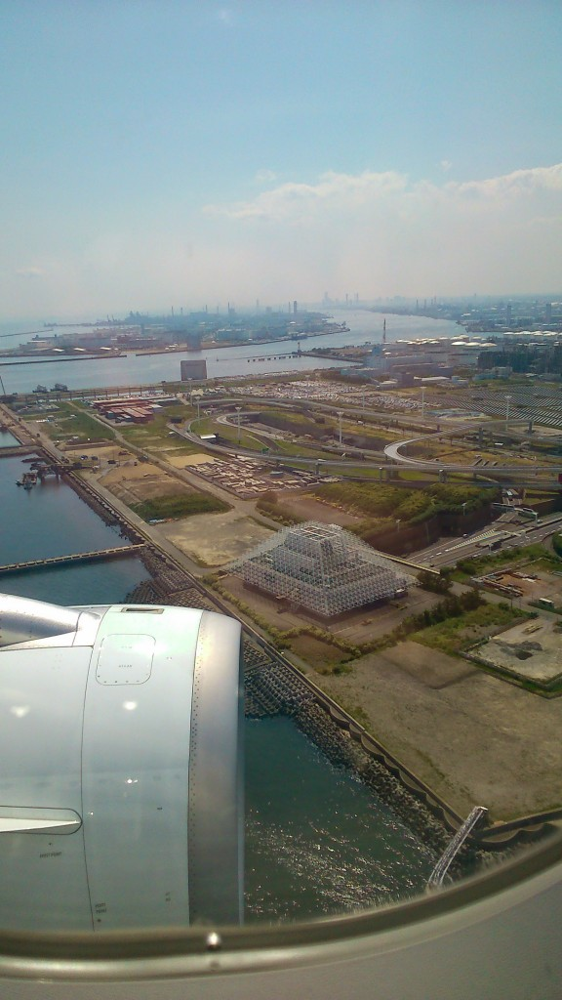

_‘One day I’m going to go Japan, and I want it to be as crazy, weird and wonderful as I ever imagined it to be’_

Landing in Tokyo

Japan is one of those countries that has always fascinated me. Like so many others, there’s just something intriguing about this country.

Tokyo in particular had always stood for to me; the desire to stand amidst the chaos of moving bodies, absorbing the cityscape in all its neon glory. I want to see how the ultramodern fuses with the traditional. The culture is going to be like no other I’ve experienced, but I’m going to embrace it with open arms.

We landed in Tokyo yesterday and are staying in a tiny capsule-like room for a week. It’s small and uncomfortable, but we don’t care! This is our opportunity to explore one of the busiest, craziest and most exciting capitals in the world.

I can’t wait to start exploring and share my adventures with you all.
