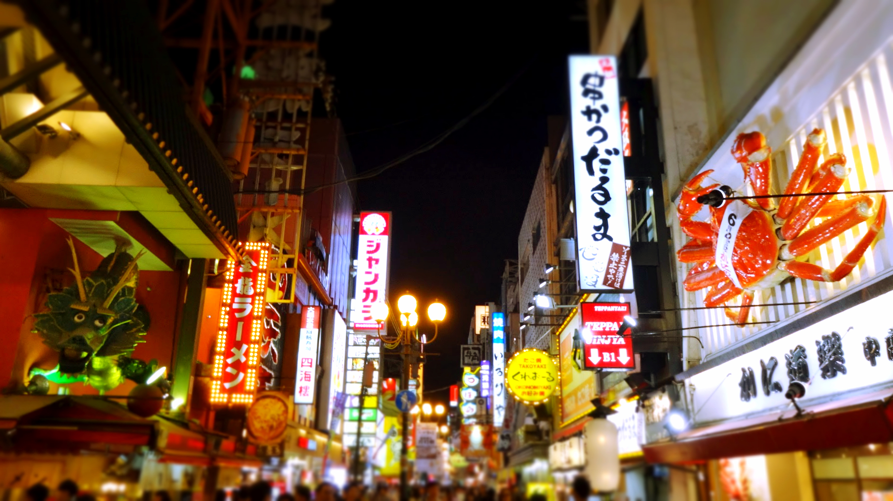
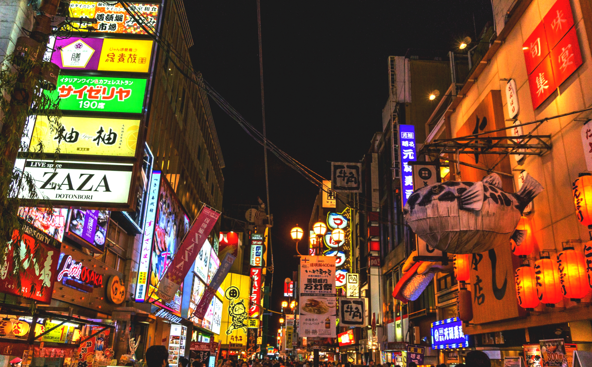
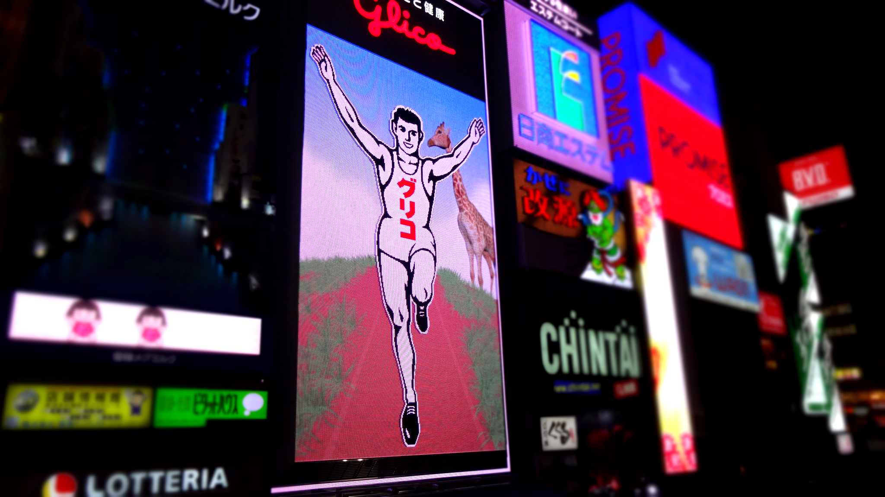
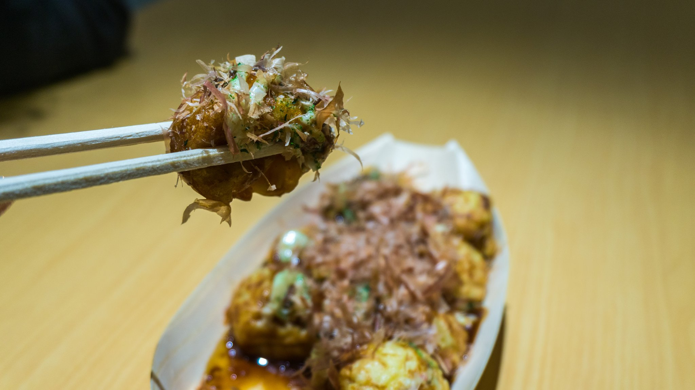
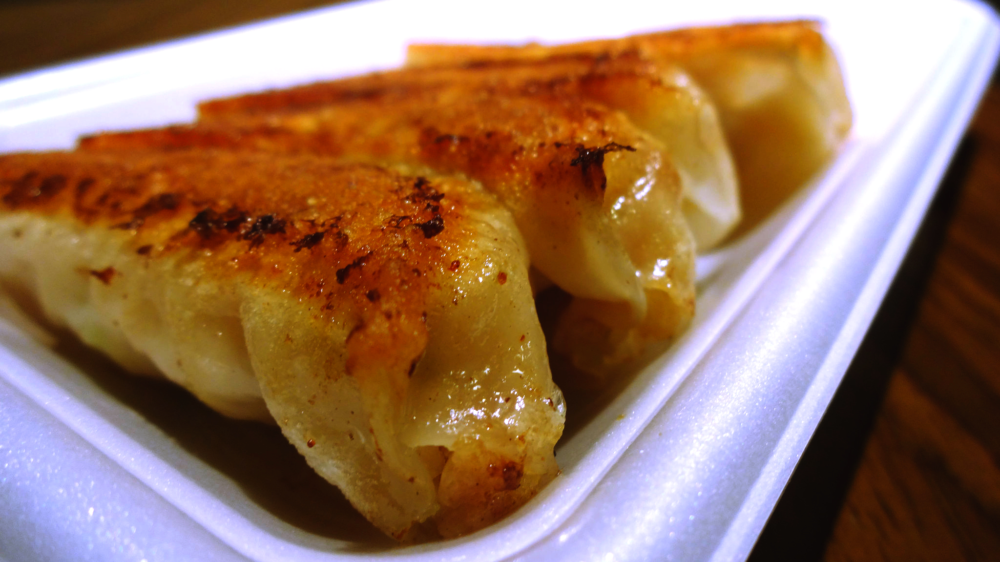
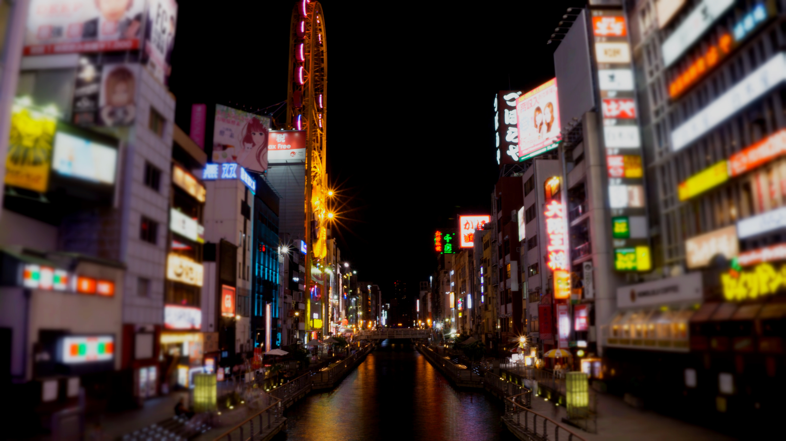

I wish we didn’t listen to other travelers saying Osaka wasn’t worth spending more than 1 night, because I left Osaka feeling like I hadn’t seen enough.

We arrived in Osaka late afternoon (after our mini excursion to [Nara](/posts/2015-05-nippin-into-nara)). After dropping our bags off we headed straight to Dotonbori which is the main entertainment district. We timed it just right as it approached evening; the atmosphere was electric with plenty going on. Dotonbori is home to Osaka’s shopping malls, restaurants, and nightlife.

Osaka gives Tokyo a run when it comes to neon signs, especially around the canal where you’ll find the famous Glico Running Man. There are many huge signs which define Dotonbori, the most famous being the Kani Doraku mechanical crab. The vibe in Dotonbori reminds me to that of Camden, London.

Just a snippet of kooky signs around Dotonbori

Another highlight for Osaka is the food – there are so many foodie choices here and plenty of restaurants to dine at. We were so indecisive due to the sheer volume of food options but we were sure to sample the takoyaki and gyoza dumpling – both regional must eats.

Takoyaki – hot balls of batter containing octopus, spring onion and ginger

Gyoza – a fried (then steamed) dumpling

Unfortunately we didn’t get the opportunity to explore the rest of Osaka. We spent the next day in Kobe and didn’t return til late. It’s a shame really, I feel that Osaka has a lot going for it.

The vibe is much more laid back than Tokyo, but with a slightly grittier feel. The locals here had more of a free spirit, even a tad bit edgy or rebellious!

I only wish we factored more time here. I can’t understand why people dislike Osaka. Unlike Tokyo or Kyoto this city feels much more creative and bolder, yet still retains a traditional charm (there’s Osaka castle and museums to delve into the history).

Our visit may have been short but Osaka has easily become one of my favourite cities. Don’t dismiss Osaka as ‘another city’ – there’s so much to discover and see here.
