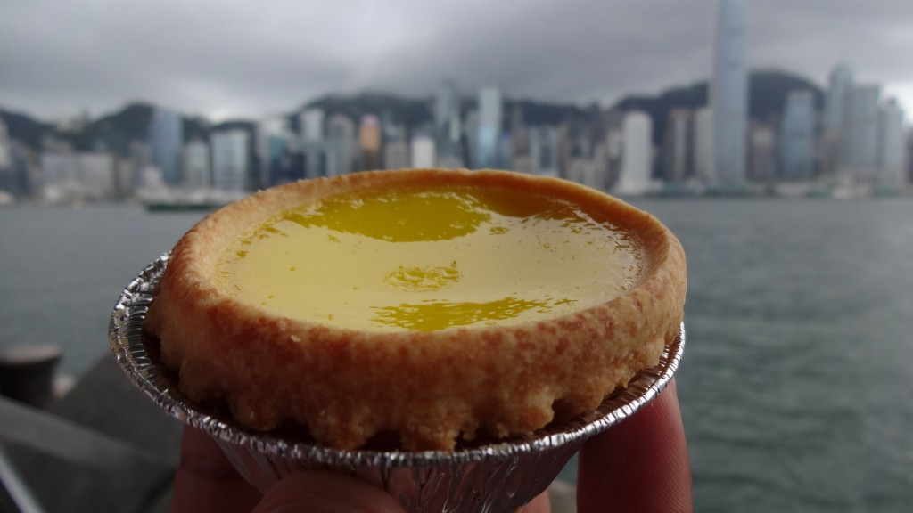
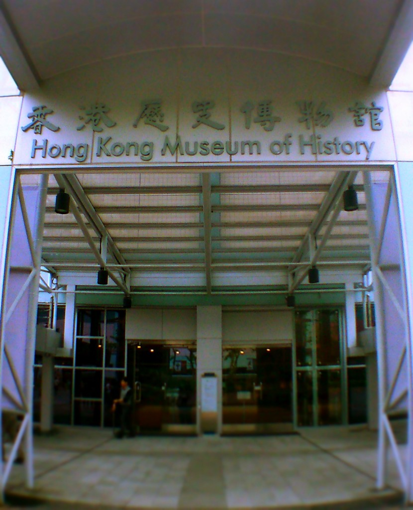
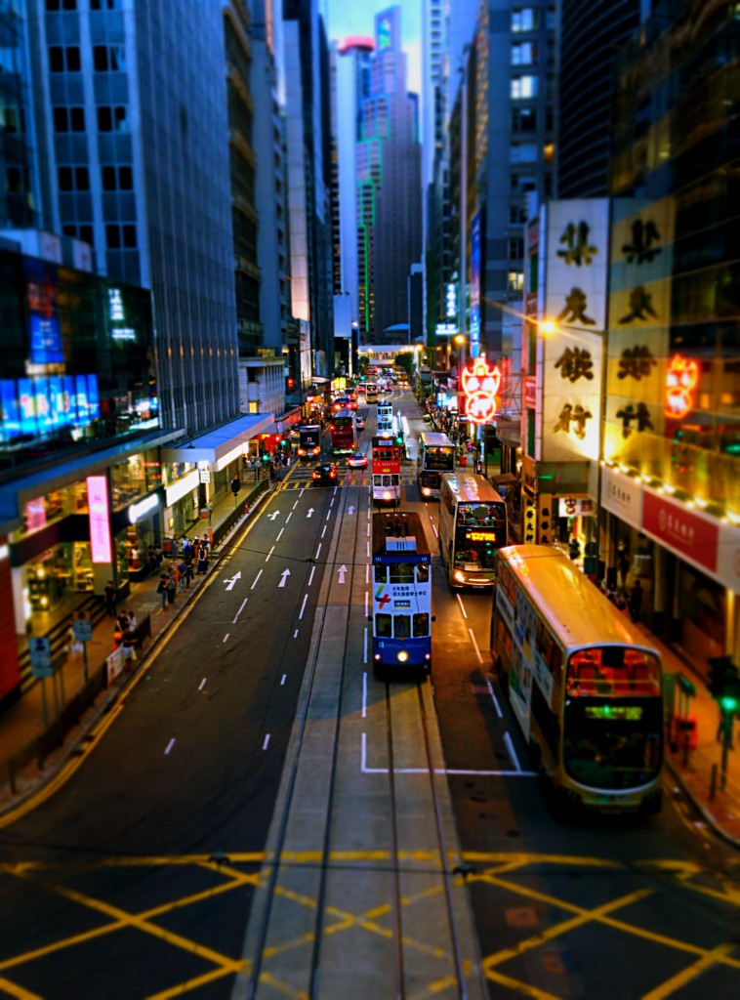
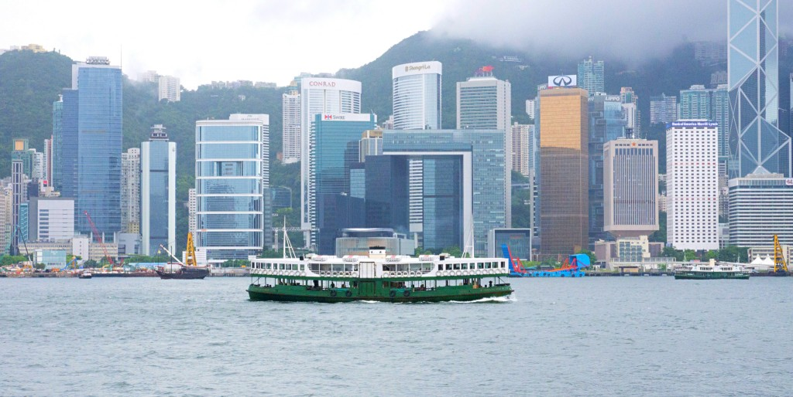
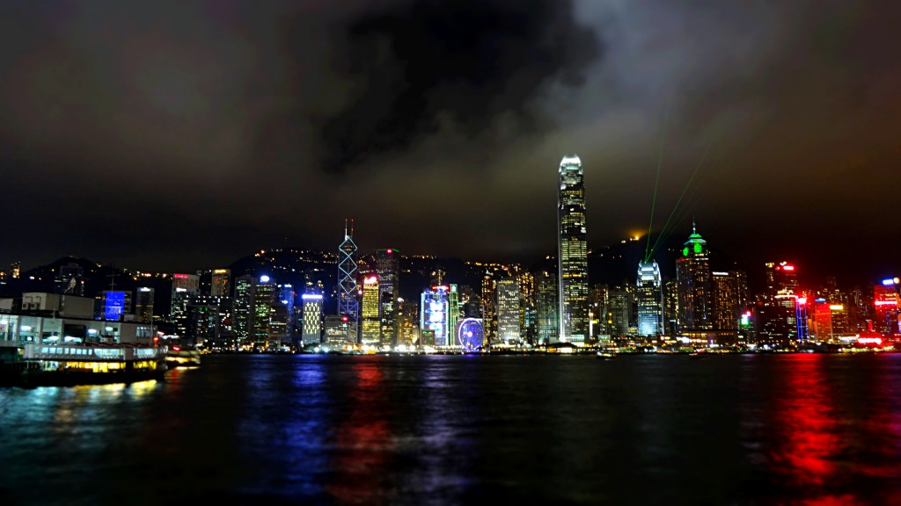

_I’ve wandered through Bangkok’s buzzing night markets, admired Singapore’s squeaky clean streets, marvelled at Tokyo’s neon glory, and gotten lost in Seoul’s quirky neighbourhoods. Still, nothing prepared me for Hong Kong…_

Hong Kong has always been an enigma for me. Despite knowing it as one of Asia’s booming mega cities I had difficulty imagining what the city would be like.

Soon after landing I noticed the initial buzz about the place. It was hot, humid and incredibly busy. More so than any other city I’ve visited, that’s including Tokyo.

It took a couple of days to really settle, that was partly due to the urban heat effect. Outside the weather was almost 100% humid with a sprinkling of sticky rain throughout the day. Inside our room (as well as the shopping malls) blasted icy cold air con through our bones.

Accommodation in HK is renowned for its lack of space, and our room was no exception. Best described as coffin size rooms, our room contained nothing more than a double bed with marginal space left over for baggage. The bathrooms are a squeeze too, though we actually had a shower cubicle (as opposed to a shower over toilet) which wasn’t too bad.

Back to HK, which after a few days we realised how incredibly dense but exciting this island was. For seven days we roamed, eating our way around and ogling at giant skyscrapers. Not a day went by had we discovered yet another HK delicacy, or stumbled on another part of the city we thought we’d initially seen.

What struck me the most was the diversity. Unlike South Korea or Japan there is a melting pot of cultures working and living in HK. It was fascinating to see and be apart of; nothing excites me more than seeing a city brimming with diversity.

I’ve shortlisted 5 favourites things we did during our visit in HK. The 5 ‘to dos’ I’ve mentioned below are a must for anyone visiting HK; it doesn’t matter how short or long the visit is, just get out there and explore this crazy city!

**Food**

It’s time to ditch the diet in HK as there’s plenty of food to indulge in. Whether its joining a food tour or discovering the hidden vendors for yourself, there is something which is guaranteed to satisfy your tummy. Milk tea, tarts, wonton noodles, dumplings, roast meats, dim sum – need I go on?

Enjoying egg tarts at Tsim Sha Tsui

**Hong Kong Museum of History**

With free admission every Wednesdays, this museum goes as far as explaining the geology of how HK was formed right the way to its current affairs. Plan 3-4 hours here, there is a wealth of information to read and watch.

**Hong Kong Tramways**

There is plenty of modern transport to navigate around Hong Kong but sometimes it’s worthwhile to step back and appreciate a vintage style of travel. Whether it’s a photo opportunity or a way to get around, the historic double-decker trams are a wonderful sight to see. Don’t expect comfortable seating or air con, but do go upstairs for the best views. At only 2.30 HKD, sit back and enjoy the charming ride.

Tram spotting!

**Star Ferry**

The easiest, cheapest (and most scenic) way to get between Kowloon and Hong Kong Island is via the Star Ferry. At around 2.50 HKD per person, this mode transport is cost effective and offers great views of the cityscape. Quick, convenient, timeless!

**Victoria Harbour**

Last but by no means least, no visit is complete without seeing Victoria Harbour. Great by day, spectacular by night, Victoria Harbour is best seen in the evening where the buildings dazzle with their light displays; at 8pm the Symphony of Lights Show is free for all to see. There are plenty of areas to see the lights or to sit back and absorb the breathtaking cityscape.

Victoria Harbour
