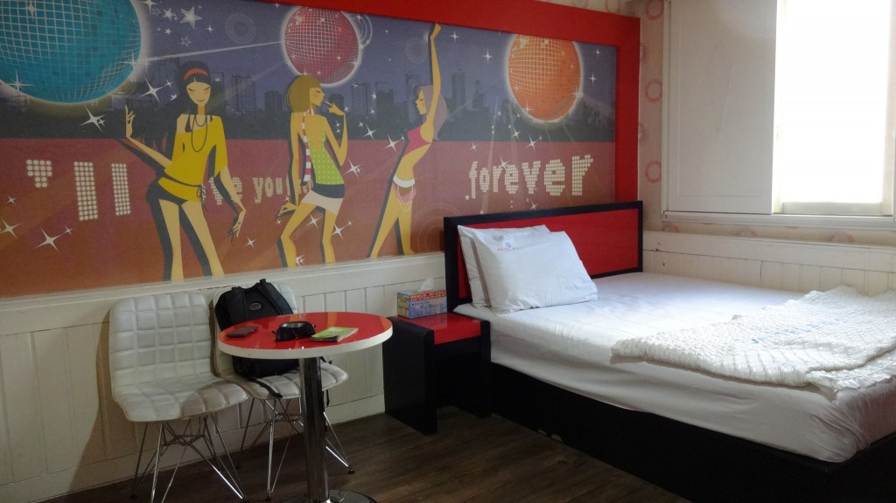
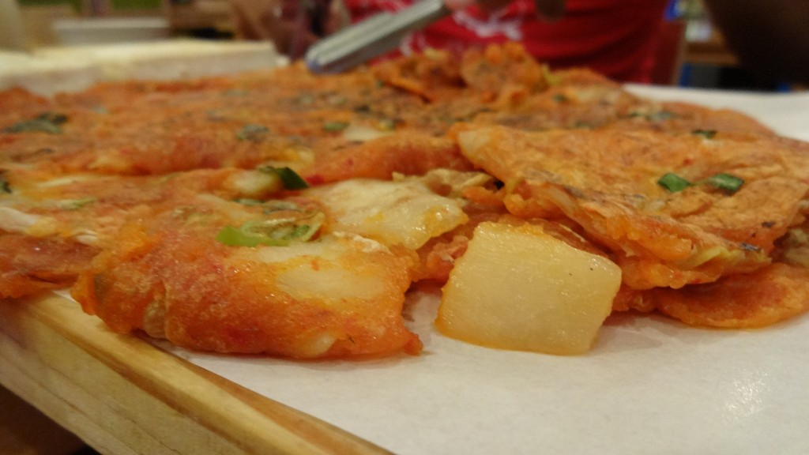
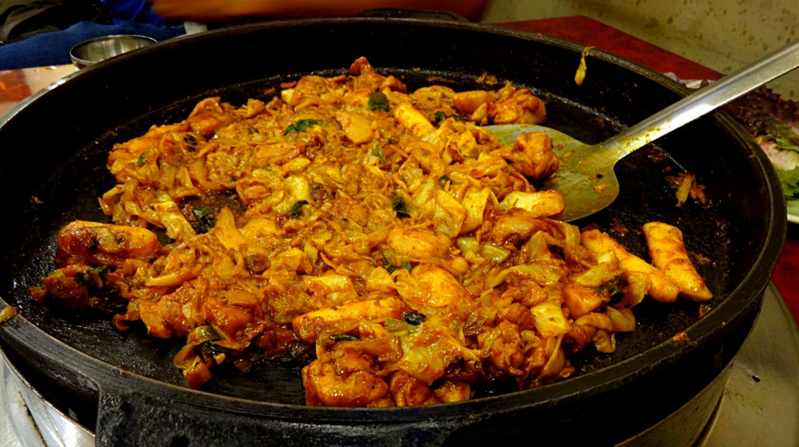
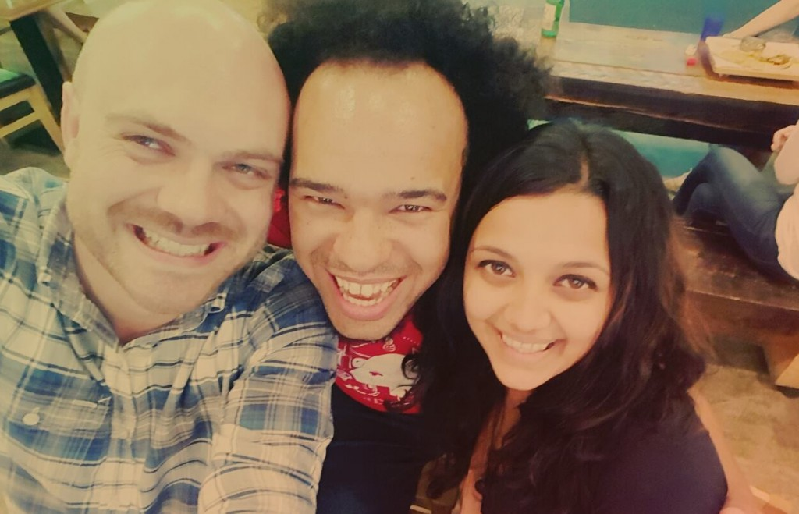

We only stopped in Daegu for a couple of nights as we were meeting up with a friend (who we met on a [cooking class](/posts/2014-11-we-cook-thai-home-garden-cooking-school) in Chiang Mai).

Again we booked another ‘love hotel’ as they’re usually the cheapest types of accommodation. Unlike Busan this one had a really tacky feel but given the location it sufficed.

Our cheesy room at Prince Motel

Still feeling burned out from our experience in Busan we didn’t really explore Daegu much. I found from previous experience that whenever we ‘force’ ourselves to go sightseeing we end up having a really crap time. _If you have to force yourself to do something you don’t want to, you ain’t gonna have a great time doing it!_

Kimchi pancake

Anyways the purpose of coming here was to meet our dear friend Rikus. He took us to a local restaurant where we got to try Korean BBQ for the first time, and then introduced us to makgeolli and soju (popular Korean alcoholic beverages).

Dak Galbi – chicken marinated in spicy sauce

It’s amazing how catching up with friends can make you feel. We both felt so happy after our catch up with Rikus; it was great just to talk, eat and drink!

We’re actually looking forward to visiting Seoul next; I’ve heard good things about South Korea’s capital so I’m hoping we find some great hangouts during our stay.

Putting the smiles back on our faces again!
