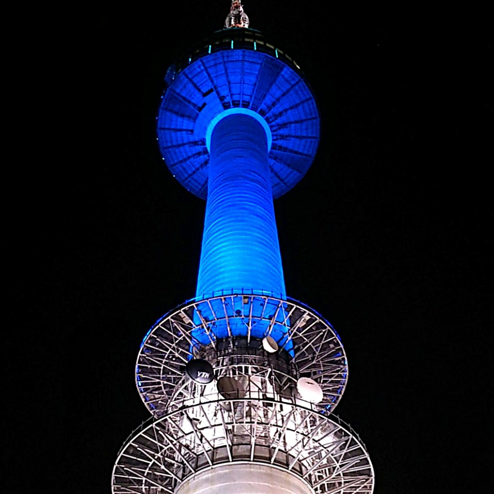

We waited until our last day in Seoul to visit N Seoul Tower. Coincidentally it was also the best time to go as the weather had finally cleared up.

N Seoul Tower opened in 1980 and has become a popular landmark for Seoul. The facilities at the Tower include an observatory, a roof terrace and a variety of restaurants.

There are 3 options to get to the Tower – walk, bus or cable car. Being cheap-skates we chose to walk the scenic but long winding route to the top.

We passed ‘Lover’s Lock’ on our ascent and had to stop to admire the view. The set up is similar to the Pont des Arts in Paris (which has sadly been removed).

There is a bridge AND metal trees to hold the locks!

It goes on and on and on!

As we didn’t buy a love lock in Paris we decided this was our second chance to do so here. I bought the cheapest lock (around 5,000 won) but we both couldn’t think of anything to write on it! How do you sum up a 5 year relationship on a teensy weensy lock?

We tried to act loved up. We just laughed at each instead

We crammed our little lock among the crowds of other locks, and feeling no less loved up than before we arrived we continued on to the Tower (_maybe it takes a while to process!_).

The cutesy theme continued when we arrived at the observation deck. There were couples locked in embraces as they overlooked the city going into dusk. Not wanting the spoil the mood we couldn’t help but worm ourselves in between doting couples to get a few snaps!

We spent an hour checking out the panoramic views from the observation deck before we made our way down. As we made our way down we passed yet _another_ love related monument littered with couples and their selfie sticks.

Seriously, Seoulites are a bunch of romantics! I saw more affection here than I did in Paris (_which is meant to the City of Love right?_).

Having said that it wasn’t just couples having all the fun. There were just as many singletons and families enjoying N Seoul Tower too – so there’s no excuses not to go!
