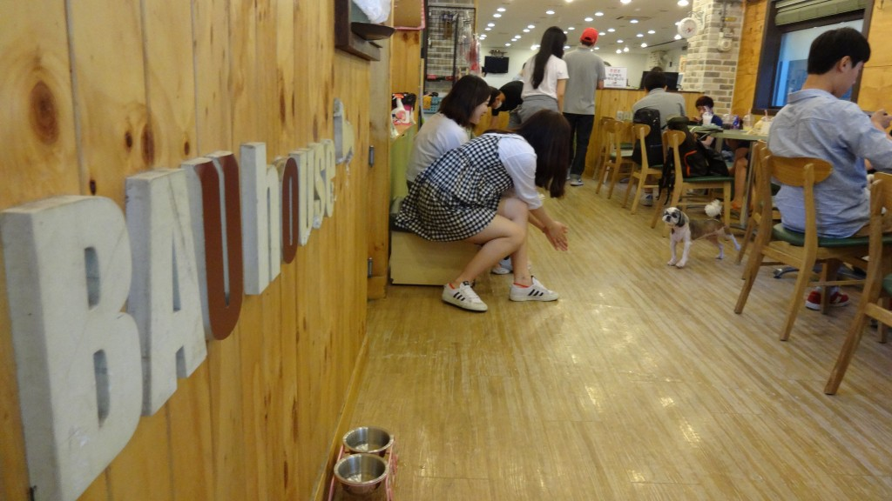
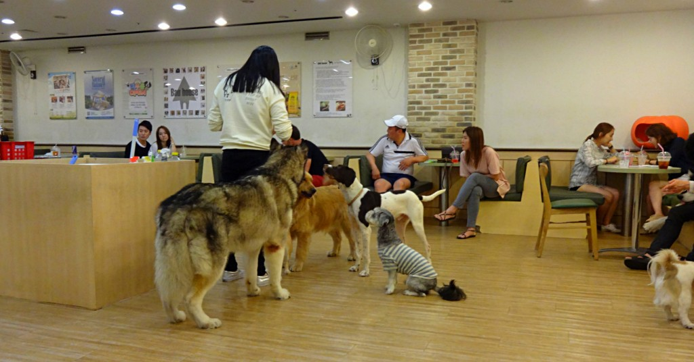
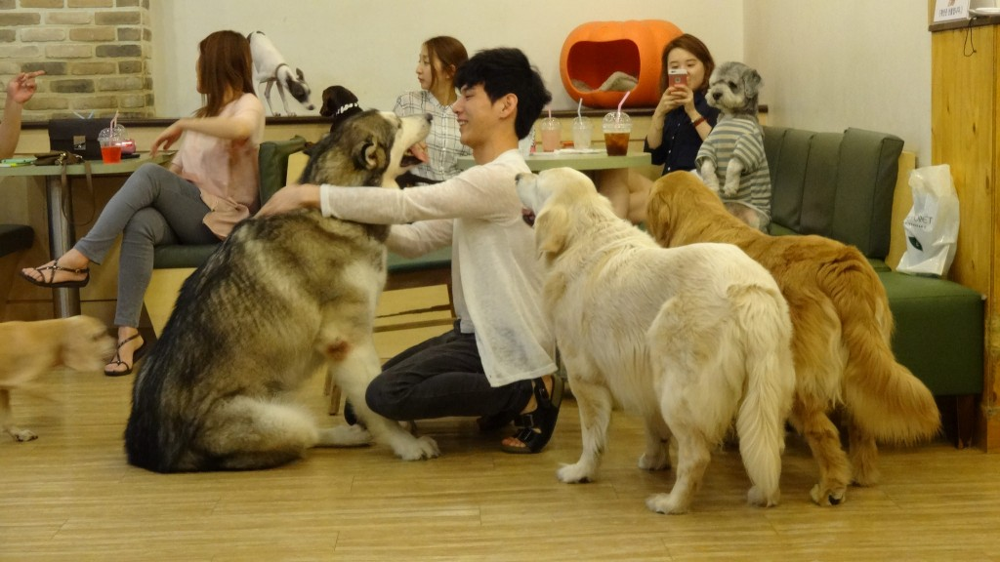
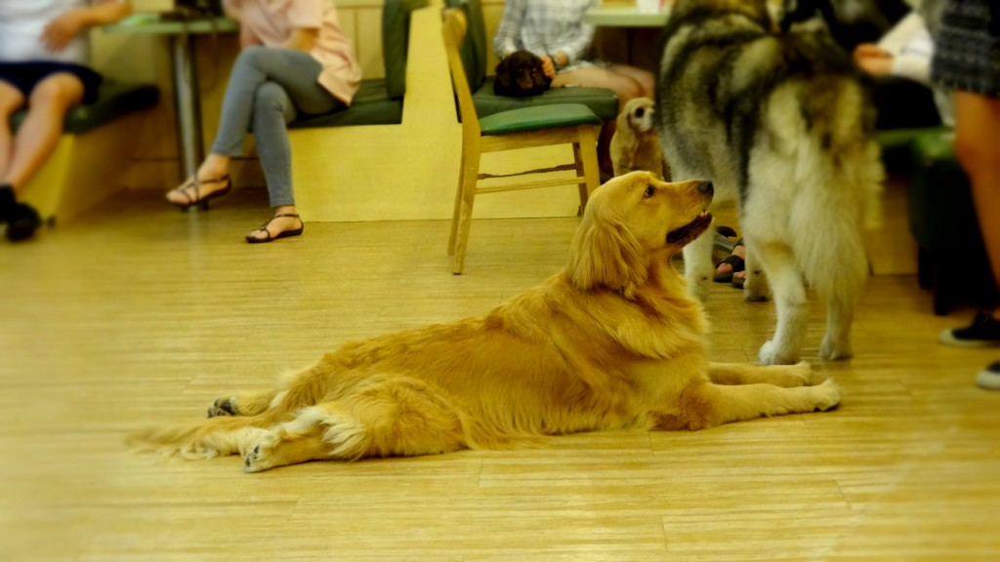
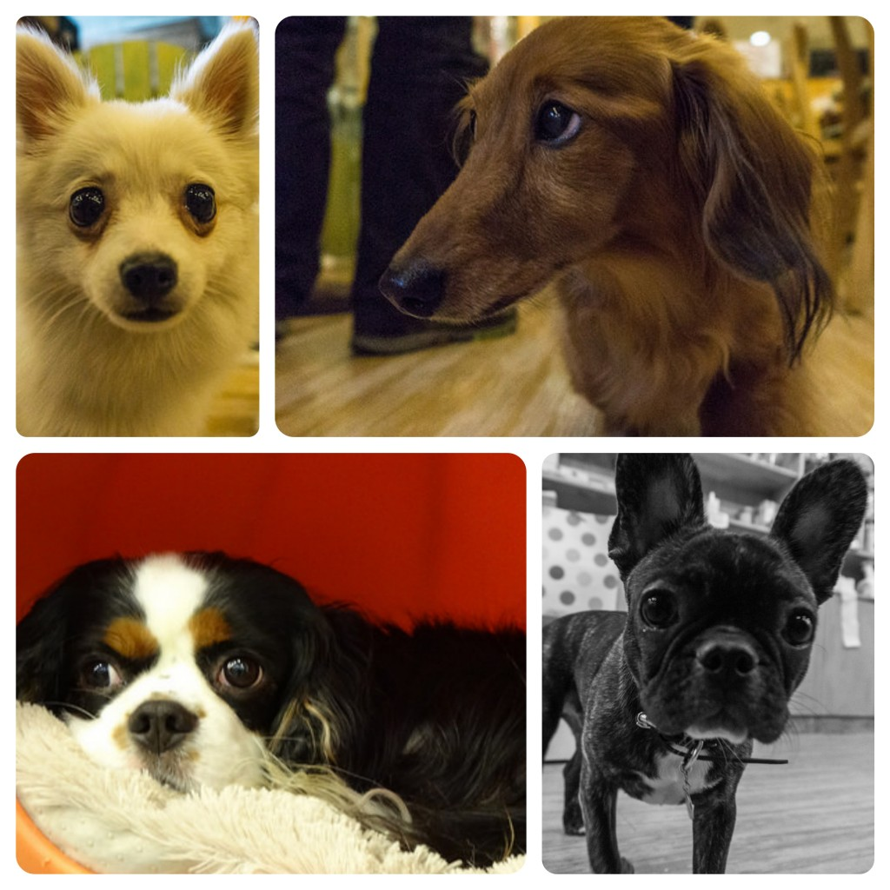
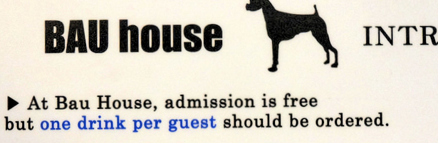

Seoul is not short of café culture. There are streets around Seoul lined with rows of coffee shop after another.

In recent years a number of quirky cafes have emerged. Cat cafes which seem to be the rage everywhere are not the only quirky cafe you’ll find in Seoul. I recently discovered there was a dog cafe in Hapjeong as well as a sheep cafe in Hongdae!_Take that kitties with your sneeze inducing fur!_

Kyle didn’t fancy going to the sheep cafe but we were both up for visiting the dog cafe. We miss Kyle’s parents dogs so it was a perfect reason to visit.

As soon as we entered Bau House dog cafe we were greeted by various barks and many wagging tails. The cafe is split into two sections – the section near the entrance is where the smaller dogs are, whilst the section at the back is where the bigger dogs can be found.

Bau House can get very busy but we were fortunate to get seated straight away on a Saturday afternoon. We were seated in the bigger section which contained most the dogs.

I was actually quite apprehensive at first, especially seeing the larger breeds. It’s been so long since I’ve interacted with dogs! There were plenty of breeds in this section mingling with each other – we saw a golden retriever, samoyeds, malamutes, cavalier king charles, whippet, terriers, and daschunds among other breeds I didn’t recognise.

Given the amount of dogs around the cafe didn’t smell too bad. The staff are on hand with cleaning equipment when accidents occur so cleanliness is maintained.

Unless you buy treats the dogs will largely avoid you. We found this out when we were there for about 10 minutes and not one dog came over! With our overpriced drinks (more about that later) we sat back and watched the dogs play around and chase people for treats (which was rather amusing!).

After a while the noise became pretty unbearable as more dogs entered the larger section; every time a new dog entered there was a mass chase around the room accompanied with deafening barks. It all got a bit too much so we moved to the quieter section of the cafe and found better luck with the little pooches there.

The dogs are smaller on the other side and much more approachable. We actually had more fun on this side as the dogs were more interactive with us and not chasing for treats.

Too much cuteness!

Whilst we mostly enjoyed our time at Bau House, it is a pricey affair to visit. I like the concept of a dog cafe and I guess nothing beats the affection of a dog to raise people’s spirits, but if anything it left us missing our dogs more!

**Details**

Admission – it is free to enter Bau House but you are expected to buy a drink per person. This is where the money is made as the drinks prices are heavily inflated. We ordered a couple of Coke’s and the bill came to around 12,000 won. A small bag of dog treats costs 4,500 won.

**Address**

Jeil Bldg. 1F, 394-44 Seogyo-dong, Mapo-gu, Seoul

**Opening Hours**

Monday – Friday 13:30 – 23:00

Saturday – Sunday 12:30 – 23:00
