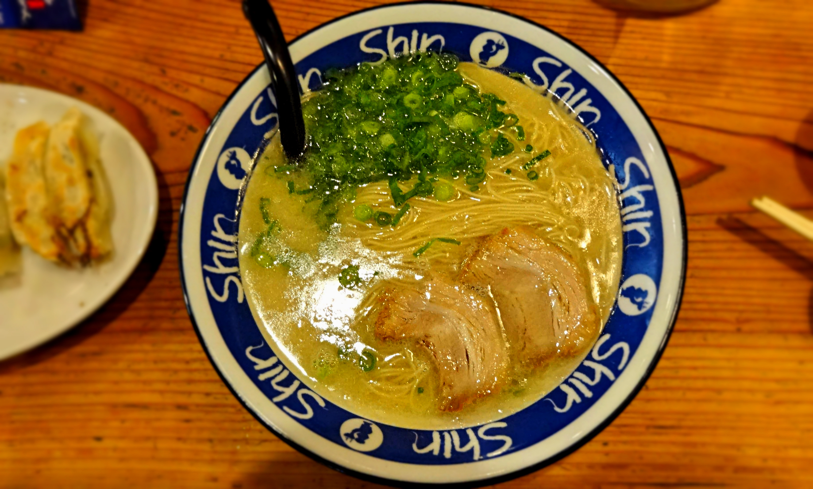
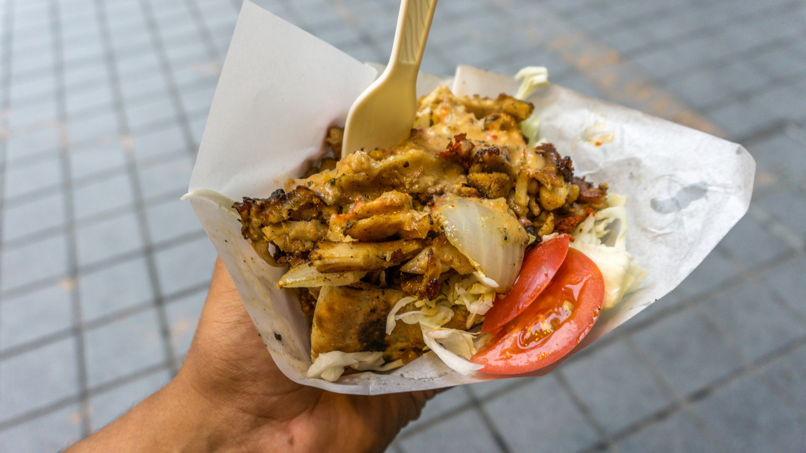
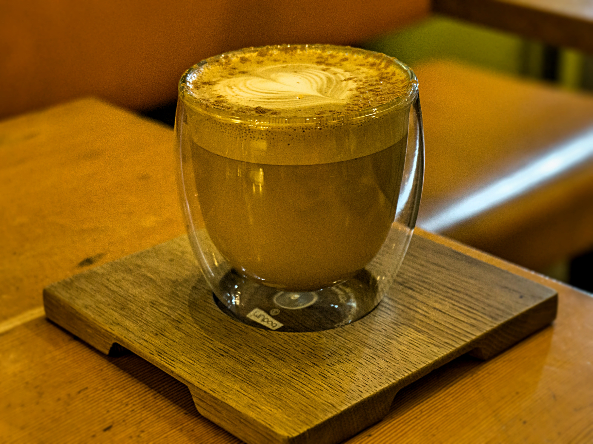

After a scenic 4 hour bus ride from Hiroshima we arrived at Fukuoka.

We didn’t really know much about Fukuoka apart from the fact that it had a port which we are intending to use to get to South Korea. However rest assured thereis plenty to do – if you go out in search for it!

What I liked most about Fukuoka was the laid back vibe. Unlike Tokyo or Osaka, you get a great feel of city life without the mass crowds. Like other cities Fukuoka is home to plenty of shopping malls but also has a huge art scene. There are also beautiful parks and ancient temples to explore. However for us we only had 4 nights to plan and rest up before we moved onto the next country so we unfortunately skipped most of the sightseeing.

Fortunately we stumbled on various local coffee establishments where we spent most our time – something we could not do in the other cities as it was just too busy to find available seats.

The ramen in Fukuoka exceeded its reputation. Normally when I tuck into a bowl of ramen I can never finish it as there’s just so much packed into the bowl. This changed at Shin Shin Ramen where I devoured my bowl of tonkotsu ramen with a side of gyoza. It was the most delicious bowl of ramen I have (and will probably ever) eaten.

Yes…Yes… Yes!

Delicious kebab at Guru Guru Chicken

What I loved most about Fukuoka was the artistic vibe. The city felt very creative and expressive, whether it was they way people dressed to the way the coffee was served (at one establishment the staff came to our table and poured our coffees complete with latte art right in front of us!).

Honey-cinnamon latte

There is definitely a lot going for Fukuoka; it amazed me how every city we visited in Japan had its own flair.

Our visit in Fukuoka was short but so worthwhile – I can already foresee how gutted I’m going to be when its time to leave. Saying that I’m probably going to cry when I leave Japan in general – I bloody love it here!
