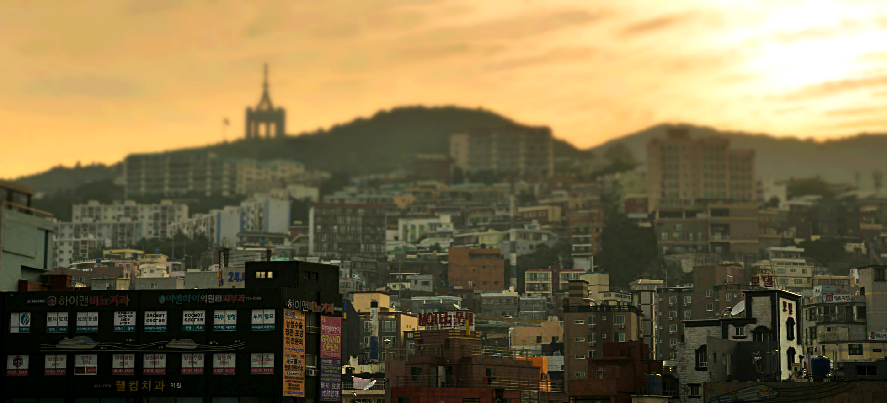
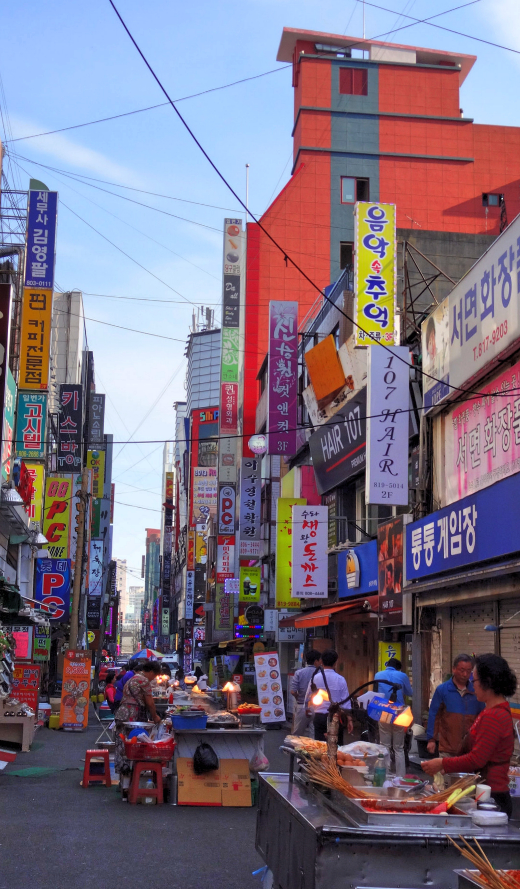
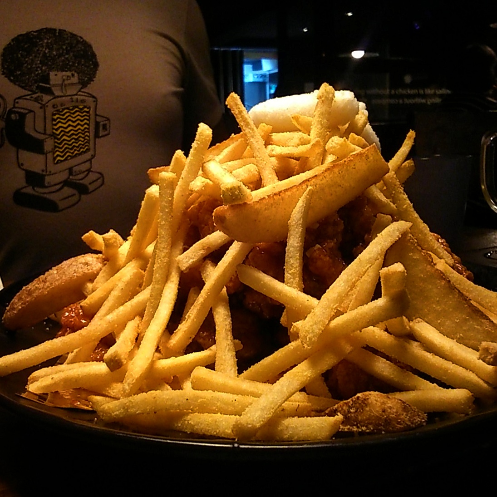

I can’t quite sum up my feelings towards Busan. We were only there for 2 nights but I couldn’t engage with the city.

As soon as we passed through immigration and exited the port I felt an immediate sense of disappointment. I thought to myself _‘Why are you feeling so down, you’ve just got here!’_

Then it struck me. I was subconsciously comparing Busan to Japan. Which is of course not fair to do at all, but everything I saw came with a reflex of ‘_but in Japan it’s like this’_ or ‘_I preferred how its done in Japan’._

We put our reservations aside and found the bus stop to get to our hotel. Unfortunately the bus driver had a vile attitude which dampened my mood further – his unnecessary shouting at us to pay the fare as we tried to find out a place to store our bags reflexed a roar of anger from me in return.

_I’ve only been here an hour and I’m already losing my nerve! Arghhhhh……._

Not all was lost though, a kind passenger saw our frazzled states and asked if we needed help which brightened us up. _Maybe it wouldn’t be so bad after all?_

We stayed in a ‘love hotel’ and initially expected the worst. To our surprise the room was huge and had plenty of amenities; it was a welcomed sight to crash out during our stay.

As we planned to visit Daegu we went to the train station and booked our tickets. I was pretty surprised to see how cheap the tickets were, we booked tickets for the local train to Daegu which ended up costing around £10 for the two of us.

Opposite the train station we decided to check out China Town. What a waste of time!

There was nothing remotely ‘Chinese-looking’ around the area. It should in fact be renamed to ‘Russia Town’ because we lost count on how many russian orientated shops we passed by. Seriously, it was the worst attempt of a China Town we’ve ever seen. I’m just glad we didn’t visit in the evening.

Street vendors around Busan

Still trying to keep the optimism levels up we walked to BIFF Square which we knew had local food markets. Yes, there was local food. But again my thoughts got the better of me; none of it looked remotely appealing to me.

‘_What the hell is going on with you Kim!’._Normally I get so excited seeing the variety and cuisine on offer. But there it was, all pre-made in advance, sitting there for hours waiting to be bought. I’m sure there was something there I’d have enjoyed, but at the time I just couldn’t bring myself to try something I didn’t feel keen about.

We eventually found a restaurant which served the popular fried chicken and fries combo. It all started off promising, ordering a spicy combo. It arrived and looked so good, the portion was pretty generous too. The mood changed once we started eating. Someone must have misinterpreted spice for sugar, because both the chicken and fries were coated in a super sweet substance. It was awful!

A pile of sugary fries and chicken. Bleurgh

Defeated and overdosed on sugar we retreated back to the hotel for solace. It’s difficult to move on from a country which I enjoyed so much to another where everything feels so alien. I guess it’s just the culture shock that has thrown me off guard.

I didn’t enjoy Busan, but then again I didn’t really venture into much of the city. Maybe another occasion would yield a better experience. For now though I’m wanting out and keeping my fingers crossed for Daegu!
