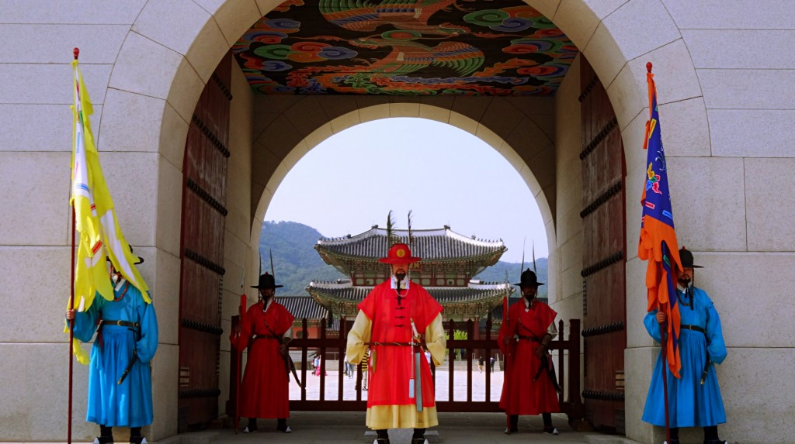
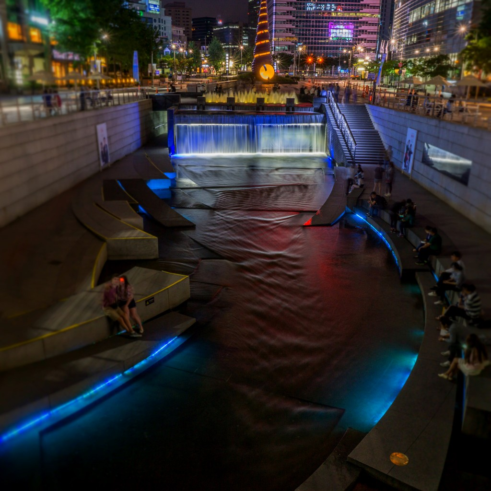
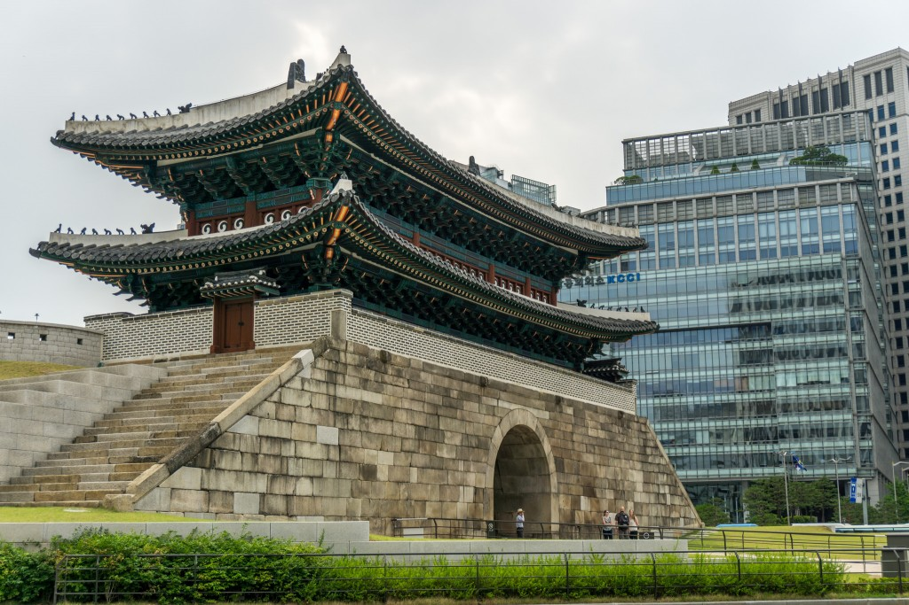
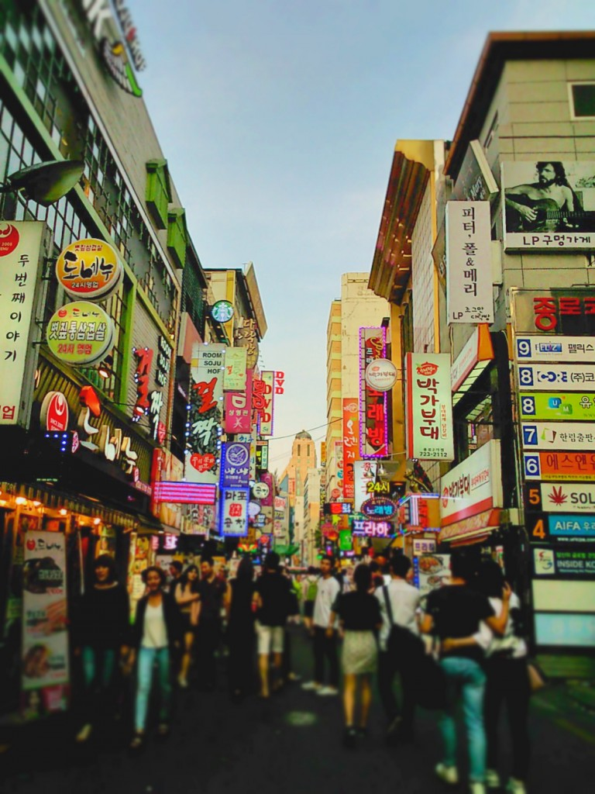

We stayed in Seoul for two weeks so Kyle could catch up on work commitments. At first we weren’t sure how to long to stay but we found a great [hostel](http://tphostel.com/tp/) which had everything we needed for a couple of weeks downtime.

There are many districts in Seoul but we decided to stay in Hongdae, a lively area near Hongik University which had plenty of food, drinking and shopping choices.

Although we spent most our time at the hostel we occasionally ventured out to explore the districts in Seoul.

Thankfully we enjoyed Seoul more than Daegu and Busan. Although we didn’t experience the same buzz like we did in Tokyo or Bangkok, there were a few places we enjoyed visiting.

Apart from Hongdae, these 4 places were some of my favourite must-sees around Seoul:

**Gyeongbokgung Palace**

Originally built by the Joseon Dynasty, Gyeongbokgung Palace is one of the grandest sights to see in Seoul. It’s also the place to see the Royal Guard Changing ceremony.

The architecture around the Palace looks stunning a bright day. I particularly enjoyed seeing the guards on duty, their stature complete with costumes keep the Palace’s traditions alive.

**Cheonggyecheon Stream**

A mini oasis amidst the urban environment, Cheonggyecheon Stream is a great recreational space to spend an afternoon escaping the city heat and exploring Seoul’s greener side. Many locals come here to relax, do fitness or catch up with loved ones.

We particularly enjoyed going in the evening when the pathways lit up; it’s also a great time for photo opportunities.

**Sungnyemun Gate**

Unofficially known as Namdaemun Gate, Sungnyemun is one of the largest castle gate structures in Seoul and is considered to be South Korea’s first national treasures. The gate looks impressive against the backdrop of modern buildings, fusing traditional and modern. Nearby Namdaemun market is the place to go for cheap souvenirs and clothing.

**Myeong-dong**

Although this is one of Seoul’s busier districts catering mostly towards shopping we enjoyed the buzz around and spent our visits window shopping and searching for good places to eat. Theres also the opportunity to buy souvenirs here but I found Namdaemun market to have better choice (+ cheaper prices).

_What do you recommend seeing in Seoul? I’d love to hear you thoughts!_
