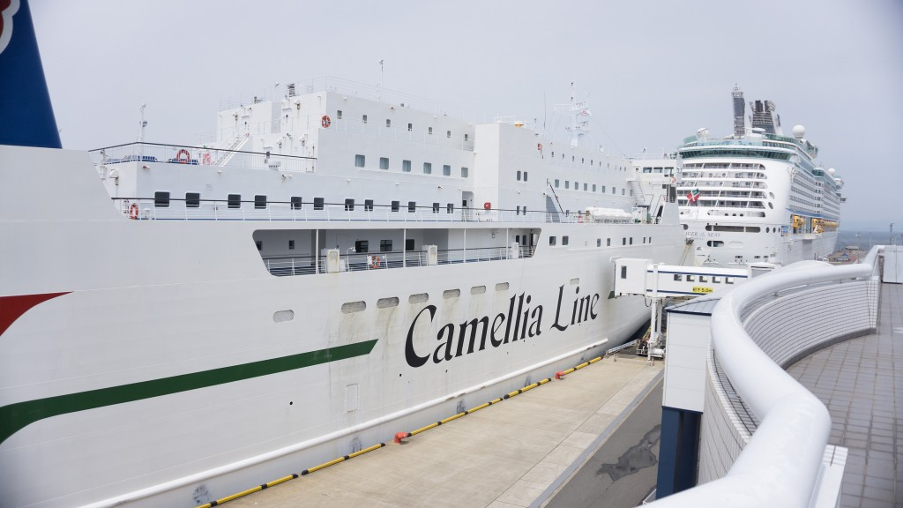

_Aand by sailing_, I mean catching the ferry from Fukuoka to Busan.

Stocking up on essentials

So. Here we are. It is now that time to bid another farewell to this country in exchange for another. However unlike my usual excited nerves at the thought of moving on, I can’t help but feel absolutely gutted to be leaving Japan.

Three awesome weeks have flown by, much to my disappointment. There just didn’t seem to be enough hours in the day to do what we wanted; we saw as much as we could but I still feel like we didn’t even scrape Japan’s surface. It actually feels like an addiction, I want to see more and more of this beautiful country but I know it’s time to move on.

We went to Fukuoka port and booked our ferry tickets with [Camellia Line Ferries](http://www.ferryto.com/camellia.html). It’s actually cheaper to book tickets 5 days in advance on the [aferry website](http://www.aferry.co.uk/timetable/BusanFukuokaCamelliaLineuk.htm) but as usual we left our transport arrangements last-minute.

The Camellia ferry journey takes about 6 hours, onboard there is restaurant, small games room and even an onsen. So I’m sure we’ll be keeping ourselves occupied during the journey.

Although I’m upset to be leaving Japan I’m intrigued to find out more about its neighbouring country. There’s still so many countries to experience so I’m glad to be leaving Japan on a high note.

It’s time to move on and experience what South Korea has got going on. I’m aware of their fondness for spicy food and fried chicken which is a promising start!

Off we go, Sayonara Japan
