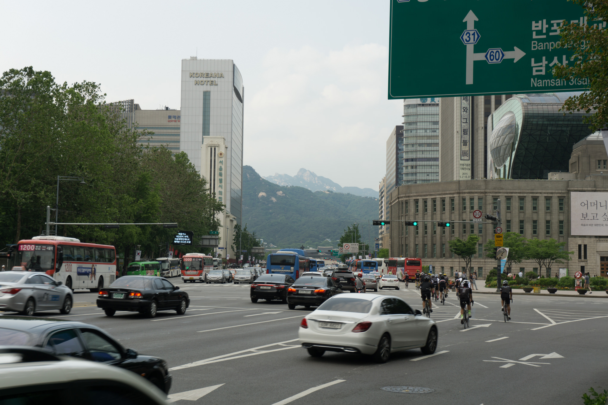
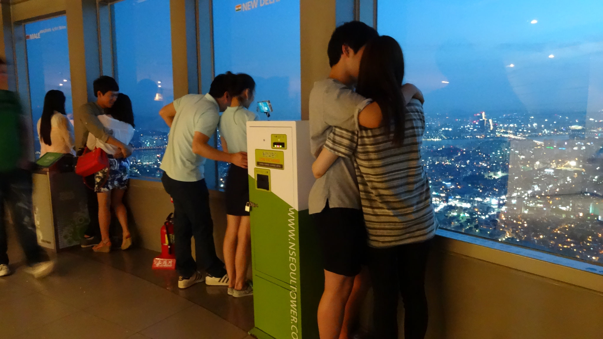
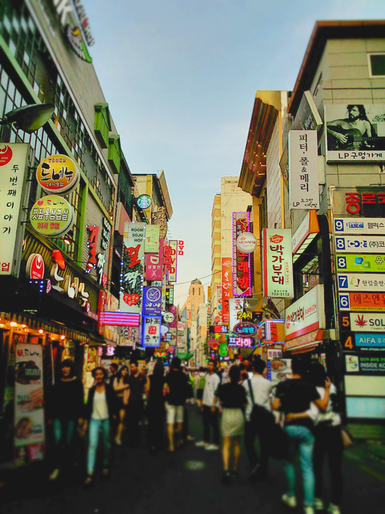

We stayed in South Korea for 3 weeks – by the time we reached Seoul the media were in a frenzy about the recent outbreak of MERS (Middle Eastern Respiratory syndrome).

Here’s my two cents/pennies/won/whatever! about this recent outbreak…

**What is MERS?**

MERS is a viral respiratory disease which was first reported in Saudi Arabia in 2012. Symptoms from the disease can range from an infection like a cold to more serious illnesses like respiratory failure and pneumonia.

**Reported cases so far?**

At the time of writing this there were 184 confirmed cases and 33 deaths reported. The majority of these cases were contracted in health care facilities (whereby most of the patients contracted had pre-existing medical conditions).

**How does it spread?**

It’s not known exactly how the virus is spread, though the likelihood is through close contact with an infected person.

**Should you cancel your visit to South Korea?**

Simply put, NO. Here’s why…

We live in a world where access to information is at our disposal. We can catch up with the world’s events by simply picking up a newspaper, watching the TV or going online. Everyday we are bombarded with ‘breaking news’ of some sort, whether it be politics or weather events, or in this case ‘deadly’ viruses.

Now I’m not dismissing MERS or making light of the disease. I’m simply researching the facts about the virus and speaking first hand being in the country that has been catapulted into the headlines.

Business as usual in Seoul

The cases reported in South Korea were contracted within health care facilities (i.e. a hospital). To date no cases have emerged in the cities, so unless you’re planning to visit a hospital you’re chances of contracting the virus is very, very low.

I felt that the people in Seoul got on with their daily business, not once did I feel a sense of panic as I wandered through the city. Yes people wear face masks but this is a common theme throughout Asia. If anything the hygiene standards have improved with the increase of hand sanitizers and cheap face masks on offer around the city.

Lover conquers all at Seoul Tower

The tourism industry has suffered a huge blow as a result of the outbreak. There were only 4 guests staying at our hostel in Hongdae when we left, most of the hostel’s bookings were cancelled within the space of a fortnight due to the panic caused by the media storm.

So what advice can I give to you? Well, I visited South Korea for 3 weeks and (believe it or not) left MERS free. Even thinking back now my thought aren’t ‘_Hey remember how in South Korea we were all so worried about contracting MERS?’_

Myeong-dong showed no signs of slowing down

There will always be ‘that’ news report or person that loves to exaggerate health scares like this. Too many people jump on the ‘fear everything’ bandwagon and will happily tell others not to go (for reasons they’re not sure of themselves).

If you’ve cancelled your visit to South Korea in fear of contracting MERS then that is quite frankly your loss! I (like many others) have visited South Korea and have enjoyed the time spent in this country.

If you do consider going then ironically now is the time to go whilst prices are low. Get yourself clued up and enjoy what South Korea has to offer!
