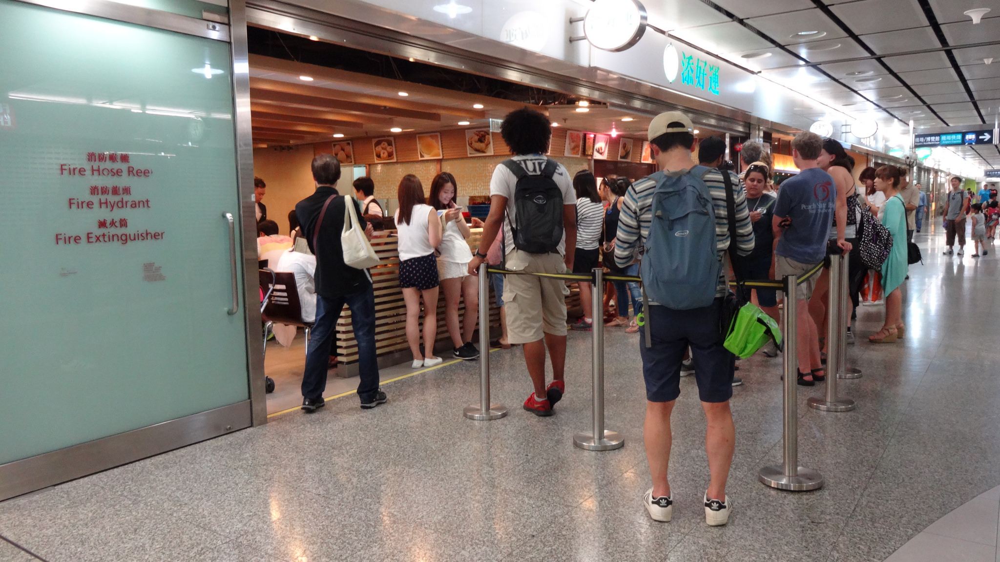
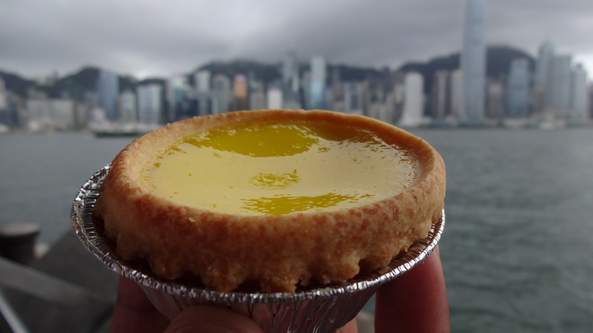
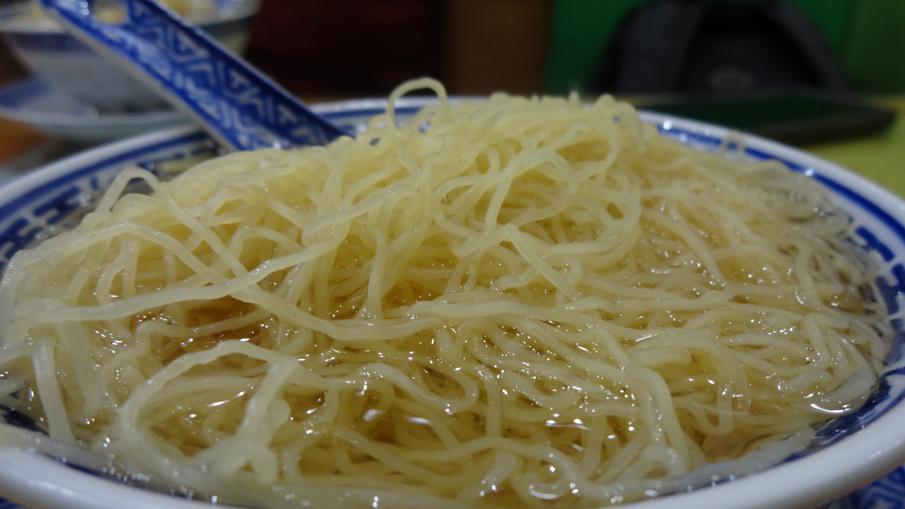
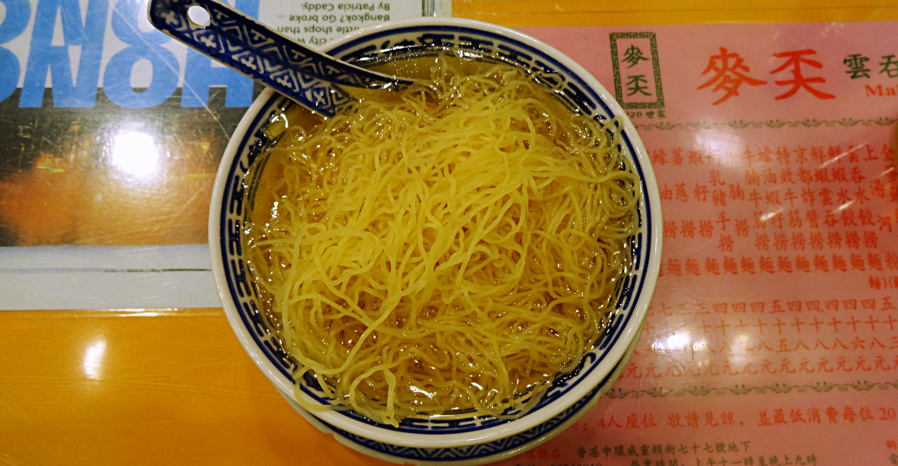
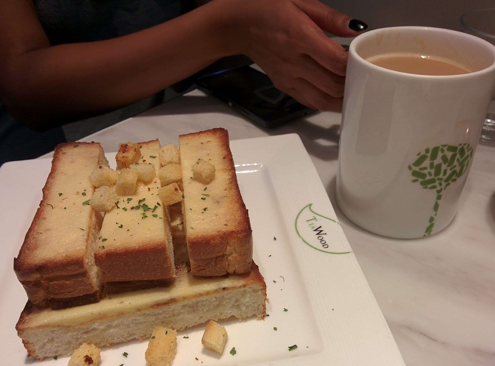
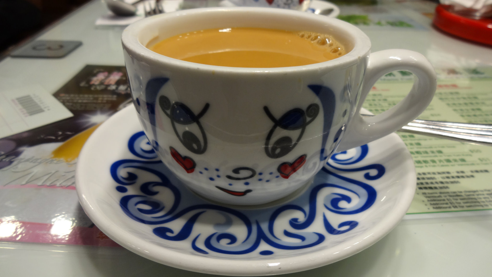
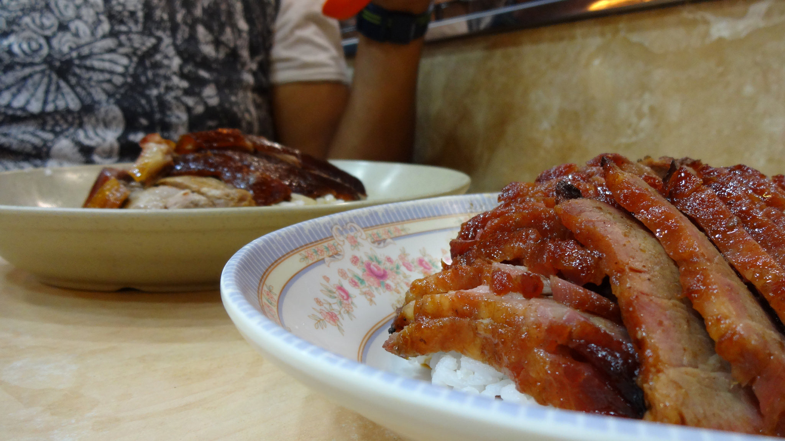
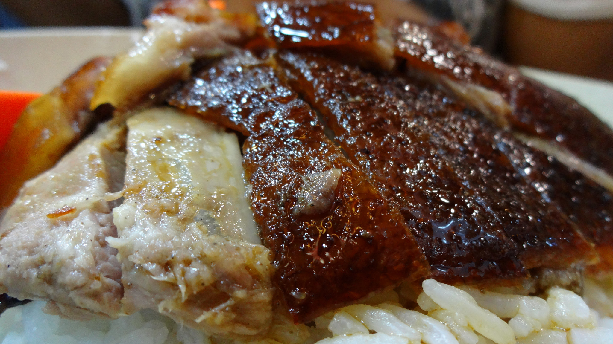

There’s no such thing as a ‘diet’ in Hong Kong due to the copious amounts of incredible food available in this mini mega city.

It doesn’t matter if you’re on a quick visit or staying longer than one week, don’t miss the opportunity to try out these delicious foods during your stay!

**1. Dim Sum**

There is only one place which is worth waiting for to try dim sum. Tim Ho Wan Dim Sum Specialists is one of the cheapest Michelin star restaurants in the city which attracts huge queues every day.

Waiting to be seated!

Of course the day we went was no exception either. After an hours’ wait we finally sat down to eat an incredible batch of steaming dim sum and sweet delicate BBQ pork buns. Arrive early for a better chance to be seated quicker, and don’t forget to fill out the order sheet whilst you wait!

A selection of tasty eats at Tim Ho Wan

_Average Price: $50 – $100_

_Address: Shop 12A, Hong Kong Station, Podium Level 1, IFC Mall_

**2. Tarts**

If you’re a fan of tarts (egg, milk or fruit) get ready to be blown away by the delicious varieties available around HK. For a Portuguese twist on egg tarts take a day trip to [Macau](/posts/2015-07-macau-where-east-meets-west).

Sampling egg tarts from Tai Cheong bakery

My favourite places to get these wonderful treats were Pie and Tart and Tai Cheong bakery. Of course there are no shortage of bakeries and cafes offering these sweet delights, but the places with the biggest queues will no doubt have the best tasting tarts!

Delicous tarts at Pie and Tart

_Average Price: &lt; $10_

_Address: Pie and Tart – Ground Floor Shop C, 77 Granville Road, Tsim Sha Tsui / Tai Cheong Bakery – 35 Lydhurst Terrace, Central_

**3. Wanton Noodles**

The best place to try wanton noodles is Mak’s Noodles. Though the portions are small, service is super quick and in a matter of minutes placing your order a steaming bowl of thin springy noodles, clean tasting broth and flavourful wanton is ready to be devoured!

Springy noodles concealing delicious pieces of wanton

A simple authentic dish, however due to the small size it’s best to try this dish if you aren’t very hungry.

Tasty but smal portions – get 2 bowls if you’re hungry!

_Average Price: &lt; $50_

_Address: 77 Wellington Street, Central_

**4. Milk tea**

Stemming from the former British colonial ways of adding milk to black tea, Hong Kong’s take on tea is strong, milky, sweet and smooth tasting.

Trying milk tea and condensed milk toast in Teawood cafe

My favourite place to enjoy this cuppa were at HK’s cha chaan tengs – local HK cafes. Tsui Wah is a popular cafe which can be found all around the city. For breakfast we would pop into one of these branches for a cup of sweet milky tea and condensed milk toast – a cheap and cheerful way to fuel up for a day’s activities.

Sweet milky tea in cute tea cups at Tsui Wah

_Average Price: &lt; $30_

_Address: there are many Tsui Wah branches around HK, just use Google to find the nearest cafe_

**5. Roast Meats**

Do not leave HK without trying the roast meats! It took a while searching for a reasonably priced HK restaurant, but I did and I recommend it highly.

Incredible BBQ pork and roast goose at Yat Lok

Yat Lok is a small local style restaurant which serve a variety of roast meats, including their speciality roast goose. Words can’t describe how delicious, tender or mouth-watering the meats are here, but it was good enough for us to return the next day! Don’t expect fancy seating or attentive staff, just go for the meat and I promise you won’t leave disappointed!

Delicious roast goose

_Average Price: $40 – $150_

_Address: G/F, 34-38 Stanley Street, Central_
