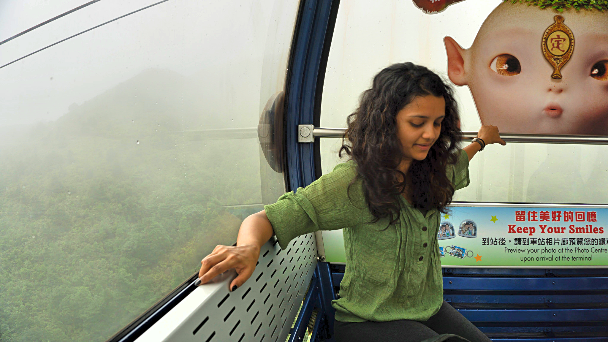
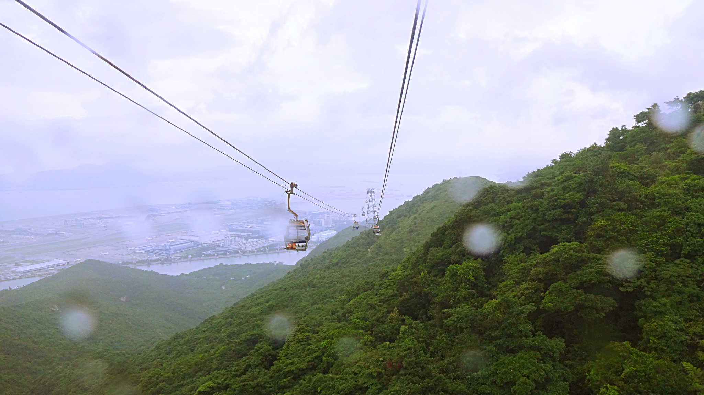
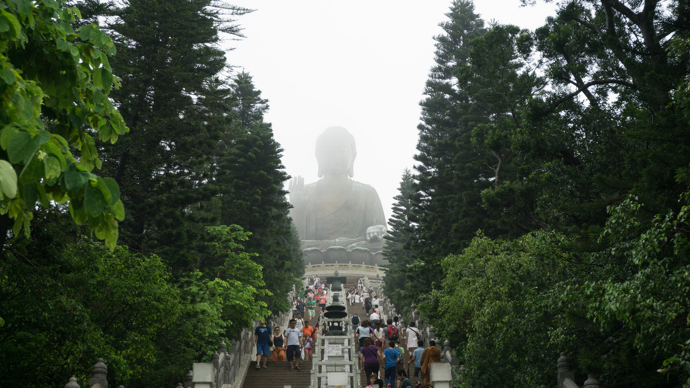
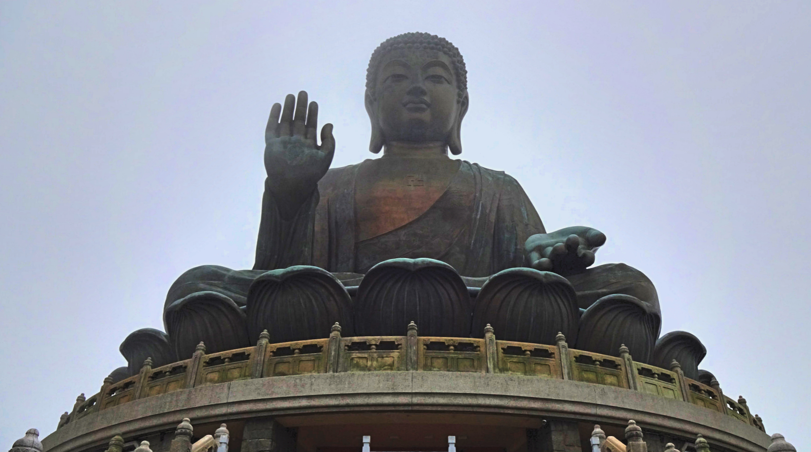
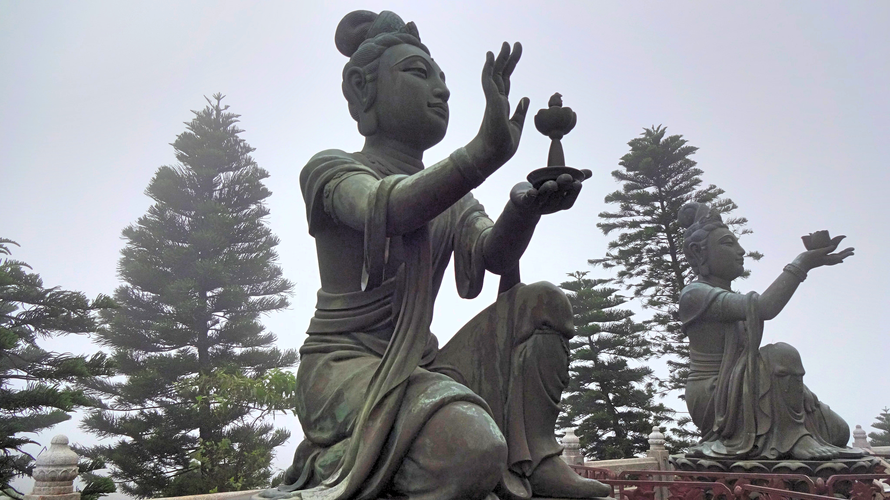
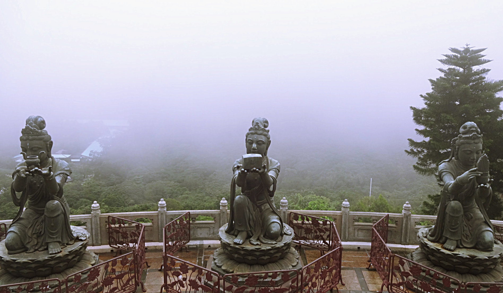
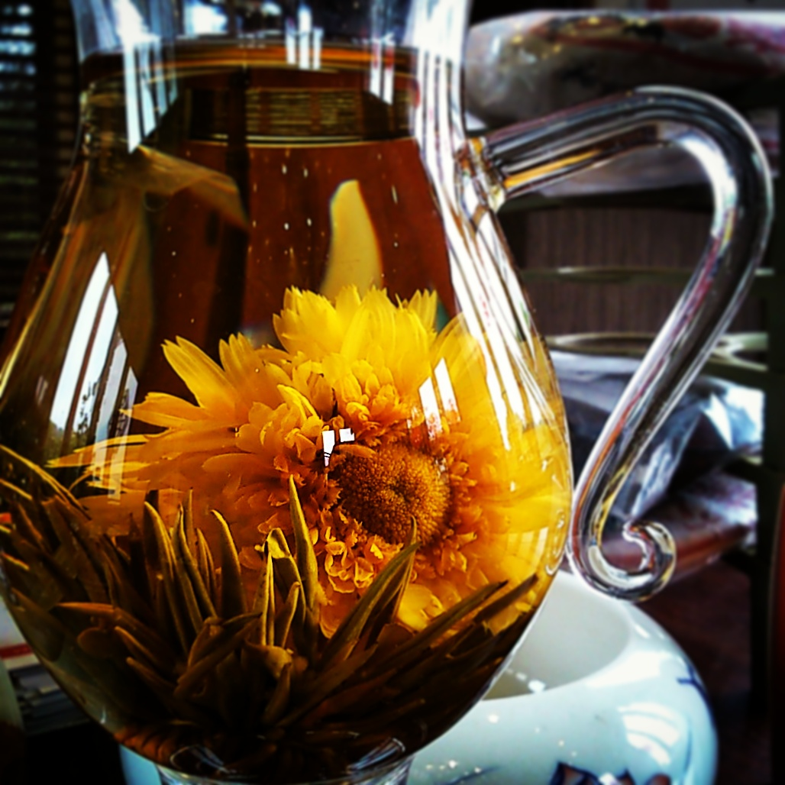
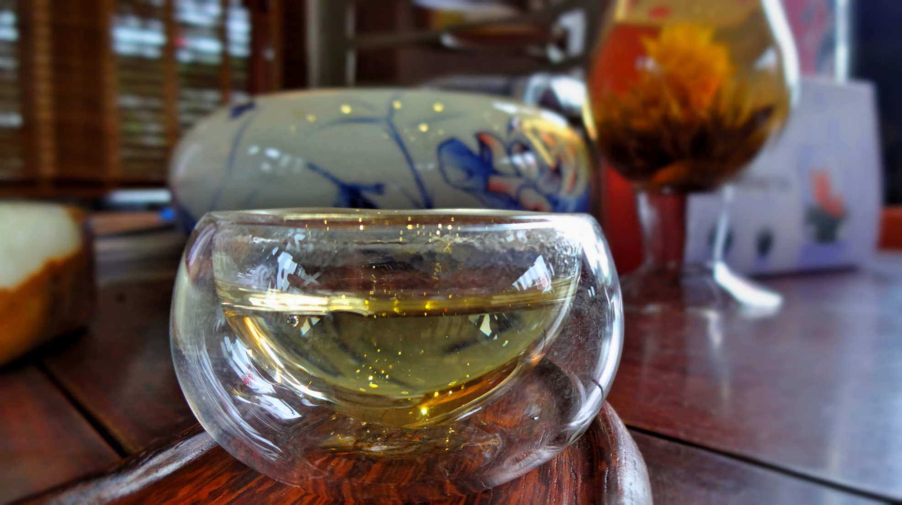

Hong Kong is one of the busiest, liveliest atmospheres I’ve visited. After a few days the constant buzz started to wear us out, so we took a mini excursion to Lantau island.

We planned to spend a whole day on the island however we overslept so only spent a few hours in the afternoon exploring!

**Getting there**

I look scared but I’m not, honest!

The weather was dreary so we took the cable car to the island. The price for a round trip in a standard cabin was $165 HKD per person.

The journey takes around 25 minutes, and the views were just stunning. If you’re not a fan of heights then brace yourself – even I was pretty apprehensive when we set off! The views however took my mind off the height; we overlooked a carpet of lush green nature below us, and could see as far as the airport.

Unfortunately the weather was so bad that we didn’t see the Big Buddha in the distance. For the last part of our ride we were floating among the clouds!

**Tian Tan Buddha**

Once we arrived at Ngong Ping village we walked to Tian Tan Buddha – most commonly known as the Big Buddha. It was erected in 1993 and sits 34 metres high facing North. It has since become an important site for pilgrims and visitors across Asia.

We climbed the 268 steps to get a closer view. At the top hoards of people were taking selfies or praying, but with a bit of luck we walked around the other side which was much quieter.

The weather was very misty at this height which seated the Buddha in a shroud of mystery. We walked around the base with intrigue, absorbing the wonderful views around us. We couldn’t see much due to the cloud cover, but it was an impressive sight nonetheless.

**Tea Appreciation**

We passed Linong Tea House on our way back from the Big Buddha and went inside for their hourly demonstration. The tea house specialises in something I’ve always wanted to see – blooming flower tea.

The staff discussed the several steps about the delicate process; first hot water is poured over the tea bulb to wash off any stray bits. Then hot water is swished around a clear glass jug (so the glass can get up to temperature) before the tea bulb goes in.

Once the bulb is placed inside hot water is added, and it’s just a matter of time before the bulb opens into a beautiful flower.

When the process is complete, the tea is poured into thimble like cups to enjoy (the longer the tea brews, the stronger the flavour will be). The tea has a light fragrant flavour and is supposed to have many medicinal benefits.

We ended up spending a while in the tea house sampling a variety of teas, most of which we eventually purhcased!

A few hours was more than enough visiting Ngong Ping village. Though the weather was humid and overcast we enjoyed the break from the HK madness. Given more time we would have explored the other parts of Lantau island, and if the weather was decent we would’ve skipped the cable car and hiked to the village.

_How did you find Lantau Island? Did you hike to the village or take the cable car? I’d love to hear your thoughts!_
