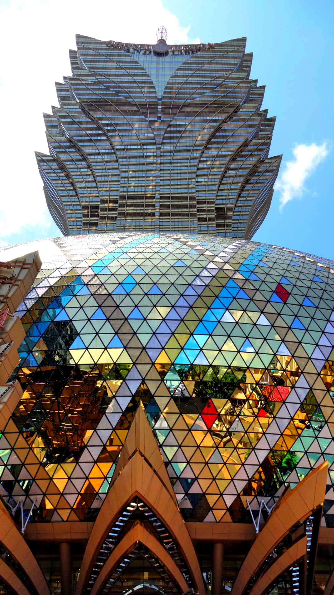
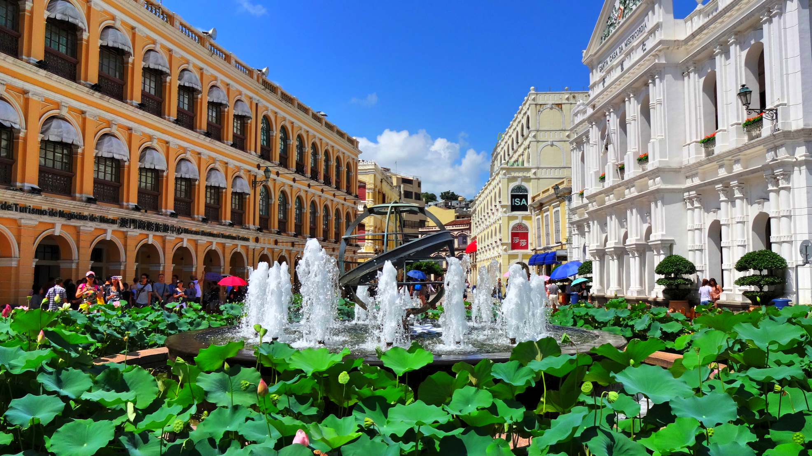
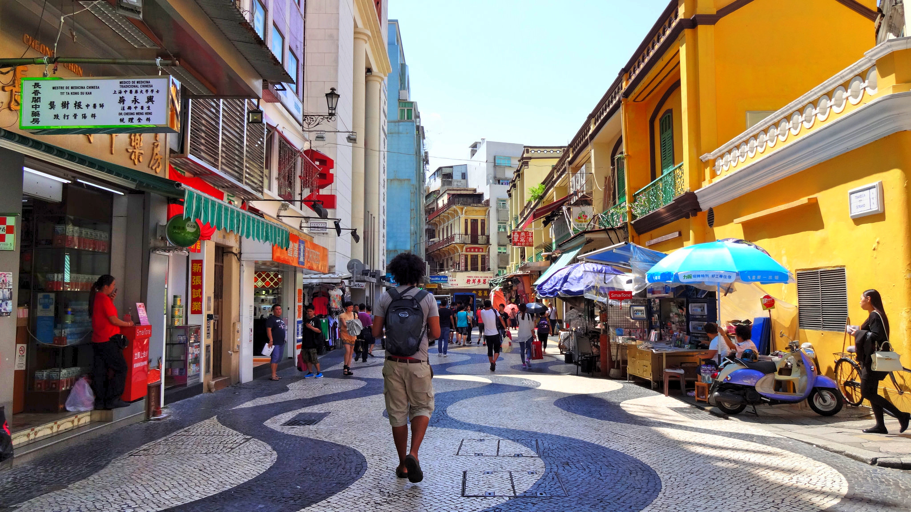
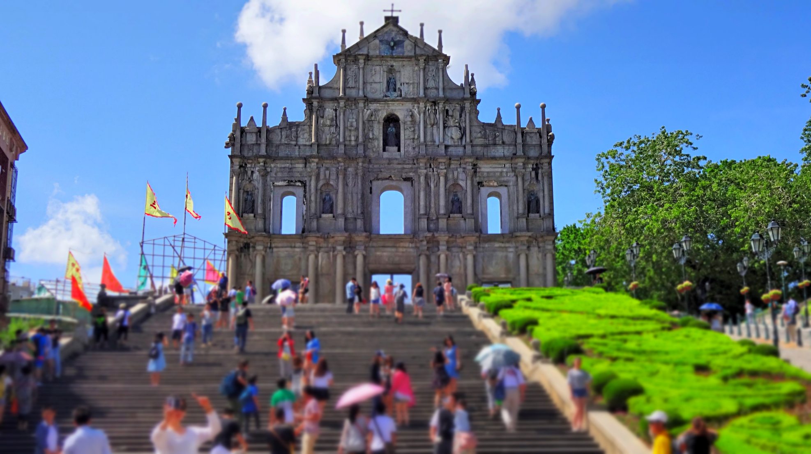
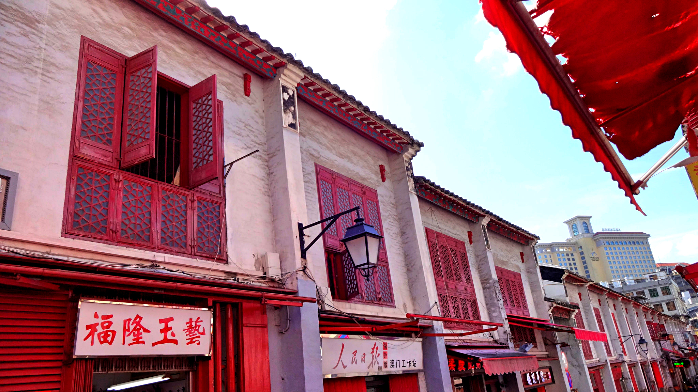
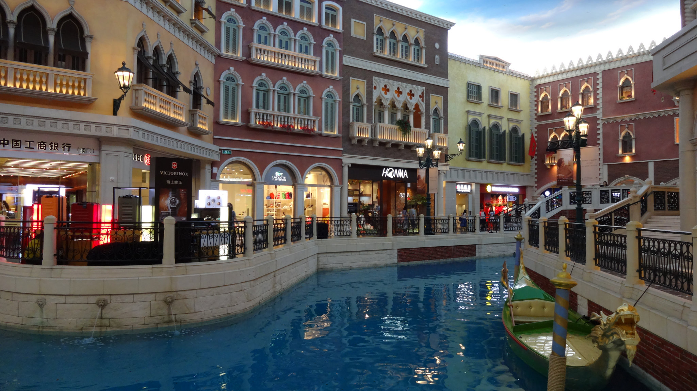
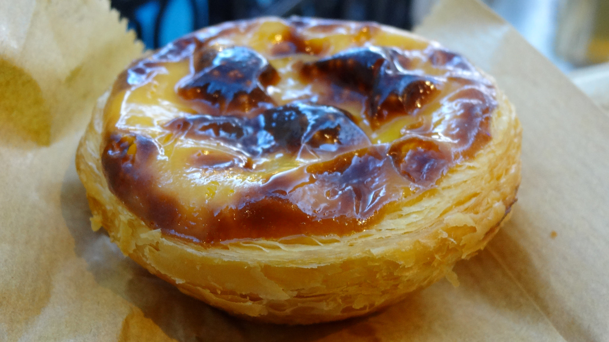

Just over 65km away from Hong Kong lies the small city of Macau. This pint-sized city is brimming with history; Macau was a Portuguese colony and one of the first settlements for Europeans in Asia. The Portuguese flair combined with Oriental influences moulded Macau as a classic city of ‘East meets West’. However over recent years Macau is also known as the ‘Vegas of Asia’ which astonishingly generates more revenue from gambling than Las Vegas itself!

We visited Macau on a whim. Out of luck we popped into the ferry terminal and by chance there were available ferry tickets with [TurboJET](https://www.turbojet.com.hk/en/). We went in at 11:30am, and by noon we set off!

The ferry was a comfortable journey, there was even wi-fi onboard though it was intermittent. We knew that our time in Macau would be limited so we decided to catch the last ferry back and keep the itinerary open.

When we arrived we passed through immigration which was a quick process. In the main lobby we helped ourselves to a free map at the tourist information desk. I was more interested in sightseeing whereas Kyle wanted to gamble, so we marked what looked interesting and set off.

Across from the terminal there are many free shuttle buses provided by the big hotels in Macau that have casinos. We boarded the shuttle bus going to the Grand Lisboa as it was close to most of the sightseeing.

The casino in the Grand Lisboa was pretty mediocre, but the exterior hotel lavishly dazzled in the afternoon heat. After a sweaty 10 minute walk (seriously Macau’s heat was insane!) we were at Senado Square. From this point on I felt like I had walked into another time zone, _Europe’s to be precise_.

Senado Square is stunning. Think beautiful patterned cobble stones, European style architecture and monuments. This spot of the city stands as a testament to Portuguese’s colonial past, and it was incredibly surreal to see.

The heat was beginning to slow us down so we walked back to the Grand Lisboa to get a free shuttle back to the port. Our next stop was the Venetian Macau which had a fancy casino for Kyle to indulge in. It took about 20 minutes from the port till we reached.

As the name suggests the Venetian Macau is an Italian inspired venue, with an attached themed shopping mall complete with artificial canals and gondolas! Conveniently this is also the place to try Portuguese egg tarts, at [Lord Stow’s](http://www.venetianmacao.com/shopping/shoppes/cafe/lord-stow-bakery-cafe.html) bakery. It was heaving at the bakery when we arrived, always a good sign.

The egg tarts were so delicious we went queued again! Seriously, these tarts were incredible – flaky, crisp and not overly sweet.

Sugar fixes out the way we ventured off to the casino where Kyle played a few games. I’ve never found casinos appealing but stuck with Kyle as a pretend lucky-charm. It seemed to work (I think) but because we overspent our time at the casino we had to rush back to the port in time for the last ferry.

Due to the last-minute rush I was gutted that we had no time left to eat at a Portuguese restaurant. Oh well, guess I have to go back (or go Portugal) for that!

I think we were both surprised on how much we enjoyed Macau. It is an incredible place to wander around and indulge in. Like HK there is more to Macau than meets the eye, it’s just a shame we underestimated how great it’d be. Nonetheless, it was a fantastic spur of the moment trip to see Macau. Regardless of whether you like gambling or not, the sheer ‘East meets West’ vibe around this city is something you need to see!

**Important Tips to Remember:**

1\. It doesn’t matter if you’ve planned to visit or go on spur of the moment, you won’t be getting nowhere unless you take your passport. Remember – your technically leaving HK so you’ll get an exit slip when you leave and an entry slip when you return!

2\. The currency in Macau is the Macau Pataca (MOP) – don’t worry though as HK dollars are accepted. However bear in mind that change will be given in both currencies. MOP isn’t accepted in HK so remember to let staff know which currency you want your change to be.
