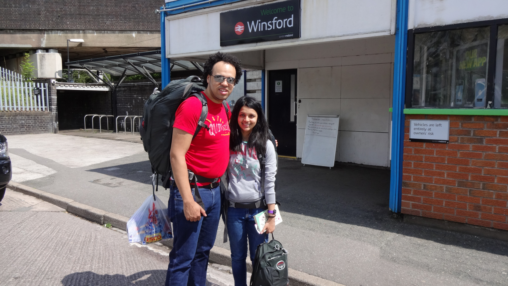
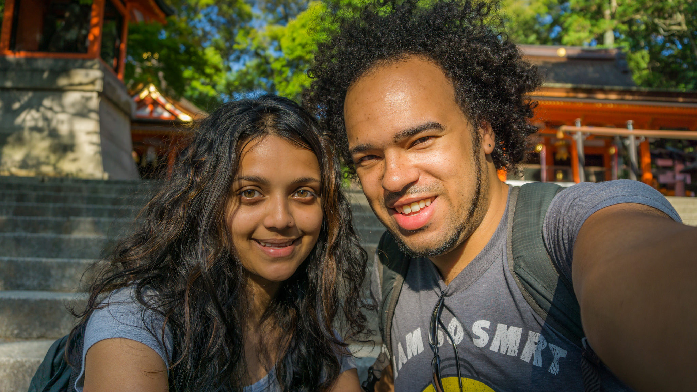
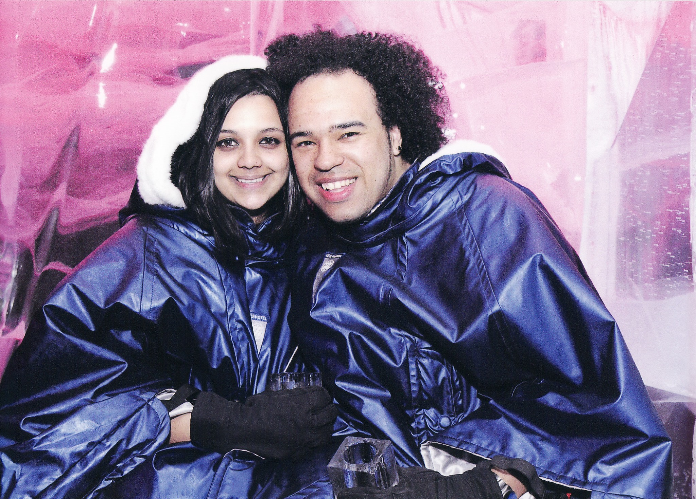

N’aaw, look how cute we looked

It’s that time again, or should I say ‘occasion’ where we’ve reached another milestone. It has been one year since we waved goodbye to England in return for a years’ long Asian adventure. Only one problem…that ‘year’ practically flew by!

I find it very surreal to believe we have been away from home for 12 months. I remember how I felt when I left the UK, all those fears and nerves about the unknown. The unhelpful advice from family members or work colleagues which filled my head with uncertainty. You know, I genuinely thought that going away for a year would quench my feelings of wanderlust; that one year is all I’d need to feel ‘alive’ before I threw myself in yet another job I could maybe enjoy this time. But it hasn’t.

We have visited 13 countries around Asia, and it has been an incredible journey. But I can’t help feel that we’ve still not even scratched the surface. The sensible person inside tells me to be grateful to have seen so much, but my inner thoughts ask me _why I can’t explore further?_

Being in Asia for 12 months has opened our eyes and questioned our own lifestyles. It showed us how privileged our lifestyles were in the UK, accompanied by the simplest of things (like safe water to drink) that we take for granted. It also highlighted how costly it is to live in the UK, something which lingers on our mind about the forseeable future.

Good times in Kyoto, Japan

This past year has no doubt sprung up moments of homesickness. There’s nothing I enjoyed more than cooking my favourite dish or a Sunday roast and crashing out on the sofa huddled up in a soft fluffy blanket. I’ve really missed cooking, and even the cold weather at times!

Enjoying the freezing cold at Ice Bar, London

We’ve had both great and hard times during this past year, but it’s a life lesson we’d have never learnt if we didn’t go on this adventure. The heat in Asia has drained us, I think I have sweated more in this year than I have in my whole life! There have also been times where our patience has been tested to the limit, whether it be pushy locals invading our personal zones for a pressure sale, or those long tedious 12+ hour train and cramped bus journeys. Let’s not forget the pesky mosquitos, giant cockroaches or ‘delicious’ food which passes through too fast \*whiff\*.

Still, it’s a small sacrifice compared to the wonders we’ve seen in Asia. We’ve met some incredible people throughout our travels, some of which I look forward to seeing in the future. Through the poverty and hard life we’ve witnessed across Asia we’ve met some wonderful locals, some of my best times have just been in the company of them, regardless of whether we both speak the same language. The friendliness, warmth and family bond I’ve seen restores my faith in this somewhat technology – dominant world we live in.

**What’s next?**

We’ve got a 2 month visa for Thailand and will be staying in Chiang Mai for most of it. We decided to go Chiang Mai because there was a direct flight from Hong Kong and from our past visit we know how cheap and accessible it is to get around. The 2 months will be our downtime to rest, catch up and plan our near future movements.

There was a possibility of going to Australia, but feasibly this won’t be realistic budget wise. Instead we’ll be returning to the UK, but taking a detour to Edinburgh first so we can catch the EDFringe festival before we go home. We’ve also made plans to go to Bestival, one of the last music festivals in the UK. So we have a few things to look forward to. My plans are to find a job once I’m back home to recover my finances until we figure out the next move.

I’m unsure where we’ll end up in the UK, or how long we’ll be back before we get itchy feet. But we have time to plan and have a bit of stability, which to be honest after 12 months on the move will be a welcomed prospect for a while!
