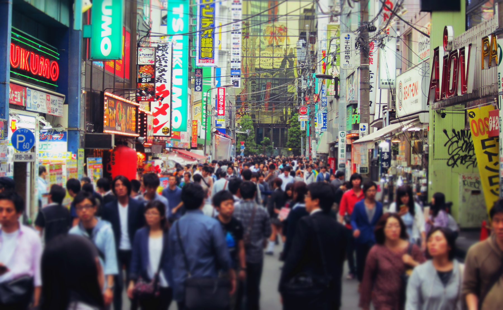

If you asked me 6 months ago _‘So, do you have a favourite country?’_ I wouldn’t have been able to answer the question. That is until, I visited Japan.

We explored Japan for 3 weeks, which in my opinion wasn’t enough time. We literally missed the cherry blossom season when we arrived, and due to our busy itinerary we didn’t get to experience an onsen. But despite this, we were blown away by Japan’s immense beauty and culture.

I could literally talk someones ear off about my time in Japan. So instead of rambling on, I’ve had a sit down and thought of 20 specific things I loved about this country.

So without further ado (and in no particular order) here are my top 20 reasons – enjoy!

**1. Kindness**

I didn’t have a clue how locals interacted with visitors, but within an hour of us landing into Tokyo we were blown away by the kindness of strangers offering to help us with our directions. Even with the language barrier, people were willing to help us out as much as possible. I’ll never forget the kindness we received from so many strangers. Arigato!!

**2. Etiquette**

Following up on kindness, the Japanese hospitality and etiquette surpasses anything I’ve ever experienced. Whether we nipped into a local convenience store or restaurant, we were warmly greeted with countless bows on every occasion. This is formality which we felt throughout the country, but one of which I never tired of experiencing.

**3. Safety**

There was not a single moment during our visit where I felt intimidated, unsafe or uncomfortable. Whether we ventured into an unknown neighbourhood or walked around late at night, there wasn’t an ounce of fear or shred of doubt that we were in danger. This unfortunately can’t be said for a lot of countries!

**4. Cleanliness**

Apart from Singapore, Japan is also a very clean country. No litter, cigarette butts or bin bags ruin the pavements, even the alleyways are spotless of rubbish and graffiti.

**5. Vending Machines**

This is not the country to be thirsty, because there is literally a vending machine on every street corner, bus stand, or train station. Heck, you’ll even find them at shrines! Some restaurants even have a vending style order system, whereby you order your meal via the machine and be served within a matter of minutes. You can even buy hot coffee and tea at the vending machines – genius!

**6. Transport**

As the ole’ saying goes, if you arrive on time you’re late! A train/metro/bus in Japan scheduled to depart at 12:30 will _actually_ leave at that time. Back in the UK, this scenario translates to the train/metro/bus arriving at 12:30, _then_ leave a few minutes after. The transport in Japan is so efficient that you’re able to request a slip from the ticket inspector if the journey is delayed, because no-one will believe you otherwise!

**7. Arcades**

There are an abundance of pachinkos and arcades all over Japan. You’ll hear them before you see them! Gaming is taken seriously here, and queues are formed for the most popular games. It’s great to see, but the deafening sounds and smokiness can get overwhelming after a while!

**8. Bakeries**

Consistency is a big part of Japan, and the bakeries I found proved to be no exception. I was initially surprised to find so many bakeries around, but I was taken aback when I tasted how dreamy the goods were. Even the savoury stuff excelled, just thinking about curry bread makes me drool!

**9. 100 Yen Stores**

A visit to Japan may be a squeeze on the purse strings, but contrary to belief not everything here is expensive. 100 yen stores are a very popular stores selling many items for 100 yen. Daiso (a popular 100 yen store) sells plenty of household and food items, even decent souvenirs. It’s worth nothing that 8% tax isn’t included, so for a 100 yen product you’ll pay 108 yen after tax.

**10. Toilets**

Clean heated seats, music, motion censored air fresheners and a variety of water jets at your disposal. Need I say any more?!

**11. Signage**

The overwhelming sea of signs in the cities are mesmerizing, and even more so come the evening. I never tired of seeing Japan’s neon glory, especially in [Tokyo](/posts/2015-05-6-popular-districts-to-visit-in-tokyo) and [Osaka](/posts/2015-05-why-one-night-in-osaka-isnt-enough).

**12. Tradition**

Despite its technological advances, the thing I really admired about Japan is the presence of strong traditional values. Amidst the concrete mazes there are an abundance of ornate shrines to see, whilst women dressed in traditional kimonos go about their daily business through the hustle and bustle of the cities.

**13. No Tipping**

Do you no it’s rude to tip in Japan? Many people believe that providing a good service should just be a standard, therefore leaving a tip can be considered rude and may even be refused. The general consensus about tipping is this – you’re paying for a good service already, so why should you pay more?

**14. Themed Cafes**

There is no shortage or quirkiness when it comes to themed cafes, and there’s plenty of kookiness to check out. I only went as far to visit a [maid cafe](/posts/2015-05-my-25th-birthday-in-tokyo) but there are robot, anime, vampire, cuddling, Super Mario, and owl cafes to name just a few!

**15. Ice Cream**

There’s an array of weird and wonderful ice cream flavours in Japan, just google it and you’ll see what I mean! My favourite though had to be the vanilla and green tea blend, which was a godsend in the warm weather.

**16. Sake**

My preconceived idea of sake couldn’t be further from the truth. I always had this idea that sake would be really bitter and strong, but thankfully I was proved wrong. Sake is smooth, delicate and clean tasting. It’s even better with a slight hint of fruit or with added fizz.

**17. Food**

Particularly sushi and ramen. The quality of the sushi in convenience stores exceeded the sushi I tried in restaurants back at home! The best sushi I had was at [Daiwa Sushi](/posts/2015-05-breakfast-at-tsukiji-fish-market) at the Tsukiji Fish Markets, whilst the award for delicious ramen (though it’s great everywhere) was at [Shin Shin Ramen](/posts/2015-06-final-days-in-fukuoka) in Fukuoka.

**18. Fashion**

The fashion in Japan is bold, quirky and unique. Harajuku is the standard place to see the best dressed peeps, though I found kooky fashion styles throughout most of the cities. I especially enjoyed seeing the elderly women rocking bright green or purple hair, because why the hell not?!

**19. Matcha**

Love matcha? Of course you do! But really, matcha green tea is wonderful. In most restaurants it is served complimentary which saves the need to order a drink. It’s just as delicious in baked goods, ice cream, and even kit kats!

**20. Scenery**

Japan has such a diverse blend of scenery; although known for its major cities there are so many beautiful places around the country. I particularly loved the green surroundings at Meiji Shrine near Yoyogi Park, and the beautiful nature spots around Kyoto.

Sensational Senso-Ji temple in Asakusa

Sake tasting!

Delicious sushi breakfast at Daiwa Sushi

Green tea kit kats!

Divine kobe beef

Getting beat on my favourite game!

Mouth watering tonkotsu ramen

Hiroshima Castle

Neon glory at Dotonbori

Street eats – gyoza dumpling

Deer around Nara

Torrii gates galore in Kyoto

Kinkaku-ji temple, Kyoto

Rainbow bridge, Odaiba

Tokyo skyline from Shinjuku

Asimo, Odaiba

Shibuya Crossing

Neon glory, Tokyo

Entrance at Meiji Shrine

Vanilla and green tea ice cream

Around Asakusa

Around Asakusa

City life in Akihabara

Meiji Shrine

Takoyaki – hot octopus balls!

Wandering through Osaka’s maze of alleys

Next level toilet

Fushimi Inari shrine, Kyoto

There’s even a Statue of Liberty in Tokyo!

Matcha latte, yum

Playful cute dogs in Tokyo!

Delicious treats from the bakery

Traditional style architecture around Kyoto

Cute flower arrangements

Scenery around Kobe

One of many vending machines
