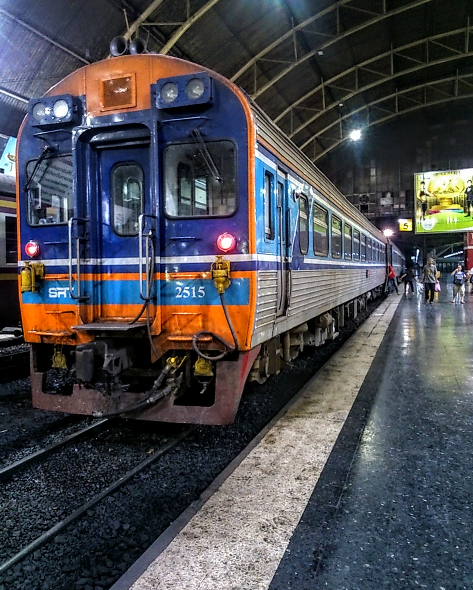
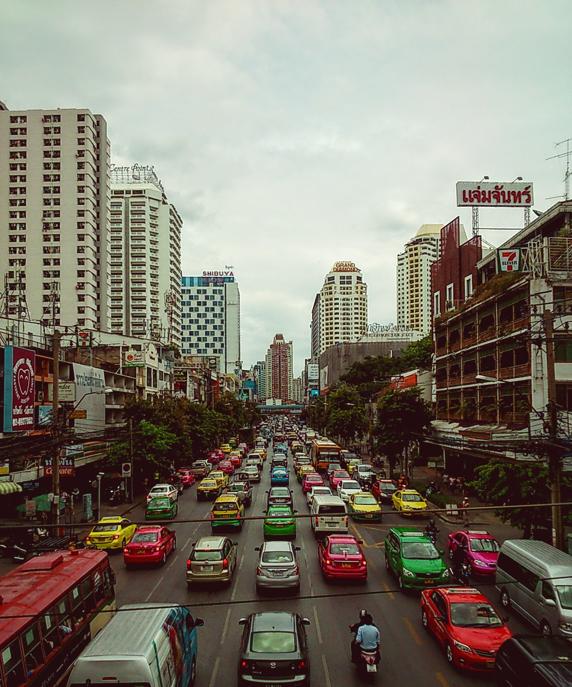
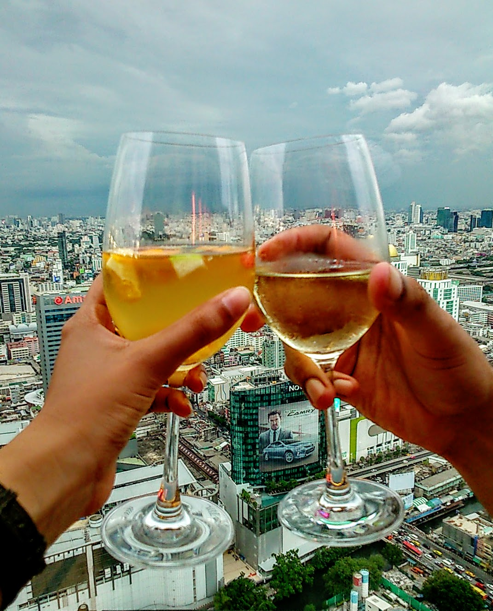
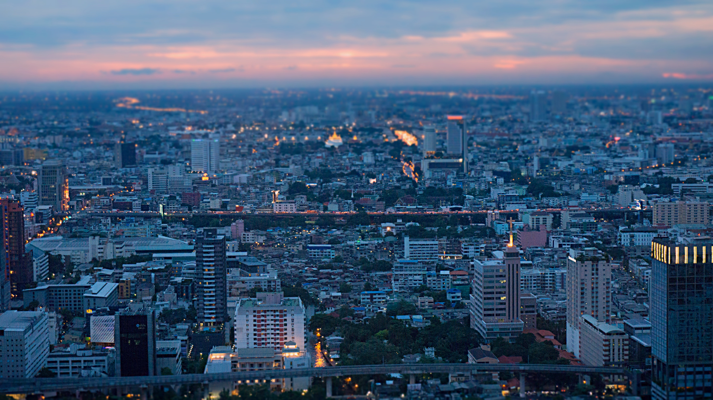
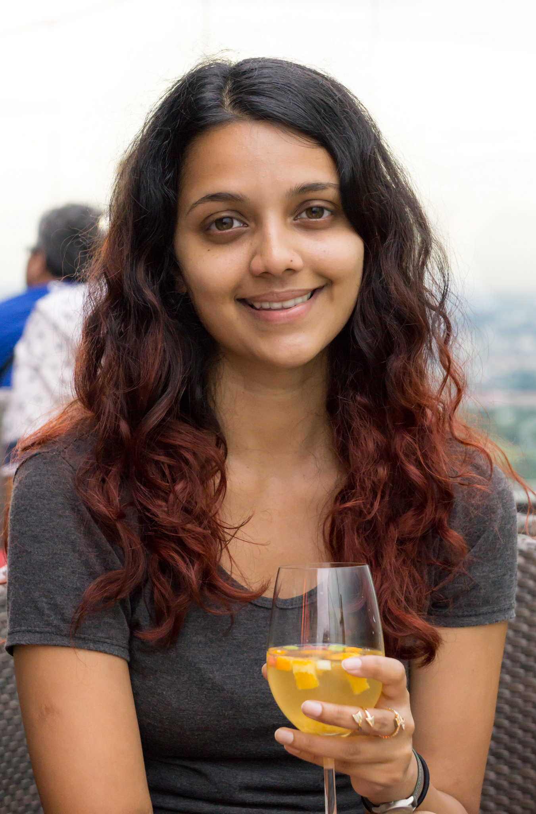

It was difficult to say goodbye to Chiang Mai, our temporary home for the past 2 months. But it was that time again to pack up our belongings and move on to Bangkok – our last destination in Asia.

We boarded an early morning train from Chiang Mai; it took around 12 hours to reach the Thai capital. Foreseeing that this was our last mode of transportation, we were welcomed by a constant stream of cockroaches feeding through the train walls, the toilet ‘aromas’ were enough to make the sturdiest of souls shed a tear, and the food served at lunch lingered an after scent of microwaved mackerel and over boiled eggs in the air.

It’s safe to say that we were itching (literally) to get off this train, and come 21:30 when the train eventually arrived we evacuated out of there as quick as our legs could carry us.

We’re off!

Just a week before our arrival one of Bangkok’s popular shrines (Erawan shrine) had been the subject of a targeted deadly attack. This devastating event left both the nation and visitors shocked, unable to comprehend why this atrocity occurred. Needless to say we were distraught to hear about this before our arrival, however from experience we’ve come to realise that no country is ever immune to threats, terror attacks or deadly viruses.

As a result of recent events there was a huge increase in security presence, and bag checks were present in shopping malls and transport hubs. Although these procedures tried to enforce a level of safety, there was still a sombre presence in the atmosphere which understandably, will take time to heal.

Now we’ve previously visited [Bangkok](/posts/2014-10-feeling-bitter-sweet-in-bangkok) on our travels, and I have to admit I wasn’t a fan of the city for various reasons. However this was our last destination in Asia so I really tried to enjoy our remaining time left here. We ventured around new neighbourhoods, restaurants and coffee shops, but I still felt like something was lacking.

I can’t quite explain why I feel so underwhelmed in Bangkok (in comparison to other major cities that I love – _I’m thinking of you Tokyo and HK_) but instead of forcing ourselves to go out and ‘enjoy’ doing all these activities, we ended up spending our last few days doing as little as possible – which worked in both our favours!

No change in Bangkok’s traffic

Now that’s not to say that we did nothing during our time in Bangkok, as did we save our last evening to go to a rooftop bar. Now let me start by saying that there are plenty of rooftop bars in Bangkok, with some charging ridiculous prices for drinks (in return for a decent view, mind you). We kept it simple though and went to the nearest bar within walking distance, which happened to be Red Sky bar.

Toasting our Asian traveling adventures

Enjoying our last sunset in Bangkok

Having arrived just in time as the sun was setting, we sipped on our happy hour drinks and watched the Eastern horizon set for the last time. I’d like to say that at that very moment I had a ground breaking epiphany, whereby the past year of my life on the road transformed into some sort of internal life changing event But it didn’t.

Because even though this chapter of travelling has come to an end, I don’t feel like the book has closed. It just turns to the next chapter, which will be my return to the UK. At this very moment I don’t feel like this ‘travelling saga’ has gracefully ended in exchange for a more comfortable, or rather stable way of life.

All I can say right now (_being mindful an all’_) is that I’m grateful to have travelled and experience another way of life, culture and food has. Since the 30th June 2014 it’s been a non stop ride of emotions and memories. I’m glad to be returning to a familiar country to rebalance and plan my next movements, however **this won’t be it.** Deep down I know that my travel senses will start to tingle, and when they do I’ll be ready for a plan of action!

Life decisions are always made easier with a glass of wine, cheers!
