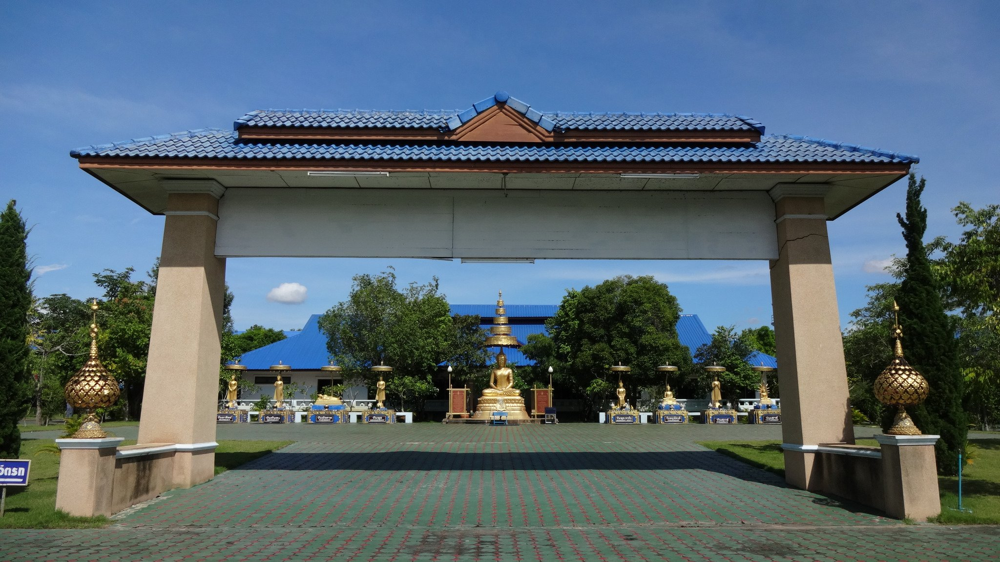
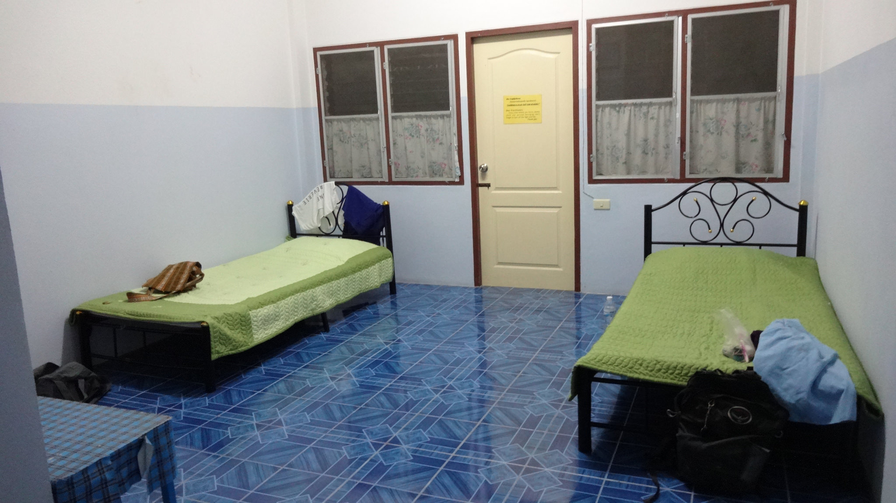
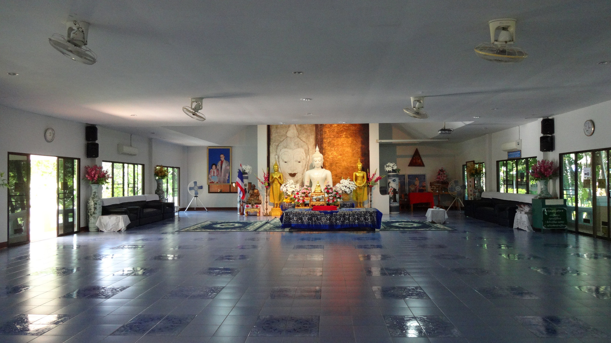

Meditation has always been somewhat of an enigma to me. The irony of wanting to learn about this technique but not being committed because **there’s** **always more important/busy things to do.**Does this sound familiar?

Out of curiosity I researched into meditation courses in Chiang Mai and came across a site which provided weekly one night meditation retreats; [Monk Chat](http://www.monkchat.net/#_=_) Meditation is located at Wat Suan Dok and also offers weekly ‘Monk Chats’.

We turned up one evening for further information about the retreat, and ended up staying for the Monk Chat. About four of us sat with a monk and we were allowed to ask as many questions as we like! It was very insightful to learn about Buddhism and learn more about a Monk’s way of living.

It got even more interesting when a couple of the Monk’s friends came in – we found out they were former Monks so we were fortunate to ask questions to both a monk and ex monk and hear two perspectives. When we left the Monk Chat we picked up a couple of application forms for the retreat.

I naïvely thought that the retreat would have around a maximum of 10 participants. How surprised I was when I arrived and saw over 40 people there! Though there was a large volume of us the Monk leading the retreat efficiently explained our schedule which primarily focused on the principles of Vipassana meditation.

**What is Vipassana Meditation?**

Vipassana means ‘to see things as they really are’.

It is a process where we mentally purify our minds through self observation. The purpose of practising Vipassana allows us to strengthen our interconnection between the mind and body. It is also a technique to free the mind of suffering, so we can heal ourselves and achieve a peaceful, happier life. Apart from speaking to the teacher, a Vipassana retreat (including this one) are conducted in silence.

This was how our Meditation Schedule looked:

**Day 1:**

01:00pm – Meet at Monk Chat Office

01:30pm – Introduction to Buddhism and meditation practice

03:00pm – Depart to meditation training centre

04:45pm – Meditation practice

06:00pm – Dinner

07:00pm – Evening chanting and meditation practice

09:30pm – Bedtime

**Day 2:**

05:00am – Morning gong

05:30am – Morning chanting, exercise and meditation practice

07:00am – Alms offering and breakfast

08:30am – Discussion

10:00am – Break and meditation practice

11:30am – Lunch

01:00pm – Meditation practice

03:00pm – Return to Monk Chat Office

Entrance of Meditation Training Centre

My clean room for the night

Meditation hall where I spent most the time practicising

**Reflections About The Experience**

Although the retreat is short in comparison to 10 day or even 30 day retreats, I thought this experience was a perfect introduction into Buddhism and meditation.

The ‘silence’ was incredibly refreshing and quite surreal. Think about it – we live such busy, social (both on/offline) lives without giving much thought about the internal impact it has on us. Silencing everything around us allows our minds to open and gives us the opportunity to delve deep and cleanse our thoughts.

We tried several styles of meditation – sitting, walking and lying down. I admit that the first couple of sessions were tricky but like all things we learn, this process takes time. I found sitting to be the most effective method for me.

The food we ate at the retreat was vegetarian. Although simple, the food was delicious, nourishing and healthy. We recited a mantra before every meal. We were encouraged to eat mindfully, focusing on one action at a time which took some getting used to. I often noticed that I subconsciously prepared my next spoon/fork full of food whilst I was still chewing – something which a lot of us do but may not actually realise!

**What I Learnt From This Retreat**

-   Meditation can be done anywhere, at any time.
-   We exercise, clean, and feed ourselves on a daily basis. Why can’t these principles be applied to the mind?
-   Don’t try to ‘block’ your thoughts during meditation. If a thought occurs then acknowledge it, and let it pass.
-   Bring attention to your breathing, in particular your nose. Be mindful of your breathing movements, inhaling and exhaling to the count of 1-5, then 5-1.
-   Don’t dwell on past thoughts or future insecurities. Thinking about these thoughts will bring suffering to the mind.
-   If you are unable to concentrate then take a break, go for a walk or drink a glass of water. Don’t be too hard on yourself.
-   Silence is golden. The reason these retreats are silent is so we can concentrate on ourselves. If we were allowed to talk, we’d only clog our mind with more thoughts.

**Would I recommend this retreat?**

If you have an interest in Buddhism, and would like to learn about basic meditation techniques then I absolutely recommend this course.

This is only a 1 night meditation retreat, but it is still demanding. You are required to immerse your mind and body into this experience – you’re going to have a tough time if you aren’t willing or motivated!

Even though me and Kyle went together, we had no interaction until the retreat finished. Men and women are put in separate accommodation, and during the retreat we sat in different locations, and ate separately. If you do go on this retreat (or any for that matter) don’t glue yourself to each other. It’s healthy to have space, and when it comes to meditation you need to stay focused on yourself.

Since the retreat I’ve continued meditating, ranging from 5-10 minutes a day. It’s not very long, but it’s the start of a gradual process which continues to spark my curiosity.

**Details About Monk Chat Meditation:**

Website – [http://www.monkchat.net/#\_=\_](http://www.monkchat.net/#_=_)

Location – MCU, Chiang Mai Campus, Wat Suan Dok

Monk Chat – Monday to Friday, 17:00 – 19:00

Meditation Retreat – Tuesday to Wednesday, weekly

Bring to Meditation Retreat –

-   Cost – 500 baht (+ 300 baht if you don’t have a set of white clothes)
-   Photocopy of Passport
-   Personal belongings for overnight stay (inc. towel)
