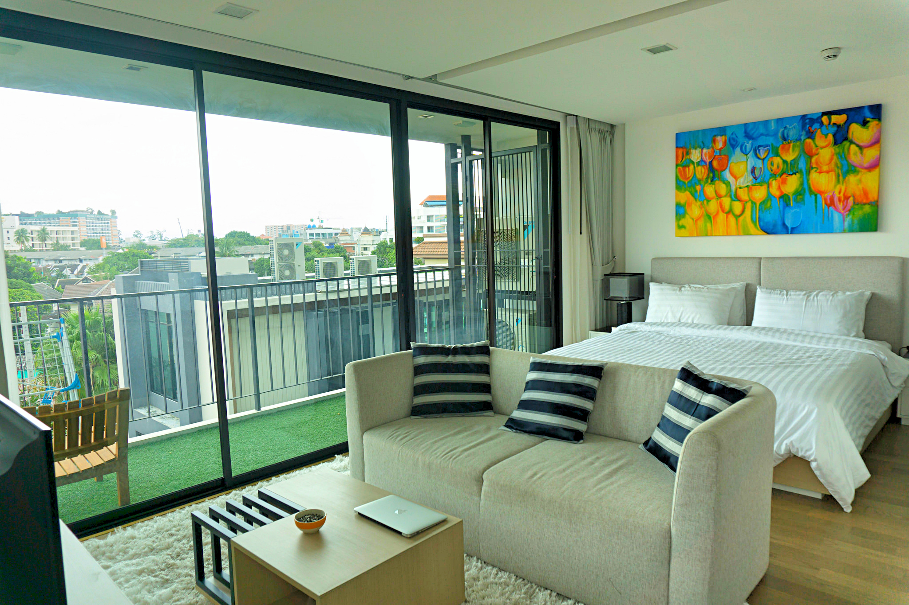

Chiang Mai is one of the last places we’re visiting before we return to the UK. It’s been just over a month since we landed and settled in an AirBnB apartment, and I can honestly say that I feel just as comfortable here as I did back at home, if not better.

Back in the UK we’re accustomed to paying a lot more when it comes to renting an apartment, using public transport and doing social activities. For a fraction of the price we spend a month living in the UK we can rent a much nicer apartment (which includes pool and gym facilities), catch a red songthaew to get around the city, and spend a hella’ lot less on social activities.

Our cosy apartment in Chiang Mai

For example it costs 100 baht per person (£1.80ish) to watch a film every Wednesday at Maya Mall – on the same day in the UK an average ticket would cost around £8 per person. A glass of wine costs as little as 35 baht (65p) at the night markets – you’ll **never** find a glass of wine this cheap back in the UK! In Manchester an average round fare bus ticket would cost around £4 per person; in Chiang Mai a return trip from Nimman to Tae Phae Gate in a red songthaew would cost at most 60 baht per person (30 one way/vice versa). That just a little over £1.

Enjoying a glass (or 2) at the Sunday night bazaar

The standard of living in Chiang Mai is both comfortable and friendly on the purse strings. I actually view Chiang Mai as my second home because it feels so natural being here; I know where to go for a coffee or a bite to eat. I know which markets to go to buy our favourite snacks and shopping stores to get our food supplies. I enjoy being a regular face and getting to know the locals behind my favourite establishments. I love that we’re in a city but surrounded by beautiful mountains, just waiting to be explored.

These thoughts have recently asked an internal question – ‘_Is the UK still your home?’_

Right now, I don’t know the answer to that. Sure, I have family and a few friends that live in the UK which I miss dearly, but what about the quality of life? Paying over the odds for accommodation, transportation and generally living – is this something I’ll have to accept and get accustomed to? What about the British ethos to ‘complain’ about everything? I’m so used to interacting with people over just a smile and wave, in the UK will I have to start any conversation with _‘What a (insert rain/windy/sunny) day we have!’_

Travelling has unearthed an internal dilemma, one of which I never questioned.

_Where is home?_

I may just be getting nervous as we slowly count down the days till our return, and as usual it’s easy to cast doubt and worries. However I know deep down that these feelings will linger around for a while.

For now though, instead of worrying and feeling uncertain about the upcoming future I’m going to enjoy the rest of my time in Chiang Mai. As I learnt from my [meditation retreat](/posts/2015-08-reflections-from-a-vipassana-meditation-retreat), thinking about the past/or future will cause the mind to suffer – we should learn to live in the present and enjoy what is happening now.
