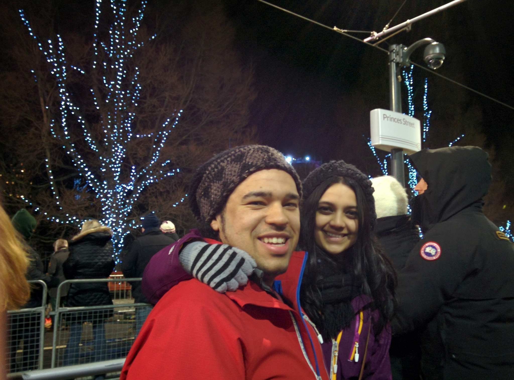
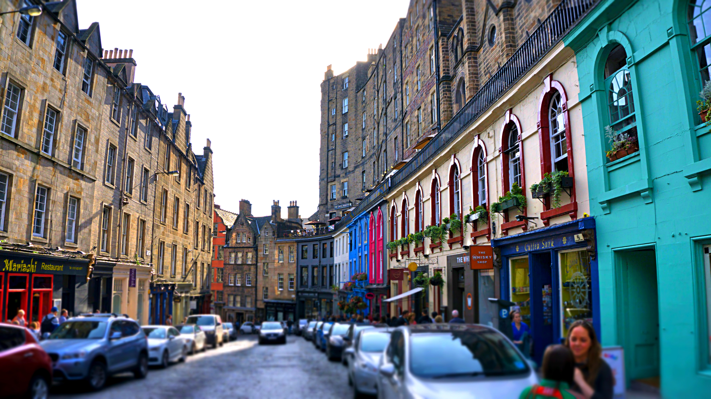
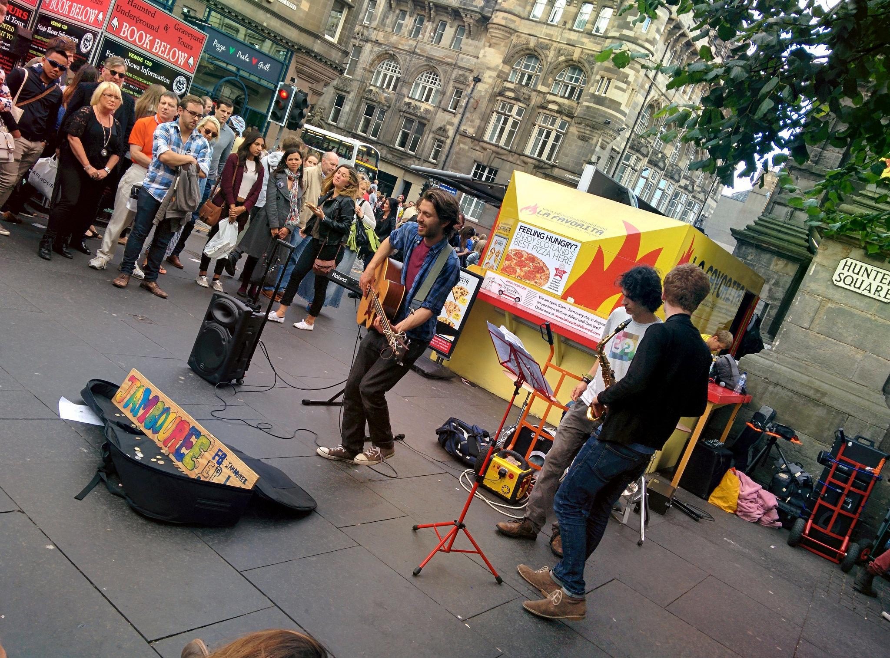
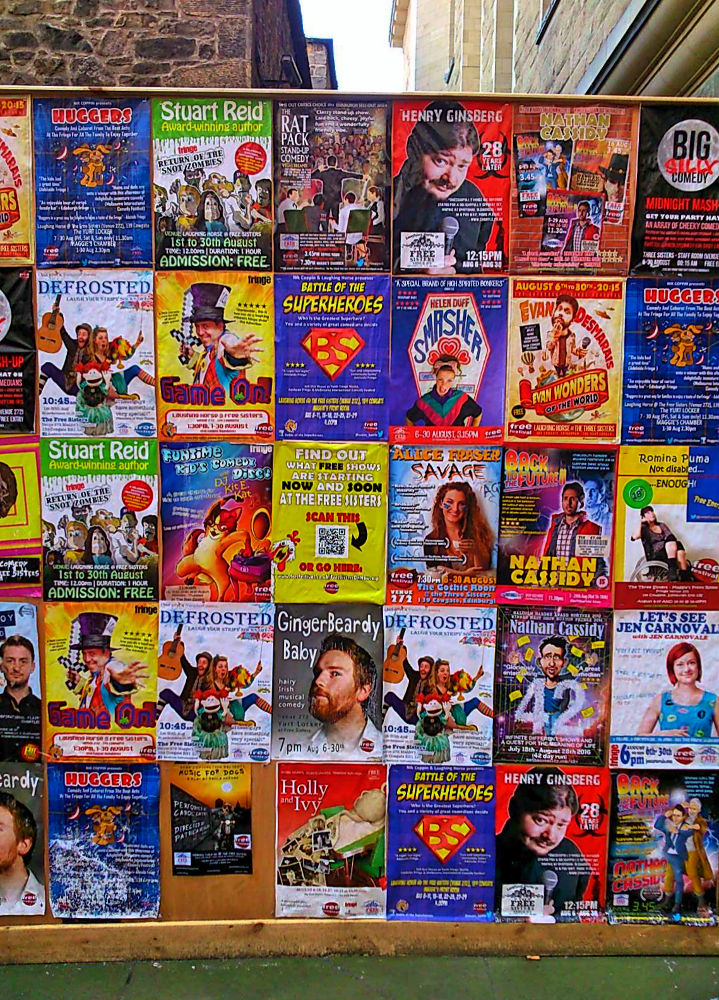
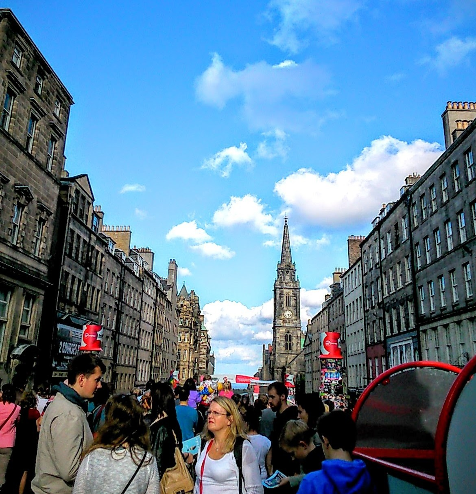
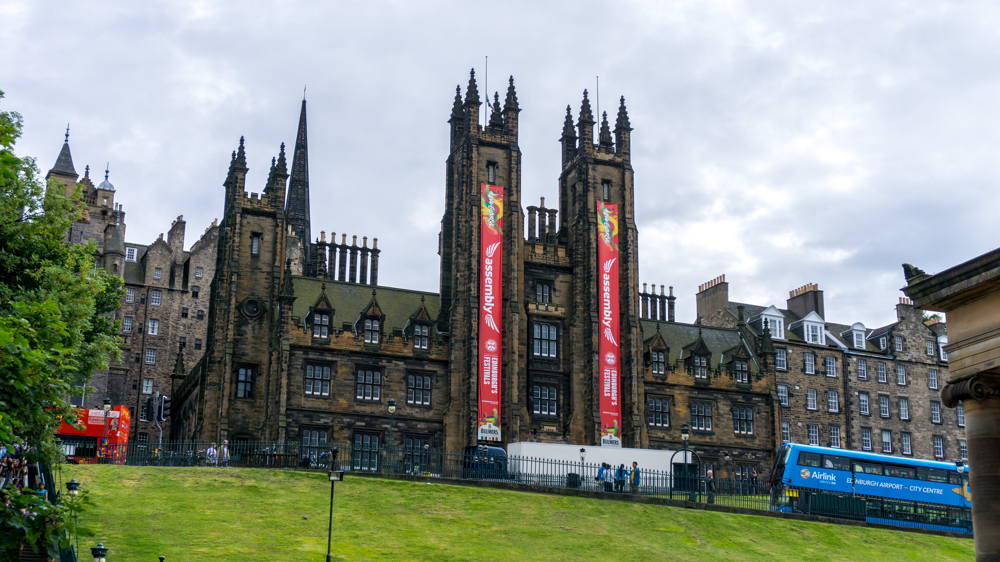
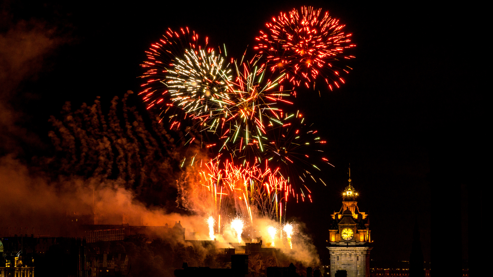

As we prepared for our return to the UK we noticed that the annual Fringe Festival in Edinburgh was on. We always watched the EdFringe comedy highlights on TV, so when we saw that the festival was still on we immediately grasped the opportunity and booked a connecting flight from London Heathrow to Edinburgh!

This isn’t our first time in Edinburgh; back in 2013 we visited the city for Hogmanay (New Years Eve). I remember the weather was awful, but I immediately fell for Edinburgh’s charms. Cobbled streets, grand architecture, rich heritage and a medieval Castle are just snippets this World Heritage site offers.

Our first trip to Edinburgh, Hogmanay 2013

Did you know that the Edinburgh Fringe Festival is the world’s largest arts festival? Thousands of performers (newbies, amateurs, and big name acts) flock every August to Scotland’s Capital showcasing their talents to inspire, entertain and reduce people to tears of laughter. The festival caters to so many tastes ranging from comedy, theatres, musicals, operas, dance, circus and exhibitions.

A popular landmark, Royal Mile

Enjoying a live jazzy street music performance

Did I mention the posters, or should I say rather the _insane amount_ of posters?! Because it doesn’t matter where you go, there is a bombardment of eye catching, colour popping posters enticing people for a closer look. This added to the influx of posters handed out on the streets meant that our hands and bags were always overloaded!

Anything take your fancy?

Apart from the big name acts, plenty of street acts and performers are free to see (though at the end of the show it’s usually a good call to give a small donation). As there is plenty to see and do at EdFringe, we made use of the free comedy guides to circle anything that we found interesting. The majority of venues (ranging from pubs, bars, cafes and theatres) are within walking distance, so we were able to catch around 5-6 free acts a day – we met a couple who’d seen 11 acts in one day!

Busy, lively atmosphere around Edinburgh

It was great to check out an array of creative performers in such a short space of time, however the main highlight for me was seeing the big acts. We had reserved tickets for the following comedians at EdFringe – Trever Noah, Ed Byne, Reginald D. Hunter and James Acaster. I wasn’t a huge fan of Jame’s set, but the rest of the comedians hit that eye-watering, chest hurting laughter spot!

The grand Assembly Hall – one of the venues used for comedy acts

We spent 4 days at EdFringe, and I have to admit on the fourth day we were starting to lag behind, all the laughter and booze was starting to catch up to us! The last day of the festival is rounded off with a glorious fireworks display at Edinburgh Castle, so during the day we walked up to Arthur’s Seat in the afternoon, then Calton Hill in the evening to watch a glorious sunset and see the fireworks. The set up was pretty similar to Hogmanay so we stayed briefly before we returned back to our apartment.

I’m thrilled that we made the effort to visit Edinburgh and check out the Fringe Festival. There’s just so much to see and do, and even though we did a lot in our short stay I feel that we need to come back and do more! Edinburgh is an incredible city to explore, and one of which I’m so happy to have visited (and will re-visit!) before we head home.

Fireworks display marking the end of the Fringe Festival
