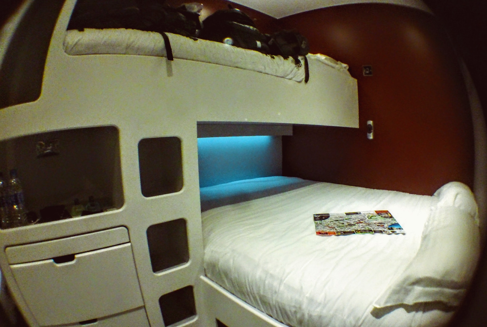
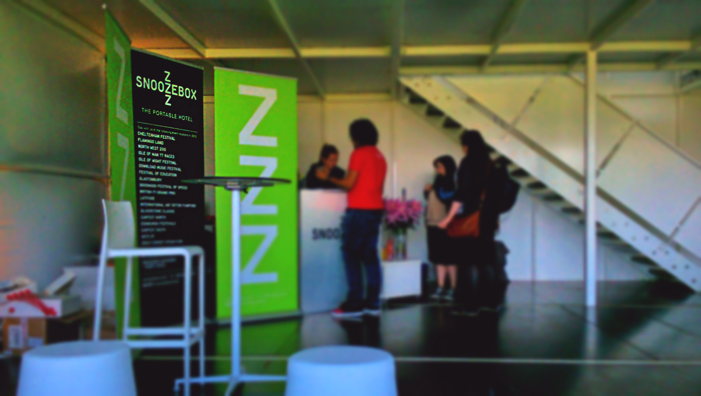

I love the idea of staying in kooky, renovated styles of accommodation. And what I’m about to share with you is a classic example of this.

Snoozebox is a portable hotel, which has recently been a big hit at festivals and events around the UK. _What’s their unique selling point, I hear you say?_ Well, they’ve renovated shipping containers into portable ‘hotel-like’ rooms. Described on their website as a premium style of accommodation, we wasted no time booking a room for our [Edinburgh Fringe Festival](/posts/2015-09-laughs-away-at-edinburghs-fringe-festival) stay.

Unfortunately due to an unforseen circumstance the location of Snoozebox changed, which forced us to alter our accommodation plans as we planned to stay near the city centre. All was not lost though! The universe worked in our favour and we got the chance to stay one night at Snoozebox (which moved to the most convenient location for us – a 10 minute walk from Edinburgh airport!)

We arrived in Edinburgh past 11pm, and after faffing around with luggage and directions we arrived at Snoozebox just before midnight. Staff are on site 24 hours which was great, and within several minutes of us arriving we were shown to our room/container.

Now I can say after a year in Asia that I’m used to staying in minimal accommodation. The worst offending countries were Japan and Hong Kong, where rooms sizes brought a new meaning to the term ‘claustrophobia’.

_So,_ to put it bluntly I wasn’t expecting anything great. That is until, I went inside…

Our delightfully, comfortable room

**Umm. Wow?**

Yes it was small, BUT it was _soo_ well designed. There was a TV, a mini safe, air-con, some space for clothes storage _and_ a comfortable bed. Attached to the room was a mini en suite, equipped with a hot shower, towels and toiletries. Oh, did I forget to mention the free Wi-Fi? Because it had that too!

The very things we needed after a 12+hour flight were catered for in this little container, and we wasted no time enjoying a hot shower each before jumping into bed, where we rested our heavy heads on fluffy pillows and melted into the warm duvet for a fantastic nights’ rest.

We both woke up so refreshed and ready for the day ahead that we felt sad to leave! Upon checkout we helped ourselves to a couple of complimentary teas’ before we returned to the airport to catch a bus into the city.

I’m still blown away by the amenities we had in our little container. I love the idea of a portable hotel, and think Snoozebox have executed this concept brilliantly. Although we stayed one night, the check-in process right through to our departure was seamless, and I can’t fault anything (apart from the change in location which was not the company’s fault).

So among the many places I have stayed in over the course of the year, I can proudly add ‘shipping container’ onto the list! If you’re a fan of quirky accommodation (and don’t mind small spaces) then I highly recommend you check out Snoozebox 🙂

_For more information about Snoozebox check out their website:_ <http://snoozeboxhotel.co.uk/>.
