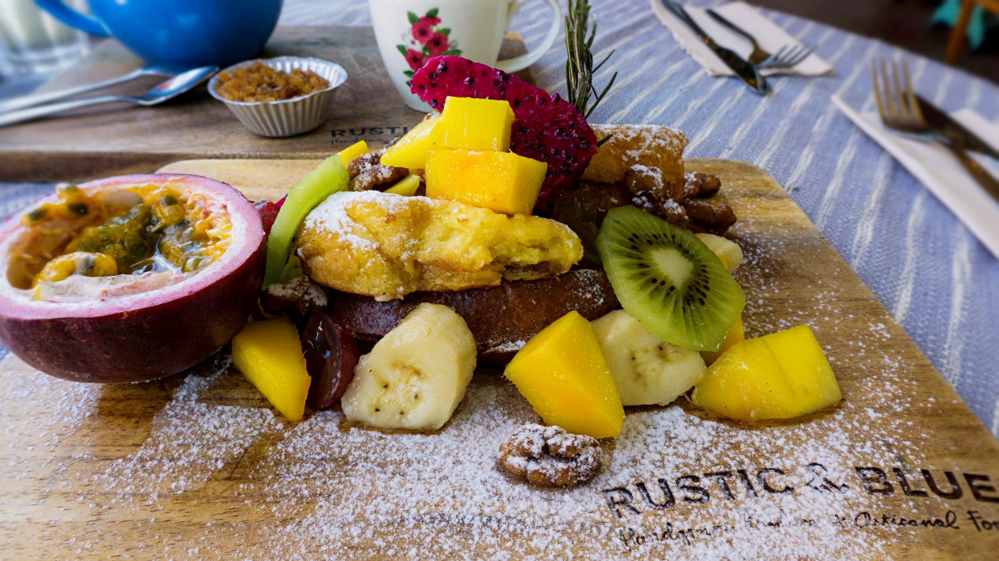
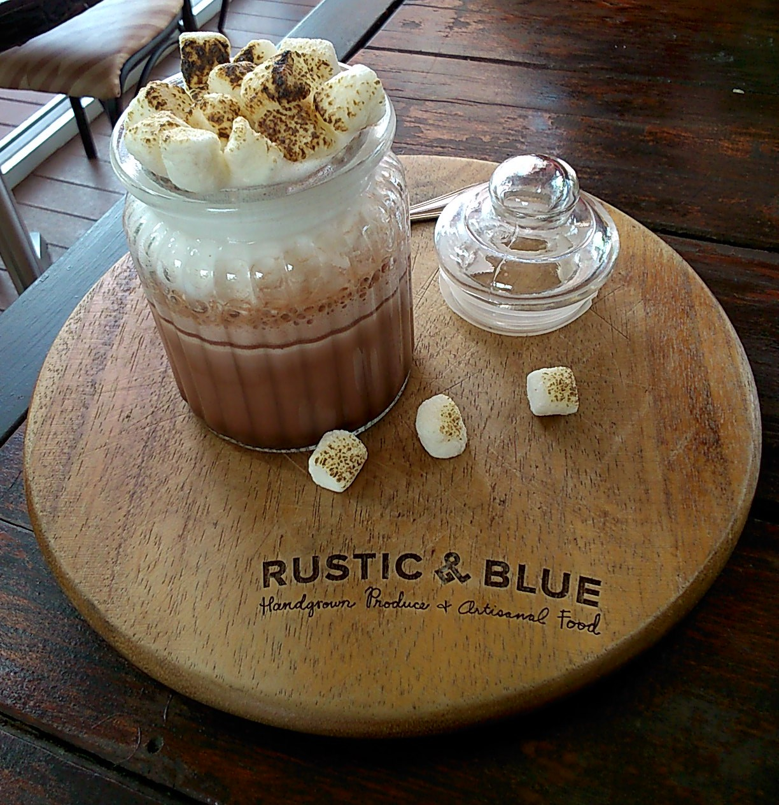
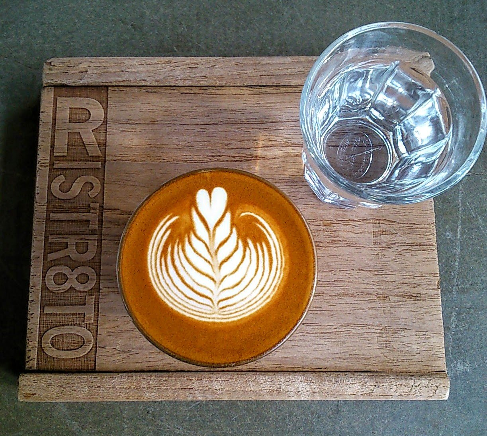
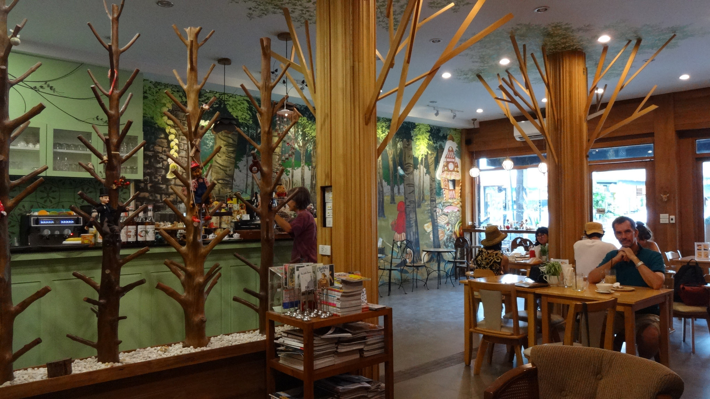
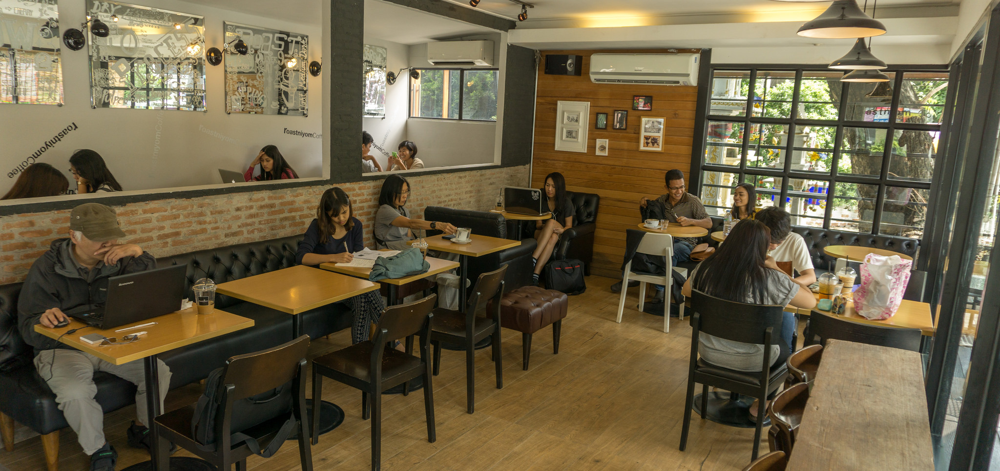
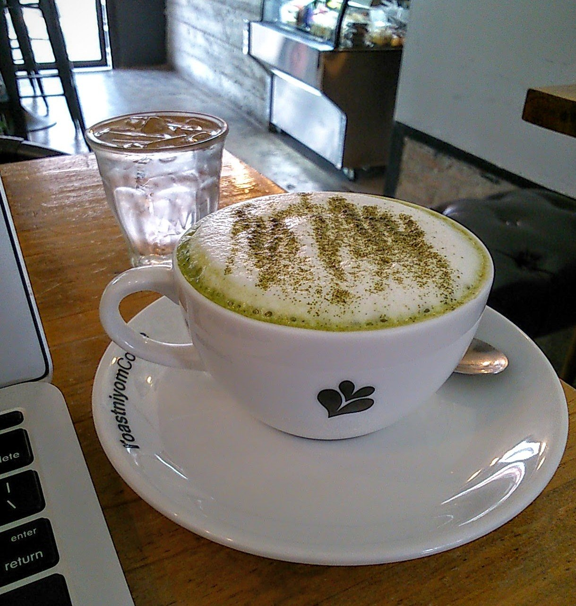
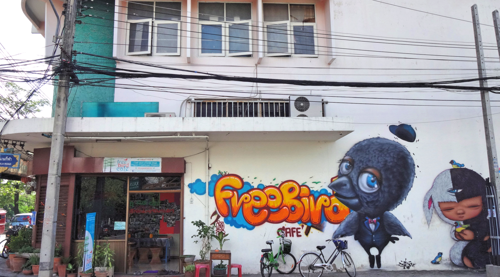
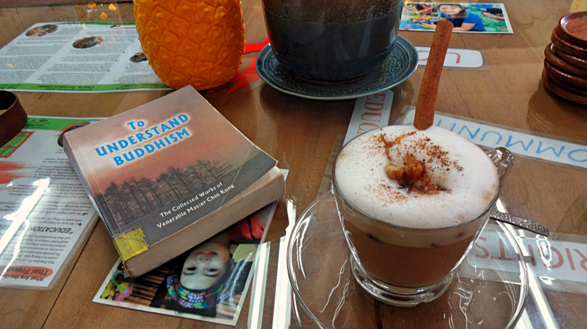

What could you possibly want if you find yourself in a popular (but laid back) city beaming with warm locals, friendly expats, and an endless list of awesome activities?

How about taking a break to find a welcoming place that serves a decent drink, like a much-needed cup of tea or coffee?

Well, you’ve still come to the right place then, because Chiang Mai has a booming cafe culture that shows no sign of slowing down!

It can be a tad overwhelming choosing which cafe to visit, as there’s just so many places to take your pick! So to help you out, I’ve recommended my favourite 5 cafes I love (and miss dearly) in this northern city.

And in no particular order (_because they’re all fantastic_) here are my top 5 cafes that you simply **need** to visit!

1.Rustic & Blue

This charming cafe specialises in a variety of tea blends, artisan food and homegrown produce. The friendly service and indeed, rustic yet warm decor had me returning several times a week! There wasn’t enough time to sample all the menu, though I’m seriously tempted to go back to fulfill this very task.

Be sure to arrive early (or mid/late afternoon) on the weekends as it gets real busy, but please believe me when I say it’s worth the wait!

_Address: Su Thep, Mueang Chiang Mai District, Chiang Mai, Thailand_

Super Awesome French Toast!

2\. Ristr8to

Ristr8to is simply the place you need to go for an awesome ‘cuppa joe’. Located on the popular strip of Nimmanhaemin, this small cafe is highly knowledgeable when it comes to coffee. The barista’s are highly trained and _know_ their beans, they’re also on hand to help if you’re unsure what to choose.

Did I mention the latte art? Because each coffee is adorned with a beautiful latte design, just to make your day that extra bit sweeter. _Seriously though_, these guys are so good at latte art that they’ve even featured in the world latte art championships!

_Address: 5/3 Nimmanhemin road, Muang, Chiang Mai 50200_

Did someone order a perfect latte?

3\. Into the Woods

This bright cafe has to be the ‘cutest of them all’ in this list. Located just off North Gate, Into the Woods serve a variety of hot/cold drinks, food and baked goods. The cafe has a fairy-tale like design complete with a cosy book section (mostly filled with Thai books, but there is the off chance you’ll find a Western one!).

I particularly admire their effort to create unique latte art, ranging from animals to movie characters. This combined with one of their delicious cakes is a sure winner in my eyes.

_Address: 191-193 King Prajadhipok Sriphum Road, Chiang Mai 50200_

Literally the cutest coffee and cake I’ve ever had!

Quaint, spacious design inside the cafe

4\. roastniyom coffee

This has to be my favourite hangout when I wanted to catch up on some blogging, as it was the kind of cafe liked minded people went to study or work. I particularly enjoyed the matcha latte and moist carrot cake, though their lattes (and other sweet treats) are worth a try too. If you’re looking to escape the hustle and bustle of Nimmanhaemin, then this could be the place for you!

_Address: 51 Sirimangkalajarn Rd,Suthep subdistrict, Chiang Mai 50200_

Calm, comfortable vibes inside roastniyom

5.Freebird cafe

This vegetarian cafe not only serves a wonderful variety of beverages and fresh, organic food, but they also actively support a community of language and arts for Burmese refugees. Inside the cafe there is a section at the back selling donated clothes and books – all of which helps to support their wonderful cause.

Unfortunately I didn’t try the food, but enjoyed several delicious drinks and quiet time reading in the cafes’ laid back surroundings. This is definitely worth a visit if you fancy eating healthy, would like to kick back with a drink and book in hand, or to simply donate to a worthy cause.

_Address: 116 Maneenoparat Rd, Chiang Mai 50301_

Freebird cafe – colorful inside and out!

